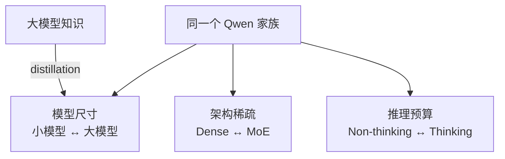

# Qwen 精读：一个家族，多种规模与推理模式

**中文** · [English](qwen.en.md)

> 阅读时间：约 9 分钟 · 类型：模型家族精读 · 最近审阅：2026-09

  
核心问题<strong>怎样让一个模型家族覆盖不同预算与 workload？</strong>

  
重点组件<strong>Dense / MoE · GQA · QK-norm · multilingual</strong>

  
训练主线<strong>预训练 → reasoning cold start / RL → thinking mode fusion → distillation</strong>

  
读完要会<strong>区分架构稀疏、推理时计算和小模型蒸馏</strong>

## 一句话定位

读 Qwen3，我更关心的是：**同一家族怎样适应不同任务和预算？** 它有 dense 和 MoE、不同参数规模，也支持 thinking 与 non-thinking。把这些版本放在一起看，才能分清哪些差异来自模型大小，哪些来自架构或推理方式。

## 先把三种“省计算”分开

- **参数规模**影响模型容量，也决定部署时最基本的资源需求。
- **MoE**让总参数增长得比每 token 激活计算更快，但会引入路由与通信。
- **Thinking budget**控制一次请求花多少计算来生成推理过程；这既不等于换成 MoE，也不等于增加参数量。

把三件事混在一起，就很容易把“更大”“更稀疏”和“想得更久”都笼统叫成 scaling。

## 真正值得抓住的三件事

1. **不同版本面向不同任务，不只是参数量不同。** 小 dense 模型适合低成本部署，大 MoE 提高容量，thinking mode 把额外计算留给复杂问题。
2. **使用者可以选择是否开启 thinking。** Qwen3 把两种模式放进同一模型框架，让使用者按任务切换预算；评价时也必须分别报告质量、长度与延迟。
3. **大模型也可以帮助训练小模型。** 通过蒸馏，小模型能学习大模型的输出和推理过程，不必完全独立地学习这些能力。

## 取舍表

| 选择 | 得到什么 | 付出什么 |
| --- | --- | --- |
| Dense + MoE 产品线 | 同一生态覆盖不同成本区间 | 训练、服务和评估矩阵更复杂 |
| Thinking mode | 复杂问题可使用更多 test-time compute | 延迟、token 成本与输出稳定性变化 |
| 多语言扩展 | 更广的语言与跨语言迁移 | 数据配比和长尾语言评估更难 |
| 家族内蒸馏 | 小模型继承大模型部分能力 | 上限受 teacher 与蒸馏数据约束 |

## 我会怎样使用这个家族

如果研究问题包含**动态计算预算**，Qwen 是很好的对象：同一个任务既可以比较 dense / MoE，也可以比较 thinking / non-thinking。关键是别只报最终准确率；至少同时记录生成 token、延迟、激活参数与失败类型。

## 自检

- MoE 的“稀疏”和 thinking mode 的“多算一会儿”有什么本质区别？
- 为什么同一个模型切换模式后，评估协议也必须改变？
- 蒸馏让模型家族获得了什么，又可能把哪些 teacher 偏差传下去？
- 如果一个小模型在 benchmark 上接近大模型，你还会检查哪些成本和泛化维度？

## 原始资料

- [Qwen3 Technical Report](https://arxiv.org/abs/2505.09388)
- [Qwen3 官方代码与模型](https://github.com/QwenLM/Qwen3)
