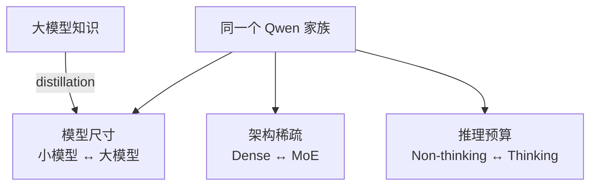

# Qwen 精读：一个家族，多种规模与推理模式

**中文** · [English](qwen.en.md)

> 类型：模型家族精读 · 最近核对：2026-10-08

Qwen 1–2.5 的 tokenizer、GQA、数据和后训练变化见[早期版本精读](qwen-early.md)。本篇从 Qwen3 讲到已公开的 Qwen3.8 型号；不把型号名、托管 API 与完整训练配方混为一谈。

  
核心问题<strong>怎样让一个模型家族覆盖不同预算与 workload？</strong>

  
重点组件<strong>Dense / MoE · GQA · QK-norm · multilingual</strong>

  
训练主线<strong>大模型四阶段后训练；小模型另走 strong-to-weak distillation</strong>

  
读完要会<strong>区分架构稀疏、推理时计算和小模型蒸馏</strong>

## 一句话定位

读 Qwen3，我更关心的是：**同一家族怎样适应不同任务和预算？** 它有 dense 和 MoE、不同参数规模，也支持 thinking 与 non-thinking。把这些版本放在一起看，才能分清哪些差异来自模型大小，哪些来自架构或推理方式。

这里的模式切换主要指初版 Qwen3 的 hybrid checkpoints。家族名不能代替型号：例如 [Qwen3-235B-A22B-Instruct-2507](https://huggingface.co/Qwen/Qwen3-235B-A22B-Instruct-2507)只支持 non-thinking；不能因为名字里有 Qwen3，就默认所有配置都能切换。

## 先把三种“省计算”分开

```mermaid
flowchart TD
    A["同一个 Qwen 家族"] --> B["模型尺寸<br/>小模型 ↔ 大模型"]
    A --> C["架构稀疏<br/>Dense ↔ MoE"]
    A --> D["推理预算<br/>Non-thinking ↔ Thinking"]
    E["大模型知识"] -->|distillation| B
```

- **参数规模**影响模型容量，也决定部署时最基本的资源需求。
- **MoE**让总参数增长得比每 token 激活计算更快，但会引入路由与通信。
- **Thinking budget**控制一次请求花多少计算来生成推理过程；这既不等于换成 MoE，也不等于增加参数量。

把三件事混在一起，就很容易把“更大”“更稀疏”和“想得更久”都笼统叫成 scaling。

## 真正值得抓住的三件事

1. **不同版本面向不同任务，不只是参数量不同。** 小 dense 模型适合低成本部署，大 MoE 提高容量，thinking mode 把额外计算留给复杂问题。
2. **初版 hybrid checkpoints 可以切换 thinking。** 这是具体 checkpoint 的接口，不是整个家族的永久承诺；评价时必须分别报告质量、长度与延迟。
3. **大模型也可以帮助训练小模型。** 通过蒸馏，小模型能学习大模型的输出和推理过程，不必完全独立地学习这些能力。

## 取舍表

| 选择 | 得到什么 | 付出什么 |
| --- | --- | --- |
| Dense + MoE 产品线 | 同一生态覆盖不同成本区间 | 训练、服务和评估矩阵更复杂 |
| Thinking mode | 复杂问题可使用更多 test-time compute | 延迟、token 成本与输出稳定性变化 |
| 多语言扩展 | 更广的语言与跨语言迁移 | 数据配比和长尾语言评估更难 |
| 家族内蒸馏 | 小模型继承大模型部分能力 | 上限受 teacher 与蒸馏数据约束 |

## 后训练不是所有型号都走同一条线

[Qwen3 报告 §4](https://arxiv.org/html/2505.09388v1#S4)把大模型路线分成四步：long-CoT cold start、reasoning RL、thinking mode fusion、general RL。小模型使用 strong-to-weak distillation，不能把它简单写成所有模型的“第五步”。

例如，学生已经生成了一段不太理想的前缀。只让它模仿老师事先写好的答案，和让老师在**学生自己的前缀**上提供分布，是两种不同训练输入。前者对应这里的 off-policy 阶段，后者是 on-policy distillation 要解决的问题。区别在于训练时遇到了谁产生的上下文，不是老师“在线”还是“离线部署”。

## Qwen3.5：线性状态与完整历史各负责什么？

以 [Qwen3.5-397B-A17B 的官方配置](https://huggingface.co/Qwen/Qwen3.5-397B-A17B)为例：每组 3 层 Gated DeltaNet 后接 1 层 Gated Attention，另有视觉编码器；MoE 使用 512 个 routed experts，每 token 激活 10 个，加 1 个 shared expert。这些数字属于这个型号，不要套到所有 Qwen3.5。

直观地看，递归状态把历史压进固定形状的矩阵；完整注意力还会查历史 KV。两者混用，不等于整个模型有恒定大小的缓存或线性的完整序列计算量。单步 decode 与整段 prefill 也要分开算。

“按 key 修正记忆”同样不等于毫无干扰地删掉一条记录。两个 key 很接近时，改动一个方向可能影响另一个方向。[Gated DeltaNet 的推导与数值例子](../deep-dives/gated-deltanet.md)解释了这个限制，也区分了训练参数与 forward 里的快速状态。

## 2026 更新：Qwen3.8 不是一种统一结构

下面按 2026-10-08 的官方模型卡整理，只列影响理解的差异。具体服务参数仍应绑定 checkpoint revision 与推理引擎版本。

| 公开型号 | token mixer / FFN | 输入与部署边界 |
| --- | --- | --- |
| [Qwen3.8-27B](https://huggingface.co/Qwen/Qwen3.8-27B) | 3 层 Gated DeltaNet + 1 层 Gated Attention 的重复布局；dense FFN | 公开视觉语言模型，不能当纯文本 Qwen3 的换名版本 |
| [Qwen3.8-2.4T-A95B](https://huggingface.co/Qwen/Qwen3.8-2.4T-A95B) | 同类混合 attention，MoE；总量 2.4T、激活 95B | 公开权重是文本模型；托管 Max 的视觉与工具功能不能全部归到这份权重 |
| [Qwen3.8-Flash-Next](https://huggingface.co/Qwen/Qwen3.8-Flash-Next) | Gated DeltaNet + QSA；另有 gated residual、n-gram embedding 与 MoE | QSA 选 micro-block，不是 V3.2 DSA 的逐 token 选择；模型卡将其定位为新架构预览 |

27B 型号仍有完整注意力层，所以“混合线性状态”不等于所有历史缓存恒定。2.4T 型号的 active 数字描述每 token 使用的计算子集，不是把其他权重从内存账里删掉。Flash-Next 则还多了一笔 n-gram 表的存储与读取成本。

### Flash-Next 的参数账，为什么不能只看 6B？

模型卡把其组成分成 125B 主体、51B n-gram embedding 与 4B MTP，总计约 180B；主体每 token 激活约 6B。这些口径回答不同问题：

- 6B 帮助理解主计算路径，不包含完整的驻留与通信成本。
- 51B 表参数通过局部地址读取，不能等同于每 token 执行 51B dense matmul；但表仍需要存储、传输与缓存。
- MTP 的训练与推理使用方式单独算；不能因为附带这个模块就声称解码必然加速。

若只做一个粗略的 BF16 原始权重估算，180B × 2 bytes 约 360 GB。量化、offload、共享与额外缓冲都会改变实际需求；这个数字不是可部署的显存预算。

QSA 模型卡给出的预算是 512 个 micro-block、对应 2,048 个 token。输入变成 32,768 token 后，主读取 pair 数与 dense 的比例可以粗算成 1/16；但 indexer、block 读取、MoE 与状态更新仍在，**不是整模型 16 倍加速**。其深度门控也不能直接写成 [Block AttnRes](../deep-dives/attention-residuals.md)，n-gram 方案不能只因用了 hash 就等同于 [Engram](../deep-dives/engram.md)。相似动机不意味着同一实现。

### 模型卡上的成绩该怎么读？

先对齐 harness、工具权限、上下文、生成预算、采样次数与 benchmark 修订。比如 27B 卡片注明部分代码评估修正了任务、重新评测基线；2.4T 页面也展示托管 Max 的结果。不能把这些表格直接解释为“下载权重，用随便一个脚本就会得到相同分数”。

更实用的比较是固定一个自己的任务集，同时记录成功率、失败类别、总生成 token、工具调用和延迟。公开架构能帮助预测成本在哪，却不能代替这个测量。本页没有重跑上述型号的性能实验，也不把模型卡当作公开了全部训练数据和 recipe。

## 我会怎样使用这个家族

如果研究问题包含**动态计算预算**，Qwen 是很好的对象：同一个任务既可以比较 dense / MoE，也可以比较 thinking / non-thinking。关键是别只报最终准确率；至少同时记录生成 token、延迟、激活参数与失败类型。

## 自检

- MoE 的“稀疏”和 thinking mode 的“多算一会儿”有什么本质区别？
- 为什么同一个模型切换模式后，评估协议也必须改变？
- 蒸馏让模型家族获得了什么，又可能把哪些 teacher 偏差传下去？
- 如果一个小模型在 benchmark 上接近大模型，你还会检查哪些成本和泛化维度？

## 原始资料

- [Qwen3 Technical Report](https://arxiv.org/abs/2505.09388)
- [Qwen3 官方代码与模型](https://github.com/QwenLM/Qwen3)
- [Gated Delta Networks](https://arxiv.org/abs/2412.06464)
