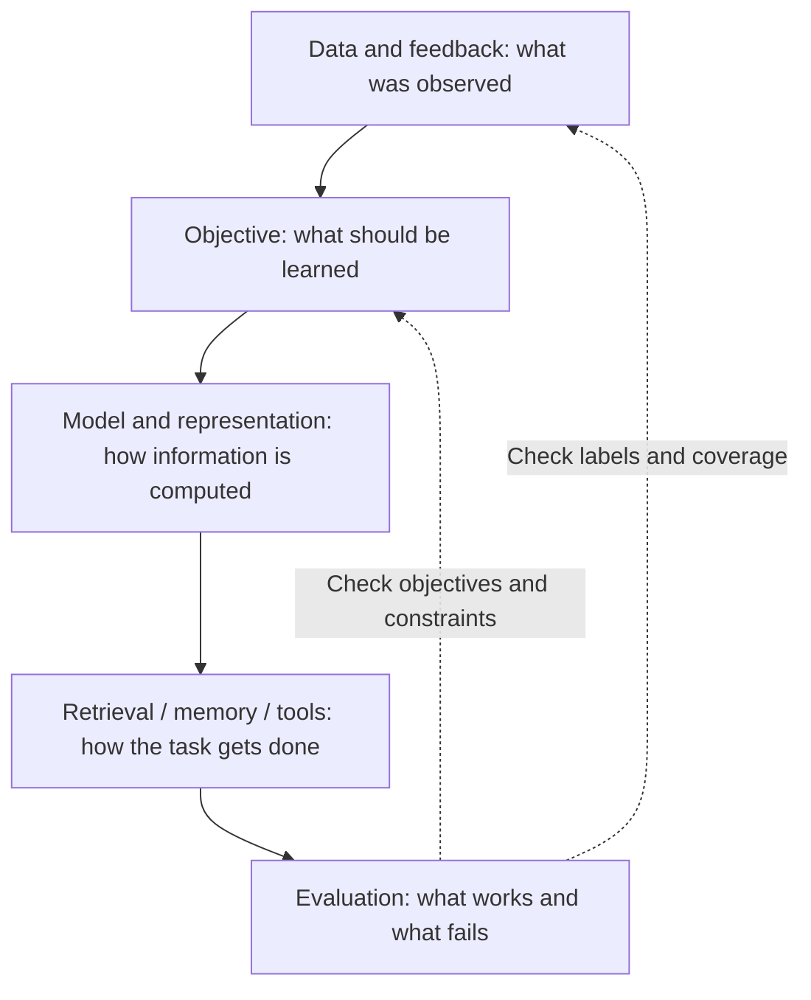

# How to use these notes

[中文](study-guide.md) · **English**

You don't need to read the directory from top to bottom. Start with the thing you're stuck on: the computation inside a model, how to train it, or how to tell whether it improved.

The two study areas remain **Quant Researcher** and **AI / ML Engineer**. They share some foundations, but they aren't the same preparation checklist. Practice, career notes, and papers also keep their own entry points.

## Pick a route

| What you want to do | Where to start | A useful checkpoint |
| --- | --- | --- |
| Review probability | [Probability](../quant/probability/README.en.md) → distributions → conditioning | Explain conditional and joint probability with a small example, not just a formula |
| Learn language models systematically | [Learning map](README.en.md) → core mechanisms → implementations | Trace tokens to logits, identifying the input and output of each step |
| Read a new model report | [Model-reading exercise](model-families/how-to-read.en.md) → family notes | Identify the exact version, its changes, and the experiments supporting an explanation |
| Train or post-train models | [Feedback to objectives](../01-data-and-feedback/feedback-to-objectives.en.md) → [methods](../05-post-training/README.en.md) → [evaluation](../07-evaluation/README.en.md) | Explain what a label means, what the loss rewards, and how to catch side effects |
| Build memory, retrieval, or agents | [Memory lifecycle](../02-memory/memory-lifecycle.en.md) → [retrieval](../04-search/README.en.md) → [agents](../10-agents/README.en.md) | Trace the evidence used for a request and locate the stage responsible for a failure |
| Prepare for interviews | [Interview preparation](../interview/README.en.md) → unfamiliar chapters → review cards | Explain an example, a limitation, and a test without looking at the notes |

## Understand both the module and its connections

Treat this diagram as a checklist, not a prescribed architecture.

A dissatisfied user may reflect stale memory rather than a small model. A higher score may reflect an easier candidate set. Looking one stage upstream and downstream is often more useful than replacing the model immediately.

## Read each chapter in three passes

  
01 · Understand<strong>Follow one example</strong>
What comes in, what computation happens, and who uses the output? Mark difficult formulas for later.

  
02 · Inspect<strong>Calculate or run a small test</strong>
Check shapes, denominators, masks, and assumptions. Change one condition and predict the effect.

  
03 · Recall<strong>Answer before reopening the notes</strong>
The chapter cards initially show only the question. Reveal the reasoning after trying; mark uncertain answers “Try again.”

Review marks stay in this browser. They aren't uploaded, don't sync across devices, and aren't proof of mastery. Chinese and English pages share progress within a chapter. The answers are starting points: explaining assumptions and reasoning matters more than matching the wording.

## Connect the chapters

- **Foundations → model families:** understand attention before comparing why designs such as GQA change it.
- **Data → training → evaluation:** a behavioral label may only approximate the goal. When changing the signal, check whether the old metrics can measure the intended improvement.
- **Memory → retrieval → agents:** not everything worth storing is worth retrieving; retrieved content must not become permission to act.
- **Principles → practice → papers:** test your understanding in a small example, examine constraints in public projects, then check the scope of the original evidence.

## Want to add a note?

It doesn't have to start as a full tutorial. Begin with something you didn't understand, add an example that can be calculated or run, then explain limitations and add 2–4 review cards. Separate public evidence, your interpretation, and untested ideas.

[Open an issue](https://github.com/tianyi-zhang-02/cooking-agi/issues) for missing topics, or read [how to contribute](../community/README.en.md). One clear note is worth more than a directory filled with outlines.
