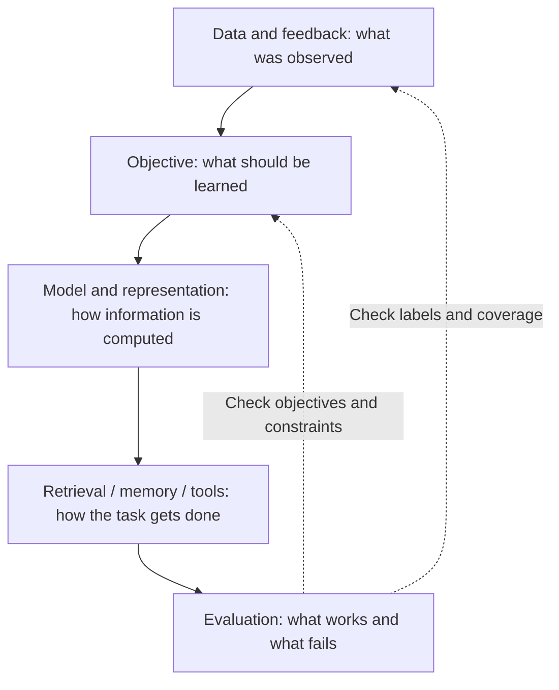

# How to use these notes

[中文](study-guide.md) · **English**

You don't need to read the directory from top to bottom. Start with the thing you're stuck on: the computation inside a model, how to train it, or how to tell whether it improved.

This page guides the foundations-and-models route. The full [study map](../learn/README.en.md) also separates training and applications, coding exercises, and system design. Technical material no longer lives inside career reflections.

## Pick a route

| What you want to do | Where to start | A useful checkpoint |
| --- | --- | --- |
| Learn language models systematically | [Learning map](README.en.md) → core mechanisms → implementations | Trace tokens to logits, identifying the input and output of each step |
| Diagnose a model that will not learn or only fits training data | [Generalization](deep-dives/generalization.en.md) → [activations and initialization](deep-dives/activation-and-initialization.en.md) → [optimizers](deep-dives/optimizers.en.md) | Separate data, gradient, and update problems; calculate a small counterexample |
| Understand learning from images and text | [Embeddings and similarity](core/embeddings-and-similarity.en.md) → [CLIP](../03-multimodal-learning/clip.en.md) → [Visual language models](../03-multimodal-learning/vision-to-language.en.md) | Distinguish pair scoring from answer generation, and trace both data and gradients |
| Read a new model report | [Model-reading exercise](model-families/how-to-read.en.md) → family notes | Identify the exact version, its changes, and the experiments supporting an explanation |
| Train or post-train models | [Feedback to objectives](../01-data-and-feedback/feedback-to-objectives.en.md) → [methods](../05-post-training/README.en.md) → [evaluation](../07-evaluation/README.en.md) | Explain what a label means, what the loss rewards, and how to catch side effects |
| Build memory, retrieval, or agents | [Memory lifecycle](../02-memory/memory-lifecycle.en.md) → [retrieval](../04-search/README.en.md) → [agents](../10-agents/README.en.md) | Trace the evidence used for a request and locate the stage responsible for a failure |
| Prepare for interviews | [ML questions and implementations](../learn/ml-exercises/README.en.md) → unfamiliar chapters → run a small example | Explain an example, a limitation, and a test without looking at the notes |

## Understand both the module and its connections

Treat this diagram as a checklist, not a prescribed architecture.

A dissatisfied user may reflect stale memory rather than a small model. A higher score may reflect an easier candidate set. Looking one stage upstream and downstream is often more useful than replacing the model immediately.

## Read each chapter in three passes

  
01 · Understand<strong>Follow one example</strong>
What comes in, what computation happens, and who uses the output? Mark difficult formulas for later.

  
02 · Inspect<strong>Calculate or run a small test</strong>
Check shapes, denominators, masks, and assumptions. Change one condition and predict the effect.

  
03 · Recall<strong>Explain it in your own words</strong>
Pick an example, explain the design, and consider a different assumption. Return to the notes wherever you get stuck.

You don't need to memorize the wording. Explaining the assumptions and reasoning with an example of your own is a good place to start.

## Connect the chapters

- **Foundations → model families:** understand attention before comparing why designs such as GQA change it.
- **Data → training → evaluation:** a behavioral label may only approximate the goal. When changing the signal, check whether the old metrics can measure the intended improvement.
- **Memory → retrieval → agents:** not everything worth storing is worth retrieving; retrieved content must not become permission to act.
- **Principles → practice → papers:** test your understanding in a small example, examine constraints in public projects, then check the scope of the original evidence.

## Want to add a note?

It doesn't have to start as a full tutorial. Begin with something you didn't understand, add an example that can be calculated or run, then explain the reasoning and limitations. Separate public evidence, your interpretation, and untested ideas.

[Open an issue](https://github.com/tianyi-zhang-02/cooking-agi/issues) for missing topics, or read [how to contribute](../community/README.en.md). One clear note is worth more than a directory filled with outlines.
