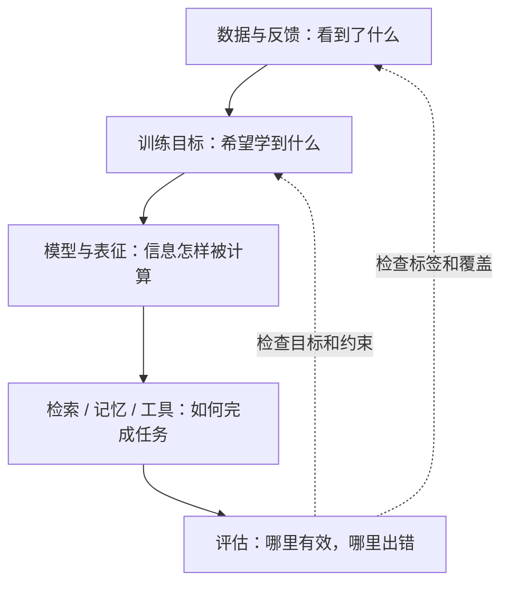

# 这份笔记怎么学

**中文** · [English](study-guide.en.md)

不用按目录从头读到尾。先想想你现在卡在哪儿：是看不懂模型里的计算，还是不知道该怎么训练、怎么判断结果？从那个问题开始就好。

这页主要介绍基础和模型部分的读法。想练代码、看训练方法或做系统设计，可以去[学习导航](../learn/README.md)找对应入口。

## 先选一条路线

| 你现在想做什么 | 建议从哪儿读 | 读到什么程度再往下走 |
| --- | --- | --- |
| 补概率基础 | [概率](../quant/probability/README.md) → 分布 → 条件概率 | 能用一个小例子分清条件概率和联合概率，而不只是会套公式 |
| 第一次系统学语言模型 | [学习地图](README.md) → 核心机制 → 从零实现 | 能画出 token 到 logits 的过程，知道每一步的输入和输出 |
| 看懂图片和文字怎么一起学 | [向量与相似度](core/embeddings-and-similarity.md) → [CLIP](../03-multimodal-learning/clip.md) → [视觉语言模型](../03-multimodal-learning/vision-to-language.md) | 能区分配对打分和生成回答，画出两者的数据与梯度路径 |
| 看懂新模型 | [模型家族阅读练习](model-families/how-to-read.md) → 各家族精读 | 能说清具体版本改了什么，以及哪项实验支持这个解释 |
| 做训练或 Post-training | [反馈怎么变成目标](../01-data-and-feedback/feedback-to-objectives.md) → [训练方法](../05-post-training/README.md) → [评估](../07-evaluation/README.md) | 能解释标签意味着什么、loss 在奖励什么、怎样发现副作用 |
| 做记忆、检索或 Agent | [记忆的写入与更新](../02-memory/memory-lifecycle.md) → [检索](../04-search/README.md) → [Agents](../10-agents/README.md) | 能追踪一次请求用了哪些证据，出错后能找到责任环节 |
| 准备技术面 | [ML 问答与手写](../learn/ml-exercises/README.md) → 不熟的章节 → 动手跑一个例子 | 不看笔记也能讲一个例子、一个限制，以及怎么验证 |

## 看懂一个模块，还要看懂它接在哪里

下面这张图可以帮你检查有没有漏掉某个环节，不必照着它搭系统。

比如用户不满意，可能不是模型太小，而是读到了过期记忆；分数上升，也可能只是测试集换了更容易的候选。往前后各多看一步，往往比立刻换模型更有用。

## 一章可以分三步读，不用一次做完

  
01 · 看懂<strong>先跟着一个例子走</strong>
输入是什么？经过什么计算？输出交给谁？暂时不懂的公式可以先圈出来。

  
02 · 拆开<strong>再算一次，或写个小实验</strong>
检查张量形状、分母、mask 和假设。只改一个条件，看看结果会怎样变。

  
03 · 回忆<strong>试着用自己的话讲一遍</strong>
挑一个例子，说清楚为什么这么做、换个条件会怎样。不确定的地方，再回正文找答案。

不必背原文。能说明前提、讲清推理，再举一个自己的例子，就已经很好了。

## 笔记之间怎么接起来

- **基础 → 模型家族**：先知道 attention 在算什么，再比较 GQA 等设计为什么要改它。
- **数据 → 训练 → 评估**：同一个行为标签，可能只是目标的近似。改训练信号时，也要检查旧指标能不能衡量它。
- **记忆 → 检索 → Agent**：存过的信息不一定适合当前任务；检索到一条指令，也不代表系统就有权限执行它。
- **原理 → 实践 → 论文**：用小实验检查理解，再看真实公开项目里的约束，最后回论文查证结论的范围。

## 如果你也想补一篇

不必一次写成教程。先写“我哪里没懂”，给一个能算清或跑通的小例子，再补解释和限制。公开证据、自己的推测、还没验证的想法，请分开写。

有遗漏就[提 issue](https://github.com/tianyi-zhang-02/cooking-agi/issues)，想一起改可以看[参与方式](../community/README.md)。我们宁可一篇讲清楚，也不急着把每个目录都填满。
