# The Transformer architecture

[中文](transformer.md) · **English**

> Reading time: ~15 min · Level: intro → advanced · Last reviewed: 2026-10-09
>
> The main line is enough on its own. Collapsed blocks marked **deeper** hold derivations and edge cases; skipping them does not affect understanding.

<div class="lesson-recipe advanced">
  <div><span>What we are dissecting</span><strong>the Transformer, from block diagram back down to matrices and invariants</strong></div>
  <div><span>Prerequisites</span><strong>matrix multiplication · softmax · residuals · causal LM</strong></div>
  <div><span>Main mechanism</span><strong>Q/K/V · norm · RoPE · GQA · KV cache</strong></div>
  <div><span>What you must be able to prove</span><strong>the implementation satisfies causality, relative position, and cache equivalence</strong></div>
</div>

## Attention gathers context; the FFN transforms each position {#attention-gathers-context-the-ffn-transforms-each-position}

The Transformer is one concrete way to build the "learned coordinate transform $\phi$" from [the previous page](from-linear-to-neural.en.md): **attention moves information across positions; the FFN processes it at a single position.** The two alternate in a stack, and at the end it is still a linear classifier that reads out the answer.

## How the two kinds of computation work together {#how-the-two-kinds-of-computation-work-together}

- **Attention**: lets each position read information from other positions according to relevance.
- **FFN**: transforms features independently inside each position.
- **Residual connection**: keeps the original state and adds each sublayer's change on top of it.
- **Stacking N layers**: repeats cross-position communication and per-position transformation, building up layer by layer a representation usable for prediction.

## Scaled dot-product attention {#scaled-dot-product-attention}

$$\text{Attention}(Q, K, V) = \text{softmax}\!\left(\frac{QK^\top}{\sqrt{d_k}}\right)V$$

Write out the full shapes first and the question "why must it be $d_k$" goes away:

$$Q\in\mathbb{R}^{T_q\times d_k},\qquad
K\in\mathbb{R}^{T_k\times d_k},\qquad
V\in\mathbb{R}^{T_k\times d_v}.$$

Every score in $QK^\top$ is a dot product of one query and one key over **$d_k$
components**, so the standard scale uses $\sqrt{d_k}$; this is a scale choice, not a matrix-multiplication requirement. Matrix multiplication only
requires $Q$ and $K$ to share their last dimension; $V$ only needs the same number of
tokens $T_k$ as $K$, and its feature dimension $d_v$ may differ. Standard multi-head
attention usually sets $d_v=d_k=d_{\text{model}}/h$ so that concatenation is convenient;
that is a common design, not a mathematical requirement of the attention formula. For
example, with $d_{\text{model}}=768$ and $h=12$, each head has $d_k=64$, and the divisor
is $\sqrt{64}$, not $\sqrt{768}$.

Broken down to a single query $\mathbf{q}_i$:

$$\alpha_{ij} = \frac{\exp\!\big(\mathbf{q}_i^\top \mathbf{k}_j / \sqrt{d_k}\big)}{\sum_{j'} \exp\!\big(\mathbf{q}_i^\top \mathbf{k}_{j'} / \sqrt{d_k}\big)}, \qquad \mathbf{o}_i = \sum_j \alpha_{ij}\, \mathbf{v}_j$$

That is: **use similarity as the weights and take a weighted average of the values.** Every row of $\alpha_{ij}$ sums to 1.

### Softmax is a differentiable allocation, not an argmax {#softmax-is-a-differentiable-allocation-not-an-argmax}

Softmax maps arbitrary real scores to positive weights that sum to one:

$$\operatorname{softmax}(z)_i=\frac{e^{z_i}}{\sum_j e^{z_j}}.$$

For example, $[2,1,0]$ becomes approximately $[0.665,0.245,0.090]$. It does not keep only
the top score; it lets one query read several positions at once. Attention applies softmax
**row by row over the last dimension** of the score matrix: row $i$ answers "how much weight
should query $i$ give to each key $j$". Therefore

$$A=\operatorname{softmax}_{j}\!\left(\frac{QK^\top}{\sqrt{d_k}}\right),
\qquad O=AV,\qquad \mathbf{o}_i=\sum_j A_{ij}\mathbf{v}_j.$$

In one line: $QK^\top$ decides **where to read**; $AV$ decides **in what proportions to combine what was read**.

### Why divide by $\sqrt{d_k}$ {#why-divide-by-sqrtd_k}

Assume the components of $q$ and $k$ are independent with mean 0 and variance 1. Then

$$\mathbb{E}[\mathbf{q}^\top\mathbf{k}] = 0, \qquad \text{Var}(\mathbf{q}^\top\mathbf{k}) = \sum_{i=1}^{d_k}\text{Var}(q_i k_i) = d_k$$

The standard deviation is $\sqrt{d_k}$, or 8 when $d_k=64$. Larger score gaps can drive softmax toward one-hot, but large absolute values alone do not: `[8, 8]` still gives `[0.5, 0.5]`. Dividing by $\sqrt{d_k}$ restores unit variance under this simplifying assumption, reducing the risk of early saturation.

<details markdown="1">
<summary><b>Deeper</b>: near one-hot, which gradient becomes small?</summary>

The softmax Jacobian is

$$\frac{\partial\, \text{softmax}(z)_i}{\partial z_j} = \alpha_i(\delta_{ij} - \alpha_j)$$

As one weight approaches one and the others approach zero, both diagonal and off-diagonal entries approach zero. With bounded values and upstream gradients, gradients through attention weights back to scores become small. That is a limit, not a claim of exactly zero gradients at every finite score, nor a claim that the entire network has no gradient.

Sigmoid also has $\sigma'(z)=\sigma(1-\sigma)$ tending to zero, but the downstream loss matters. With binary cross-entropy, the logit gradient is $\sigma(z)-y$, which can remain large for a confidently wrong prediction. One operator's derivative is not automatically the final loss gradient.

</details>

### Python: attention itself {#python-attention-itself}

```python
import torch, torch.nn.functional as F

def attention(q, k, v, mask=None):
    """q: (B,H,Tq,dk)  k: (B,H,Tk,dk)  v: (B,H,Tk,dv)"""
    scores = q @ k.transpose(-2, -1) / q.size(-1) ** 0.5   # (B, H, Tq, Tk)
    if mask is not None:
        scores = scores.masked_fill(mask, float("-inf"))
    if torch.isneginf(scores).all(dim=-1).any():
        raise ValueError("Each query must have at least one allowed key")
    attn = scores.softmax(dim=-1)                          # every row sums to 1
    return attn @ v, attn
```

<details markdown="1">
<summary><b>follow-up</b>: what does attention become if $Q=K$?</summary>

In that case the score matrix before scaling is the Gram matrix $QQ^\top$, so it is
symmetric and positive semidefinite. After row-wise softmax, however, it is generally
**no longer symmetric**, because each row has its own normalizing denominator.

- All queries identical: every dot product is the same, and every attention row is a
  uniform distribution.
- Queries mutually orthogonal with equal norm: the diagonal score is largest; attention
  approaches the identity matrix only when the norm is large enough relative to the
  softmax temperature.
- The general case: positions more similar to a position itself receive more weight, but
  there is no guarantee that it attends only to itself.

So $Q=K$ does not make attention fail; it only turns "matching between two projected
spaces" into similarity inside one space. What really determines the output is still
row-wise softmax and $V$.

</details>

### Do the three projection matrices have any "actual meaning"? {#do-the-three-projection-matrices-have-any-actual-meaning}

For the self-attention input $X$, the model learns

$$Q=XW_Q,\qquad K=XW_K,\qquad V=XW_V.$$

The intuition has to be split into two levels:

- **A single parameter value or a single coordinate usually has no fixed human meaning.**
  With a different random seed, the coordinate axes and weight values can be completely
  different while the model still implements similar behavior.
- **The computational roles carried by the three matrices are meaningful.** $W_Q$ produces
  queries, $W_K$ produces the keys used for matching, and $W_V$ decides what content is
  actually transmitted after a match.

Why separate Q and K? Consider only self-attention over one sequence and force
$W_Q=W_K=W$. Then

$$S=XWW^\top X^\top$$

is symmetric, and the raw compatibility score must satisfy $S_{ij}=S_{ji}$. Once they are
separate,

$$S=XW_QW_K^\top X^\top,$$

$W_QW_K^\top$ need not be symmetric, so the raw score can express directional relations.
Three things must be distinguished here:

1. what is symmetric is the **raw score before the mask and softmax**;
2. row-wise softmax has a different denominator in every row, so the resulting attention
   weights are generally not symmetric;
3. the causal mask itself also breaks symmetry.

Why is V separate as well? Q/K are the addressing interface; V is the content being read.
Two positions can match because of one kind of feature while what needs to be transmitted
after the match is a different group of features; $W_V$ decouples "why it was found" from
"what to take from it". The database analogy is usable, but do not read it as three
manually named semantic fields.

More strictly, these internal coordinates are not unique. For any invertible matrix $R$, let

$$Q'=QR,\qquad K'=KR^{-\top},$$

and $Q'K'^\top=QK^\top$ still holds. In other words, the internal basis can be swapped with
the function completely unchanged. Interpreting an isolated entry such as $W_Q[17,42]$ is
therefore usually meaningless; what is meaningful is the function implemented by the whole
projection, its causal effect on the output, and the interface constraints among Q, K, and V.

This code uses `True` for blocked positions and assumes finite scores at allowed positions. Set blocked scores to `-inf` before softmax; setting them to zero still assigns weight. Zeroing weights afterwards without renormalizing is also not equivalent. See the worked example in [multi-head attention](core/multi-head-attention.en.md).

## One module, three uses: changing where Q/K/V come from {#one-module-three-uses-changing-where-qkv-come-from}

This is the part of the original paper's (2017) encoder-decoder structure most worth keeping an eye on. `self_attn(x, x, x)` and `cross_attn(x, memory, memory)` are the same class; only the three tensors fed in differ:

| Use | Q from | K, V from | mask | Attention shape |
| --- | --- | --- | --- | --- |
| Encoder self-attention | src | src | blocks padding only, **bidirectional** | $(B,h,S,S)$ |
| Decoder self-attention | tgt | tgt | padding **∨** causal | $(B,h,T,T)$ |
| **Cross-attention** | **tgt** | **memory** | blocks src padding | $(B,h,T,S)$ ← not square |



Cross-attention is the only place the two towers touch: at every generation step, the decoder takes its current state as the query and looks things up once in the encoder's output.

[`code/vanilla_demo.py`](code/vanilla_demo.py) trains a sequence-reversal task and prints cross-attention weights. The following is an intuitive reverse-alignment sketch, not the only valid pattern: encoder positions already mix context, so correct outputs do not require a particular head to form an anti-diagonal.

```
        1  2  3  4  5  6  7  8   <- source (encoder)
  BOS                        @
    1                     @
    2                  @
    3               @
    4            #  :
    5         @
    6      @
    7   @
  ^ decoder step
```

Use the script's separate generation check to evaluate outputs rather than judging only this picture. Even a perfect small batch does not establish generalization to arbitrary lengths or unseen distributions.

## Multi-head attention: why not one big attention {#multi-head-attention-why-not-one-big-attention}

$$\text{MultiHead}(Q,K,V) = \text{Concat}(\text{head}_1, \ldots, \text{head}_h)W^O, \quad \text{head}_i = \text{Attention}(QW_i^Q, KW_i^K, VW_i^V)$$

This equation follows the original paper's interface notation: Q/K/V here are the three **pre-projection inputs**, all equal to X in self-attention. It does not project the already-projected tensors from the opening section a second time.

One head shares one weight distribution across all its value channels. Splitting a fixed width into $h$ heads allows several such distributions. Projection and main matmul costs remain comparable, but attention-weight storage and kernel overhead can differ. Equal total width does not mean identical runtime.

The implementation does not need $h$ groups of small matrices: use one $(d_{\text{model}}, d_{\text{model}})$ projection and **reshape** it into $h$ heads — mathematically equivalent, but only a single GEMM.

```python
q = self.w_q(x).view(B, T, h, d_k).transpose(1, 2)   # (B, T, C) -> (B, h, T, d_k)
# ... attention ...
y = out.transpose(1, 2).reshape(B, T, h * d_k)       # merge back
```

## Training stability: why post-norm depends on warmup {#training-stability-why-post-norm-depends-on-warmup}

The paper writes

$$\mathbf{x} \leftarrow \text{LayerNorm}\big(\mathbf{x} + \text{Sublayer}(\mathbf{x})\big)$$

**Layer normalization sits outside the residual addition** (post-norm). Many later models use pre-norm instead:

$$\mathbf{x} \leftarrow \mathbf{x} + \text{Sublayer}\big(\text{Norm}(\mathbf{x})\big)$$


The change affects the gradient path, not just notation. [Research on LayerNorm placement](https://arxiv.org/abs/2002.04745) found large expected gradients near the output of Post-LN models under particular initialization assumptions; warmup can temper early updates. The original Noam schedule is

$$\text{lr}(t) = d_{\text{model}}^{-0.5} \cdot \min\big(t^{-0.5},\; t \cdot t_{\text{warmup}}^{-1.5}\big)$$

It increases linearly, then decays with the inverse square root of the step. Neither “six layers inevitably explode” nor “training cannot start without this schedule” follows. Pre-LN preserves an identity term on the residual path and is often easier to train, but initialization, depth, and learning rate still matter. Warmup does not automatically become unnecessary.

> Field note: `LambdaLR` **multiplies base_lr by** the lambda. Set Adam's `lr` to 0 and attach a Noam schedule, and the learning rate stays 0 forever, while dropout noise makes the loss look like it is still moving. This pitfall is common.

## Positional encoding: from sinusoids to RoPE {#positional-encoding-from-sinusoids-to-rope}

Without positional information or an order-dependent mask, self-attention is **permutation-equivariant**: reordering inputs reorders outputs. A causal mask already constrains earlier versus later positions; positional encodings further express position and distance. The entire causal model should not be described as a bag of words.

### Original: fixed sinusoids {#original-fixed-sinusoids}

$$PE_{(pos,\, 2i)} = \sin\!\left(\frac{pos}{10000^{2i/d}}\right), \qquad PE_{(pos,\, 2i+1)} = \cos\!\left(\frac{pos}{10000^{2i/d}}\right)$$

**Added** to the embedding, not concatenated. Wavelengths form a geometric sequence from $2\pi$ to just below $10000\cdot 2\pi$, like clocks running at different speeds. For a fixed offset k, $PE_{pos+k}$ is a linear transform of $PE_{pos}$, making relative offsets representable without guaranteeing that the model learns to use them.

### Now: RoPE {#now-rope}

Nothing is added to the input; instead, **$q$ and $k$ are rotated at every layer**. Pair up the channels of $\mathbf{q}$ two by two as complex numbers, with rotation angle $m\theta_i$ at position $m$:

$$\tilde{\mathbf{q}}_m = R_m \mathbf{q}, \qquad R_m = \begin{pmatrix} \cos m\theta & -\sin m\theta \\ \sin m\theta & \cos m\theta \end{pmatrix} \ \ (\text{per channel pair})$$

With fixed q/k content and rotary frequencies, the **explicit positional factor** introduced by RoPE depends only on $n-m$. Actual q/k also depend on context and masks, so the model does not simply operate on distances. Common implementations do not apply this rotation to V; its contextual representation can still carry positional information.

<details markdown="1">
<summary><b>deeper</b>: where the relative property comes from</summary>

Rotation matrices are orthogonal, and rotations in the same plane add: $R_m^\top = R_{-m}$ and $R_a R_b = R_{a+b}$. So

$$\langle R_m\mathbf{q},\; R_n\mathbf{k}\rangle
= \mathbf{q}^\top R_m^\top R_n \mathbf{k}
= \mathbf{q}^\top R_{n-m}\mathbf{k}$$

$m$ and $n$ appear only as a difference in this rotation identity. That is not a guarantee of long-context generalization: longer inputs introduce unfamiliar phases, distances, and attention distributions, requiring dedicated extension methods and evaluation.

It is also why you cannot rotate only $\mathbf{q}$ and not $\mathbf{k}$: then $R_m^\top$ has no $R_n$ to pair with, and absolute position no longer cancels.

</details>

```python
def apply_rope(x, cos, sin):
    """x: (B, H, T, d)   cos/sin: (T, d/2)"""
    x1, x2 = x.chunk(2, dim=-1)                     # split-half (Llama convention)
    return torch.cat([x1 * cos - x2 * sin,
                      x1 * sin + x2 * cos], dim=-1)
```

⚠️ There are two pairing conventions: split-half (channel $i$ pairs with $i + d/2$; GPT-NeoX/Llama) and interleaved (the original RoPE paper). They differ by a channel permutation, so **weights are not interchangeable** — a classic pitfall when converting models.

## What else the modern decoder-only model changed {#what-else-the-modern-decoder-only-model-changed}

This table describes the choices in the teaching implementation, not a universal configuration for all modern models.

| | vanilla (2017) | This decoder-only implementation |
| --- | --- | --- |
| Structure | encoder + decoder | decoder only |
| Normalization | post-norm LayerNorm | pre-norm RMSNorm |
| Position | sinusoidal, added to the input | RoPE, rotating q/k at every layer |
| Attention | MHA (each of the $h$ heads has its own K/V) | GQA (fewer K/V heads) |
| FFN | ReLU, $4d$ | SwiGLU, $\tfrac{8}{3}d$ |
| Inference | autoregressive; self/cross-attention K/V can be cached | preallocated KV cache |

**RMSNorm** drops the mean-subtraction step and has no bias:

$$\text{RMSNorm}(\mathbf{x}) = \frac{\mathbf{x}}{\sqrt{\frac{1}{d}\sum_i x_i^2 + \epsilon}} \odot \boldsymbol{\gamma}$$

It omits centered variance; actual speed depends on kernels and hardware, and quality needs evaluation. This code computes the mean square in fp32 and casts back to the activation dtype to reduce low-precision reduction error. A mean square is not a variance.

**SwiGLU** replaces ReLU with gating:

$$\text{SwiGLU}(\mathbf{x}) = \big(\text{SiLU}(\mathbf{x}W_g) \odot \mathbf{x}W_u\big)W_d, \qquad \text{SiLU}(z) = z\cdot\sigma(z)$$

Here x is a row vector, $W_g,W_u\in\mathbb R^{d\times h}$ and $W_d\in\mathbb R^{h\times d}$. The three matrices have about 3dh parameters. Choosing $h=\frac83d$ matches the roughly 8d² parameters of a two-matrix FFN with hidden width 4d, before hardware-oriented rounding.

**GQA** lets each group of $n_{\text{rep}}$ query heads share one set of K/V heads. For one sequence with the same configuration at every layer, raw KV-cache bytes are

$$2 \cdot n_{\text{layer}} \cdot n_{\text{kv}} \cdot d_{\text{head}} \cdot T \cdot \text{sizeof(dtype)}$$

With other conditions fixed, reducing $n_{\text{kv}}$ from 32 to 8 makes the **raw KV cache** one quarter as large. It does not divide total model memory or latency by four. See [KV cache and inference cost](deep-dives/kv-cache-and-inference.en.md) for worked accounting.

## Hands-on: implement it from scratch and check the common mistakes {#hands-on-implement-it-from-scratch-and-check-the-common-mistakes}

Neither of the two implementations in [`code/`](code/) calls `nn.MultiheadAttention` or `F.scaled_dot_product_attention`; they use only `nn.Linear` and bare tensor operations:

- [`vanilla.py`](code/vanilla.py) — the original 2017 encoder-decoder, with the Noam schedule and label smoothing
- [`model.py`](code/model.py) — modern decoder-only (RMSNorm + RoPE + GQA + SwiGLU + KV cache)

[`test_model.py`](code/test_model.py) verifies, one by one, the four places a from-scratch implementation most easily gets wrong:

```
  causality:     change token 9 -> logits at the first 8 positions differ by 0.0 (exactly 0)
  kv cache:      incremental decode vs one-shot forward, max error 3.6e-07
  rope relative: score(5,2) = score(20,17) = +5.6092, score(20,10) = +0.4579
  init loss:     4.19  vs  ln(V) = 4.16
```



With a cache, query positions start at `cache.pos + i`, while keys start at zero and end at `cache.pos + T - 1`. An existing prefix therefore gives a non-square mask $(T,S)$; RoPE is sliced from `cache.pos` too. In this implementation `cache.pos` advances once per model forward, after the entire layer loop. Equivalence checks require unchanged parameters, prefix, positions, and visibility, with dropout disabled; changed weights or truncated caches are not directly comparable to full forward passes.

Sources: [original Transformer](https://arxiv.org/abs/1706.03762), [RoFormer](https://arxiv.org/abs/2104.09864), [RMSNorm](https://arxiv.org/abs/1910.07467), [GLU variants](https://arxiv.org/abs/2002.05202).

## Self-check {#self-check}

<div class="taste-check advanced">
  <strong>After finishing this chapter, you should be able to explain at least four key questions:</strong>
  <ol>
    <li>Why is the attention score divided by $\sqrt{d_k}$?</li>
    <li>Which gradient highway does pre-norm change?</li>
    <li>Why does RoPE's relative property require rotating both Q and K?</li>
    <li>How do you prove that a KV cache is implemented correctly, rather than the generations merely "not looking broken"?</li>
  </ol>
</div>

## Where to read next {#where-to-read-next}

- [From linear models to neural networks](from-linear-to-neural.en.md) — why the last layer is always a linear classifier
- [Post-training](../05-post-training/README.en.md) — how these parameters keep being changed afterwards
- [Systems overview](../06-systems/README.en.md) — where this sits in the whole system

## Reference papers {#reference-papers}

- [Attention Is All You Need](https://arxiv.org/abs/1706.03762) — the original
- [On Layer Normalization in the Transformer Architecture](https://arxiv.org/abs/2002.04745) — why pre-norm can drop warmup
- [RoFormer](https://arxiv.org/abs/2104.09864) — RoPE
- [GQA](https://arxiv.org/abs/2305.13245) — grouped-query attention
- [GLU Variants Improve Transformer](https://arxiv.org/abs/2002.05202) — SwiGLU

## Quick learning: what does a Transformer actually do? {#quick-learning-what-does-a-transformer-actually-do}

<details class="interview" markdown="1">
<summary>Learn the spine first, then open the standard answer and the deep dive</summary>

**Quick memory**

- Attention: exchanges information between tokens.
- FFN: applies a nonlinear transformation independently at every token.
- Residual + Norm: lets the two kinds of computation stack deep and stay stable.
- Position information: tells the model about order and relative distance.

**Interview answer**

> A Transformer block alternates token mixing and channel mixing. Self-attention uses QK similarity to aggregate V across sequence positions; the FFN expands, activates, and contracts each position independently. The residual path preserves the old representation and provides a gradient path, Norm controls the scale of sublayer inputs, and positional encoding supplies the ordering information that attention itself lacks.

<details markdown="1">
<summary><b>Deep dive</b>: why is the final layer a linear head, yet the whole model is not linear?</summary>

Attention weights depend on the input:

$$
A(X)=\operatorname{softmax}\left(\frac{XW_Q(XW_K)^\top}{\sqrt{d_k}}\right).
$$

So $A(X)XW_V$ is already an input-dependent nonlinear map, and the FFN activation adds another layer of nonlinearity. The final linear head only reads logits out of the learned hidden state; it does not turn the dozens of layers before it back into a linear model.

</details>

</details>
