# Transformer 架构

**中文** · [English](transformer.en.md)

> 阅读时间：约 8 分钟 · 难度：入门到进阶 · 最近审阅：2026-08
>
> 主线读完就够用。标着 **进阶** 的折叠块是推导和边角情况，跳过不影响理解。

<div class="lesson-recipe advanced">
  <div><span>这次要拆什么</span><strong>把 Transformer 从框图拆回矩阵与 invariant</strong></div>
  <div><span>需要先会</span><strong>矩阵乘 · softmax · residual · causal LM</strong></div>
  <div><span>真正的主角</span><strong>Q/K/V · norm · RoPE · GQA · KV cache</strong></div>
  <div><span>最后要能证明</span><strong>实现满足因果性、位置相对性与 cache 等价性</strong></div>
</div>

## Attention 搬信息，FFN 加工信息

Transformer 就是[上一页](from-linear-to-neural.md)那个「学出来的坐标变换 $\phi$」的一种具体做法：**注意力负责跨位置搬运信息，FFN 负责在单个位置上加工**，两者交替堆叠，最后仍然是一个线性分类器读出答案。

## 一个直观的类比

- **注意力**：每道工序前，先环顾整个案板，决定这一步该从哪几样食材取味。
- **FFN**：拿到取来的味道之后，在自己这一格里加工。
- **残差连接**：每一步都保留原样的一份，改动是叠加上去的，不是推倒重来。
- **堆 N 层**：反复「环顾—加工」，直到答案浮出来。

## 第一口锅：缩放点积注意力

$$\text{Attention}(Q, K, V) = \text{softmax}\!\left(\frac{QK^\top}{\sqrt{d_k}}\right)V$$

先把 shape 写全，就不会纠结「为什么一定是 $d_k$」：

$$Q\in\mathbb{R}^{T_q\times d_k},\qquad
K\in\mathbb{R}^{T_k\times d_k},\qquad
V\in\mathbb{R}^{T_k\times d_v}.$$

$QK^\top$ 的每个分数是一个 query 和一个 key 沿 **$d_k$ 个分量**做的点积，
所以缩放项必须是 $\sqrt{d_k}$。矩阵乘法只要求 $Q$ 与 $K$ 的最后一维相同；
$V$ 只需和 $K$ 有相同的 token 数 $T_k$，它的特征维 $d_v$ 可以不同。标准
multi-head attention 通常为了拼接方便令 $d_v=d_k=d_{\text{model}}/h$，这是常见
设计，不是注意力公式的数学要求。例如 $d_{\text{model}}=768,h=12$ 时，每个头
$d_k=64$，除的是 $\sqrt{64}$，不是 $\sqrt{768}$。

拆开看单个查询 $\mathbf{q}_i$：

$$\alpha_{ij} = \frac{\exp\!\big(\mathbf{q}_i^\top \mathbf{k}_j / \sqrt{d_k}\big)}{\sum_{j'} \exp\!\big(\mathbf{q}_i^\top \mathbf{k}_{j'} / \sqrt{d_k}\big)}, \qquad \mathbf{o}_i = \sum_j \alpha_{ij}\, \mathbf{v}_j$$

也就是：**用相似度当权重，对 value 做加权平均**。$\alpha_{ij}$ 每一行加起来是 1。

### Softmax 不是 argmax，而是可微的分配

Softmax 把任意实数分数变成正数且总和为 1 的权重：

$$\operatorname{softmax}(z)_i=\frac{e^{z_i}}{\sum_j e^{z_j}}.$$

例如 $[2,1,0]$ 会变成约 $[0.665,0.245,0.090]$。它不是只留下最高分，而是
允许一个 query 同时读取多个位置。Attention 对 score 矩阵的**最后一维逐行**做
softmax：第 $i$ 行回答「query $i$ 应该把多少权重分给每个 key $j$」。因此

$$A=\operatorname{softmax}_{j}\!\left(\frac{QK^\top}{\sqrt{d_k}}\right),
\qquad O=AV,\qquad \mathbf{o}_i=\sum_j A_{ij}\mathbf{v}_j.$$

一句话：$QK^\top$ 决定**从哪里读**，$AV$ 决定**按什么比例把读到的内容合起来**。

### 为什么要除以 $\sqrt{d_k}$

假设 $q$ 和 $k$ 的每个分量独立、均值 0、方差 1，那么

$$\mathbb{E}[\mathbf{q}^\top\mathbf{k}] = 0, \qquad \text{Var}(\mathbf{q}^\top\mathbf{k}) = \sum_{i=1}^{d_k}\text{Var}(q_i k_i) = d_k$$

即标准差是 $\sqrt{d_k}$。$d_k = 64$ 时点积的典型量级就有 $\pm 8$。softmax 在这种量级上已经接近 one-hot，而 one-hot 附近**没有梯度**。除以 $\sqrt{d_k}$ 把方差拉回 1，让 softmax 待在有梯度的区域。

<details markdown="1">
<summary><b>进阶</b>：为什么「接近 one-hot」就等于没有梯度</summary>

softmax 的雅可比是

$$\frac{\partial\, \text{softmax}(z)_i}{\partial z_j} = \alpha_i(\delta_{ij} - \alpha_j)$$

当某个 $\alpha_i \to 1$、其余 $\to 0$ 时，对角元 $\alpha_i(1-\alpha_i) \to 0$，非对角元 $-\alpha_i\alpha_j \to 0$——整个矩阵趋近于零矩阵。前向还在正常输出，反向已经没有信号传回去了。

这和[逻辑回归那一页](from-linear-to-neural.md)里 sigmoid 的饱和是同一回事：$\sigma'(z) = \sigma(1-\sigma)$ 在两端也趋近 0。softmax 只是它的多类推广，饱和的机制原样保留。

</details>

### Python：注意力本体

```python
import torch, torch.nn.functional as F

def attention(q, k, v, mask=None):
    """q: (B,H,Tq,dk)  k: (B,H,Tk,dk)  v: (B,H,Tk,dv)"""
    scores = q @ k.transpose(-2, -1) / q.size(-1) ** 0.5   # (B, H, Tq, Tk)
    if mask is not None:
        scores = scores.masked_fill(mask, float("-inf"))
    attn = scores.softmax(dim=-1)                          # 每行和为 1
    return attn @ v, attn
```

<details markdown="1">
<summary><b>追问</b>：如果 $Q=K$，attention 会变成什么</summary>

此时缩放前的分数矩阵是 Gram matrix $QQ^\top$，因此它对称且半正定。但逐行
softmax 之后一般**不再对称**，因为每一行有自己的归一化分母。

- 所有 query 完全相同：每个点积相同，attention 每行是均匀分布；
- query 两两正交且范数相同：对角分数最大；范数相对 softmax 温度足够大时，
  attention 才接近单位矩阵；
- 一般情况：更像自己的位置会获得更大权重，但并不保证只看自己。

所以 $Q=K$ 并不会让注意力失效；它只是把「两个投影空间的匹配」变成同一个
空间里的相似度。真正决定输出的仍是 row-wise softmax 和 $V$。

</details>

### 三个投影矩阵到底有没有“实际意义”

对 self-attention 的输入 $X$，模型学习

$$Q=XW_Q,\qquad K=XW_K,\qquad V=XW_V.$$

你的直觉要分成两层：

- **单个参数值或某一维通常没有固定的人类语义。** 换一个随机种子，坐标轴和
  权重数值可以完全不同，模型仍实现相近功能。
- **三个矩阵承担的计算角色有意义。** $W_Q$ 产生查询，$W_K$ 产生用于匹配的
  key，$W_V$ 决定匹配之后真正传递什么内容。

为什么 Q/K 分开？只看同一序列的 self-attention，并强制 $W_Q=W_K=W$，则

$$S=XWW^\top X^\top$$

是对称的，原始 compatibility score 必须满足 $S_{ij}=S_{ji}$。分开以后

$$S=XW_QW_K^\top X^\top,$$

$W_QW_K^\top$ 不必对称，于是 raw score 可以表达有方向的关系。这里要区分三件事：

1. 对称的是**加 mask 和 softmax 之前的 raw score**；
2. row-wise softmax 的每行分母不同，得到的 attention weight 一般不对称；
3. causal mask 本身也会破坏对称性。

为什么 V 还要分开？Q/K 是寻址接口，V 是读取内容。两个位置可以因为某种特征
匹配，但匹配后需要传递的是另一组特征；$W_V$ 让「为什么找到它」和「从它那里
拿走什么」解耦。数据库类比可以用，但不要把它理解成三套人工命名的语义字段。

更严格地说，这些内部坐标并不唯一。对任意可逆矩阵 $R$，令

$$Q'=QR,\qquad K'=KR^{-\top},$$

仍有 $Q'K'^\top=QK^\top$。也就是说，可以换一套内部基，功能完全不变。因此
孤立地解释某个元素如 $W_Q[17,42]$ 通常没有意义；有意义的是整个投影实现的函数、
它对输出的因果作用，以及 Q/K/V 之间的接口约束。

`-inf` 而不是 0：屏蔽要发生在 softmax **之前**，否则被屏蔽的位置仍会分到概率质量。

## 三种菜式：同一个模块，换掉 Q/K/V 来源

这是原论文（2017）的 encoder-decoder 结构里最该盯住的地方。`self_attn(x, x, x)` 和 `cross_attn(x, memory, memory)` 是同一个类，只是喂进去的三个张量不同：

| 用法 | Q 来自 | K, V 来自 | mask | 注意力形状 |
| --- | --- | --- | --- | --- |
| encoder 自注意力 | src | src | 只挡 padding，**双向** | $(B,h,S,S)$ |
| decoder 自注意力 | tgt | tgt | padding **∨** 因果 | $(B,h,T,T)$ |
| **交叉注意力** | **tgt** | **memory** | 挡 src 的 padding | $(B,h,T,S)$ ← 非方阵 |



交叉注意力是两座塔唯一接触的地方：decoder 每生成一步，就拿当前状态当查询去 encoder 的输出里查一次。

[`code/vanilla_demo.py`](code/vanilla_demo.py) 训练它做「把序列反过来」，然后把交叉注意力矩阵打出来——正确的对齐是已知的（反对角线），所以能直接检查它学没学对：

```
        1  2  3  4  5  6  7  8   <- source (encoder)
  BOS                        @
    1                     @
    2                  @
    3               @
    4            #  :
    5         @
    6      @
    7   @
  ^ decoder step
```

64/64 序列完全正确。

## 分灶：为什么不是一个大注意力

$$\text{MultiHead}(Q,K,V) = \text{Concat}(\text{head}_1, \ldots, \text{head}_h)W^O, \quad \text{head}_i = \text{Attention}(QW_i^Q, KW_i^K, VW_i^V)$$

单个注意力只能算一种相似度、输出一个加权平均。切成 $h$ 份、每份 $d_k = d_{\text{model}}/h$ 维之后，不同的头可以并行关注不同的关系（语法依赖、共指、位置邻近）。总计算量不变。

实现上不需要 $h$ 组小矩阵：用一个 $(d_{\text{model}}, d_{\text{model}})$ 的投影再 **reshape** 成 $h$ 个头，数学上等价，但只有一次 GEMM。

```python
q = self.w_q(x).view(B, T, h, d_k).transpose(1, 2)   # (B, T, C) -> (B, h, T, d_k)
# ... attention ...
y = out.transpose(1, 2).reshape(B, T, h * d_k)       # 拼回去
```

## 火候：post-norm 为什么绑着 warmup

论文写的是

$$\mathbf{x} \leftarrow \text{LayerNorm}\big(\mathbf{x} + \text{Sublayer}(\mathbf{x})\big)$$

**层归一化在残差加法外面**（post-norm）。今天所有实现都改成了

$$\mathbf{x} \leftarrow \mathbf{x} + \text{Sublayer}\big(\text{Norm}(\mathbf{x})\big)$$



差别不是风格。post-norm 把 norm 压在残差高速路上，堆 6 层之后早期梯度会炸，所以原论文的 Noam 调度

$$\text{lr}(t) = d_{\text{model}}^{-0.5} \cdot \min\big(t^{-0.5},\; t \cdot t_{\text{warmup}}^{-1.5}\big)$$

不是调参技巧，而是**训练能不能启动的前提**。pre-norm 之后梯度有一条完全不经过 norm 的通路，大家才敢用简单的常数 lr + 短 warmup。

> 实测提醒：`LambdaLR` 是拿 **base_lr 乘** lambda 的。把 Adam 的 `lr` 设成 0 再挂 Noam 调度，学习率会永远是 0，而 loss 因为 dropout 噪声看起来还在动。这个坑很常见。

## 位置编码从正弦到 RoPE

注意力本身对顺序**完全不敏感**——打乱输入的顺序，输出只是跟着打乱。位置信息必须显式注入。

### 原版：固定正弦

$$PE_{(pos,\, 2i)} = \sin\!\left(\frac{pos}{10000^{2i/d}}\right), \qquad PE_{(pos,\, 2i+1)} = \cos\!\left(\frac{pos}{10000^{2i/d}}\right)$$

**加**到 embedding 上（不是拼接）。波长从 $2\pi$ 到 $10000\cdot 2\pi$ 排成等比数列，相当于一个多尺度的时钟。选它的理由：$PE_{pos+k}$ 是 $PE_{pos}$ 的线性函数，模型可以学相对偏移。

### 现在：RoPE

不加到输入上，而是在**每一层的 $q$ 和 $k$ 上做旋转**。把 $\mathbf{q}$ 的通道两两配对成复数，位置 $m$ 处旋转角 $m\theta_i$：

$$\tilde{\mathbf{q}}_m = R_m \mathbf{q}, \qquad R_m = \begin{pmatrix} \cos m\theta & -\sin m\theta \\ \sin m\theta & \cos m\theta \end{pmatrix} \ \ (\text{每个通道对})$$

关键结果：注意力分数**只依赖相对距离 $n-m$**，绝对位置自动消掉。$\mathbf{v}$ 不旋转——它不该带位置信息。

<details markdown="1">
<summary><b>进阶</b>：相对性是怎么来的</summary>

旋转矩阵是正交的，且绕同一平面的旋转可以相加：$R_m^\top = R_{-m}$，$R_a R_b = R_{a+b}$。于是

$$\langle R_m\mathbf{q},\; R_n\mathbf{k}\rangle
= \mathbf{q}^\top R_m^\top R_n \mathbf{k}
= \mathbf{q}^\top R_{n-m}\mathbf{k}$$

$m$ 和 $n$ 只以差的形式出现。这就是为什么 RoPE 外推到训练时没见过的长度还能工作一部分——它编码的从来不是「第几个 token」，而是「隔多远」。

也是为什么不能只旋转 $\mathbf{q}$ 不旋转 $\mathbf{k}$：那样 $R_m^\top$ 没有配对的 $R_n$，绝对位置就消不掉了。

</details>

```python
def apply_rope(x, cos, sin):
    """x: (B, H, T, d)   cos/sin: (T, d/2)"""
    x1, x2 = x.chunk(2, dim=-1)                     # split-half（Llama 约定）
    return torch.cat([x1 * cos - x2 * sin,
                      x1 * sin + x2 * cos], dim=-1)
```

⚠️ 配对方式有两种：split-half（通道 $i$ 配 $i + d/2$，GPT-NeoX/Llama）和交错（原 RoPE 论文）。两者差一个通道置换，**权重不能互换**——转模型时这是经典踩坑点。

## 换成今天的配方：Decoder-only 还改了什么

| | vanilla (2017) | 现在 |
| --- | --- | --- |
| 结构 | encoder + decoder | 只有 decoder |
| 归一化 | post-norm LayerNorm | pre-norm RMSNorm |
| 位置 | 正弦，加在输入上 | RoPE，每层在 q/k 上旋转 |
| 注意力 | MHA（$h$ 个头各有 K/V） | GQA（K/V 头更少） |
| FFN | ReLU，$4d$ | SwiGLU，$\tfrac{8}{3}d$ |
| 推理 | 逐步重算 | KV cache |

**RMSNorm** 去掉了减均值那一步，也没有偏置：

$$\text{RMSNorm}(\mathbf{x}) = \frac{\mathbf{x}}{\sqrt{\frac{1}{d}\sum_i x_i^2 + \epsilon}} \odot \boldsymbol{\gamma}$$

省一次归约，效果不掉。平方和必须用 fp32 累加，否则 bf16 训练时方差会烂掉。

**SwiGLU** 用门控换掉 ReLU：

$$\text{SwiGLU}(\mathbf{x}) = \big(\text{SiLU}(W_g\mathbf{x}) \odot W_u\mathbf{x}\big)W_d, \qquad \text{SiLU}(z) = z\cdot\sigma(z)$$

它有**三个**矩阵而不是两个，所以隐藏维取 $\frac{8}{3}d$ 而非 $4d$，参数量才对得上。

**GQA** 让每组 $n_{\text{rep}}$ 个查询头共享一组 K/V 头。KV cache 的大小是

$$2 \cdot n_{\text{layer}} \cdot n_{\text{kv}} \cdot d_{\text{head}} \cdot T \cdot \text{sizeof(dtype)}$$

把 $n_{\text{kv}}$ 从 32 降到 8 就直接省下 4 倍显存——长上下文推理时这是主要瓶颈。

## 动手：手搓一遍，并故意找它的错

[`code/`](code/) 里两版实现都不调 `nn.MultiheadAttention` 和 `F.scaled_dot_product_attention`，只用 `nn.Linear` 和裸张量运算：

- [`vanilla.py`](code/vanilla.py) —— 2017 原版 encoder-decoder，含 Noam 调度和标签平滑
- [`model.py`](code/model.py) —— 现代 decoder-only（RMSNorm + RoPE + GQA + SwiGLU + KV cache）

从零实现最容易错的四个地方，[`test_model.py`](code/test_model.py) 逐个验证：

```
  因果性：      改第 9 个 token，前 8 个位置 logits 差 0.0（严格 0）
  KV cache：    增量解码 vs 一次性前向，max 误差 3.6e-07
  RoPE 相对性： score(5,2) = score(20,17) = +5.6092，score(20,10) = +0.4579
  初始 loss：   4.19  vs  ln(V) = 4.16
```



带 cache 时最容易翻车的是 mask：query 的绝对位置是 `cache.pos + i`，key 从 0 数到 `cache.pos + T - 1`，所以 mask 是**非方阵**的 $(T, S)$；RoPE 的 cos/sin 也得从 `cache.pos` 切片。而且 `cache.pos` 每层前向只推进**一次**（在层循环之后），写在 `update()` 里会翻 $n_{\text{layer}}$ 倍。

## 自检

<div class="taste-check advanced">
  <strong>这一大锅拆完，至少要能守住四条线：</strong>
  <ol>
    <li>为什么 attention score 要除以 $\sqrt{d_k}$？</li>
    <li>pre-norm 改变了哪条梯度高速路？</li>
    <li>RoPE 的相对性为什么要求同时旋转 Q 和 K？</li>
    <li>怎样证明 KV cache 是正确实现，而不是只让生成结果“看起来没坏”？</li>
  </ol>
</div>

## 继续读

- [从线性模型到神经网络](from-linear-to-neural.md) —— 为什么最后一层永远是线性分类器
- [Post-Training](../05-post-training/) —— 这些参数后来怎么被继续改
- [系统总览](../06-systems/) —— 它在整套系统里的位置

## 起始论文

- [Attention Is All You Need](https://arxiv.org/abs/1706.03762) — 原版
- [On Layer Normalization in the Transformer Architecture](https://arxiv.org/abs/2002.04745) — pre-norm 为什么能去掉 warmup
- [RoFormer](https://arxiv.org/abs/2104.09864) — RoPE
- [GQA](https://arxiv.org/abs/2305.13245) — 分组查询注意力
- [GLU Variants Improve Transformer](https://arxiv.org/abs/2002.05202) — SwiGLU
