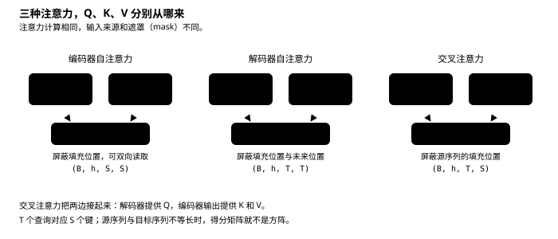
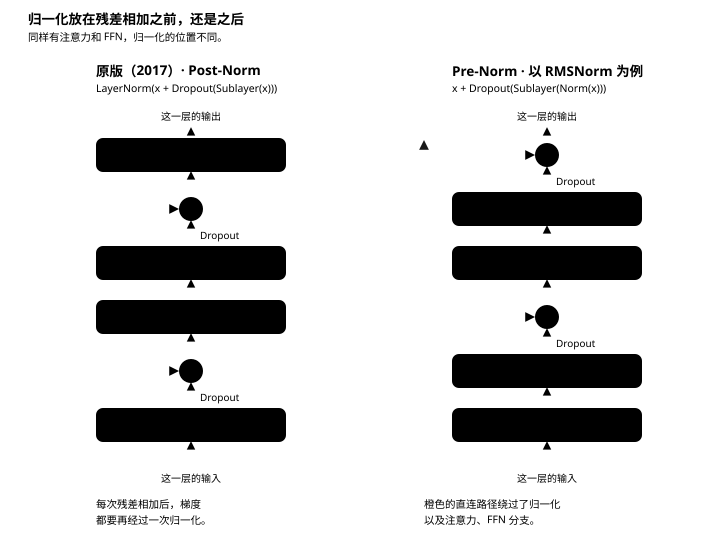
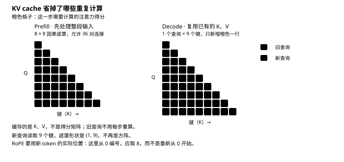

# Transformer 架构

**中文** · [English](transformer.en.md)

> 阅读时间：约 15 分钟 · 难度：入门到进阶 · 最近审阅：2026-10-09
>
> 主线读完就够用。标着 **进阶** 的折叠块是推导和边角情况，跳过不影响理解。

<div class="lesson-recipe advanced">
  <div><span>这次要拆什么</span><strong>把 Transformer 从框图拆回矩阵与 invariant</strong></div>
  <div><span>需要先会</span><strong>矩阵乘 · softmax · residual · causal LM</strong></div>
  <div><span>真正的主角</span><strong>Q/K/V · norm · RoPE · GQA · KV cache</strong></div>
  <div><span>最后要能证明</span><strong>实现满足因果性、位置相对性与 cache 等价性</strong></div>
</div>

<span id="transformer"></span>

## Attention 汇聚上下文，FFN 逐位置变换 {#attention-ffn}

Transformer 就是[上一页](from-linear-to-neural.md)那个「学出来的坐标变换 $\phi$」的一种具体做法：**注意力负责跨位置搬运信息，FFN 负责在单个位置上加工**，两者交替堆叠，最后仍然是一个线性分类器读出答案。

## 两类计算如何配合 {#_1}

- **注意力**：让每个位置根据相关性读取其他位置的信息。
- **FFN**：在每个位置内部独立变换特征。
- **残差连接**：保留原状态，并把每个子层的改动叠加上去。
- **堆叠 N 层**：反复进行跨位置通信与逐位置变换，逐层形成可用于预测的表示。

## 核心公式：缩放点积注意力 {#_2}

$$\text{Attention}(Q, K, V) = \text{softmax}\!\left(\frac{QK^\top}{\sqrt{d_k}}\right)V$$

先把 shape 写全，就不会纠结「为什么一定是 $d_k$」：

$$Q\in\mathbb{R}^{T_q\times d_k},\qquad
K\in\mathbb{R}^{T_k\times d_k},\qquad
V\in\mathbb{R}^{T_k\times d_v}.$$

$QK^\top$ 的每个分数是一个 query 和一个 key 沿 **$d_k$ 个分量**做的点积，
所以标准缩放项按 $\sqrt{d_k}$ 取值；这是尺度设计，不是矩阵乘法的硬性要求。矩阵乘法只要求 $Q$ 与 $K$ 的最后一维相同；
$V$ 只需和 $K$ 有相同的 token 数 $T_k$，它的特征维 $d_v$ 可以不同。标准
multi-head attention 通常为了拼接方便令 $d_v=d_k=d_{\text{model}}/h$，这是常见
设计，不是注意力公式的数学要求。例如 $d_{\text{model}}=768,h=12$ 时，每个头
$d_k=64$，除的是 $\sqrt{64}$，不是 $\sqrt{768}$。

拆开看单个查询 $\mathbf{q}_i$：

$$\alpha_{ij} = \frac{\exp\!\big(\mathbf{q}_i^\top \mathbf{k}_j / \sqrt{d_k}\big)}{\sum_{j'} \exp\!\big(\mathbf{q}_i^\top \mathbf{k}_{j'} / \sqrt{d_k}\big)}, \qquad \mathbf{o}_i = \sum_j \alpha_{ij}\, \mathbf{v}_j$$

也就是：**用相似度当权重，对 value 做加权平均**。$\alpha_{ij}$ 每一行加起来是 1。

### Softmax 不是 argmax，而是可微的分配 {#softmax-argmax}

Softmax 把任意实数分数变成正数且总和为 1 的权重：

$$\operatorname{softmax}(z)_i=\frac{e^{z_i}}{\sum_j e^{z_j}}.$$

例如 $[2,1,0]$ 会变成约 $[0.665,0.245,0.090]$。它不是只留下最高分，而是
允许一个 query 同时读取多个位置。Attention 对 score 矩阵的**最后一维逐行**做
softmax：第 $i$ 行回答「query $i$ 应该把多少权重分给每个 key $j$」。因此

$$A=\operatorname{softmax}_{j}\!\left(\frac{QK^\top}{\sqrt{d_k}}\right),
\qquad O=AV,\qquad \mathbf{o}_i=\sum_j A_{ij}\mathbf{v}_j.$$

一句话：$QK^\top$ 决定**从哪里读**，$AV$ 决定**按什么比例把读到的内容合起来**。

### 为什么要除以 $\sqrt{d_k}$ {#sqrtd_k}

假设 $q$ 和 $k$ 的每个分量独立、均值 0、方差 1，那么

$$\mathbb{E}[\mathbf{q}^\top\mathbf{k}] = 0, \qquad \text{Var}(\mathbf{q}^\top\mathbf{k}) = \sum_{i=1}^{d_k}\text{Var}(q_i k_i) = d_k$$

标准差是 $\sqrt{d_k}$，在 $d_k=64$ 时为 8。更大的分数差容易让 softmax 接近 one-hot，但绝对值大并不够：`[8, 8]` 的权重仍是 `[0.5, 0.5]`。除以 $\sqrt{d_k}$ 在这个简化假设下把方差拉回 1，降低注意力过早饱和的风险。

<details markdown="1">
<summary><b>进阶</b>：接近 one-hot，哪一段梯度会变小？</summary>

softmax 的雅可比是

$$\frac{\partial\, \text{softmax}(z)_i}{\partial z_j} = \alpha_i(\delta_{ij} - \alpha_j)$$

当一个权重趋近 1、其余趋近 0 时，对角元和非对角元都趋近 0。若 value 和上游梯度有界，通过注意力权重传回分数的梯度会很小。注意是“趋近于零”，不是有限分数下一律等于零，更不是整个网络都没有梯度。

Sigmoid 也有 $\sigma'(z)=\sigma(1-\sigma)$ 趋近 0 的现象，但还要看后面接什么 loss。例如 sigmoid 配 binary cross-entropy，对 logit 的梯度是 $\sigma(z)-y$；模型非常自信却答错时，这个梯度并不小。不要把单个算子的导数直接当作最终 loss 的梯度。

</details>

### Python：注意力本体 {#python}

```python
import torch, torch.nn.functional as F

def attention(q, k, v, mask=None):
    """q: (B,H,Tq,dk)  k: (B,H,Tk,dk)  v: (B,H,Tk,dv)"""
    scores = q @ k.transpose(-2, -1) / q.size(-1) ** 0.5   # (B, H, Tq, Tk)
    if mask is not None:
        scores = scores.masked_fill(mask, float("-inf"))
    if torch.isneginf(scores).all(dim=-1).any():
        raise ValueError("Each query must have at least one allowed key")
    attn = scores.softmax(dim=-1)                          # 每行和为 1
    return attn @ v, attn
```

<details markdown="1">
<summary><b>追问</b>：如果 $Q=K$，attention 会变成什么</summary>

此时缩放前的分数矩阵是 Gram matrix $QQ^\top$，因此它对称且半正定。但逐行
softmax 之后一般**不再对称**，因为每一行有自己的归一化分母。

- 所有 query 完全相同：每个点积相同，attention 每行是均匀分布；
- query 两两正交且范数相同：对角分数最大；范数相对 softmax 温度足够大时，
  attention 才接近单位矩阵；
- 一般情况：更像自己的位置会获得更大权重，但并不保证只看自己。

所以 $Q=K$ 并不会让注意力失效；它只是把「两个投影空间的匹配」变成同一个
空间里的相似度。真正决定输出的仍是 row-wise softmax 和 $V$。

</details>

### 三个投影矩阵到底有没有“实际意义” {#_3}

对 self-attention 的输入 $X$，模型学习

$$Q=XW_Q,\qquad K=XW_K,\qquad V=XW_V.$$

你的直觉要分成两层：

- **单个参数值或某一维通常没有固定的人类语义。** 换一个随机种子，坐标轴和
  权重数值可以完全不同，模型仍实现相近功能。
- **三个矩阵承担的计算角色有意义。** $W_Q$ 产生查询，$W_K$ 产生用于匹配的
  key，$W_V$ 决定匹配之后真正传递什么内容。

为什么 Q/K 分开？只看同一序列的 self-attention，并强制 $W_Q=W_K=W$，则

$$S=XWW^\top X^\top$$

是对称的，原始 compatibility score 必须满足 $S_{ij}=S_{ji}$。分开以后

$$S=XW_QW_K^\top X^\top,$$

$W_QW_K^\top$ 不必对称，于是 raw score 可以表达有方向的关系。这里要区分三件事：

1. 对称的是**加 mask 和 softmax 之前的 raw score**；
2. row-wise softmax 的每行分母不同，得到的 attention weight 一般不对称；
3. causal mask 本身也会破坏对称性。

为什么 V 还要分开？Q/K 是寻址接口，V 是读取内容。两个位置可以因为某种特征
匹配，但匹配后需要传递的是另一组特征；$W_V$ 让「为什么找到它」和「从它那里
拿走什么」解耦。数据库类比可以用，但不要把它理解成三套人工命名的语义字段。

更严格地说，这些内部坐标并不唯一。对任意可逆矩阵 $R$，令

$$Q'=QR,\qquad K'=KR^{-\top},$$

仍有 $Q'K'^\top=QK^\top$。也就是说，可以换一套内部基，功能完全不变。因此
孤立地解释某个元素如 $W_Q[17,42]$ 通常没有意义；有意义的是整个投影实现的函数、
它对输出的因果作用，以及 Q/K/V 之间的接口约束。

这份代码用 `True` 表示屏蔽，要求允许位置的分数有限。softmax 前把禁止位置设为 `-inf`；设成 0 仍会分到权重。之后只把权重置零却不重新归一化，也不等价。具体例子见[多头注意力](core/multi-head-attention.md)。

## 同一模块的三种用法：改变 Q/K/V 的来源 {#qkv}

这是原论文（2017）的 encoder-decoder 结构里最该盯住的地方。`self_attn(x, x, x)` 和 `cross_attn(x, memory, memory)` 是同一个类，只是喂进去的三个张量不同：

| 用法 | Q 来自 | K, V 来自 | mask | 注意力形状 |
| --- | --- | --- | --- | --- |
| encoder 自注意力 | src | src | 只挡 padding，**双向** | $(B,h,S,S)$ |
| decoder 自注意力 | tgt | tgt | padding **∨** 因果 | $(B,h,T,T)$ |
| **交叉注意力** | **tgt** | **memory** | 挡 src 的 padding | $(B,h,T,S)$ ← 非方阵 |



交叉注意力是两座塔唯一接触的地方：decoder 每生成一步，就拿当前状态当查询去 encoder 的输出里查一次。

[`code/vanilla_demo.py`](code/vanilla_demo.py) 训练模型把序列反过来，再打印交叉注意力矩阵。下面画的是直观的反向对齐示意，不是注意力必须学成的唯一答案：encoder 的每个位置本身已经混合了上下文，输出正确也不保证某个头呈反对角线。

```
        1  2  3  4  5  6  7  8   <- source (encoder)
  BOS                        @
    1                     @
    2                  @
    3               @
    4            #  :
    5         @
    6      @
    7   @
  ^ decoder step
```

实际效果要看脚本中的独立生成检查，而不是只看这张图。即使一个小批次全部预测正确，也不能说明模型对任意长度或未见分布都能泛化。

## 多头注意力：为什么不是一个大注意力 {#_4}

$$\text{MultiHead}(Q,K,V) = \text{Concat}(\text{head}_1, \ldots, \text{head}_h)W^O, \quad \text{head}_i = \text{Attention}(QW_i^Q, KW_i^K, VW_i^V)$$

上式沿用原论文的接口记号，Q/K/V 指**投影前的三组输入**，self-attention 中都等于 X，不是在本页开头的投影结果上再投影一次。

一个头的所有 value 通道共用一套权重。固定总宽度，切成 $h$ 个头后，可以同时使用多套权重。投影和主要矩阵乘的量级接近单头，但 attention 权重存储及 kernel 开销仍会随实现改变；“总宽度不变”不等于实际耗时完全一样。

实现上不需要 $h$ 组小矩阵：用一个 $(d_{\text{model}}, d_{\text{model}})$ 的投影再 **reshape** 成 $h$ 个头，数学上等价，但只有一次 GEMM。

```python
q = self.w_q(x).view(B, T, h, d_k).transpose(1, 2)   # (B, T, C) -> (B, h, T, d_k)
# ... attention ...
y = out.transpose(1, 2).reshape(B, T, h * d_k)       # 拼回去
```

## 训练稳定性：post-norm 为什么依赖 warmup {#post-norm-warmup}

论文写的是

$$\mathbf{x} \leftarrow \text{LayerNorm}\big(\mathbf{x} + \text{Sublayer}(\mathbf{x})\big)$$

**层归一化在残差加法外面**（post-norm）。很多后来的模型采用 pre-norm：

$$\mathbf{x} \leftarrow \mathbf{x} + \text{Sublayer}\big(\text{Norm}(\mathbf{x})\big)$$



两者改变了梯度路径，不只是书写顺序。[LayerNorm 位置的研究](https://arxiv.org/abs/2002.04745)在特定初始化假设下发现，Post-LN 靠近输出层的期望梯度较大，warmup 能缓和初期更新。原论文使用的 Noam 调度为

$$\text{lr}(t) = d_{\text{model}}^{-0.5} \cdot \min\big(t^{-0.5},\; t \cdot t_{\text{warmup}}^{-1.5}\big)$$

先线性升高，再按步数平方根衰减。不能说“堆到 6 层必炸”或“没有这条调度就无法训练”。Pre-LN 在残差主干保留恒等项，通常更容易训练，但初始化、深度和学习率仍需一起考虑；它也不保证可以取消 warmup。

> 实测提醒：`LambdaLR` 是拿 **base_lr 乘** lambda 的。把 Adam 的 `lr` 设成 0 再挂 Noam 调度，学习率会永远是 0，而 loss 因为 dropout 噪声看起来还在动。这个坑很常见。

## 位置编码从正弦到 RoPE {#rope}

没有位置编码和顺序相关 mask 时，self-attention 对置换是**等变**的：输入调换，输出跟着调换。Causal mask 已经提供前后约束，位置编码则进一步表示位置与距离；不要把整个因果模型说成“一袋词”。

### 原版：固定正弦 {#_5}

$$PE_{(pos,\, 2i)} = \sin\!\left(\frac{pos}{10000^{2i/d}}\right), \qquad PE_{(pos,\, 2i+1)} = \cos\!\left(\frac{pos}{10000^{2i/d}}\right)$$

**加**到 embedding 上（不是拼接）。波长是从 $2\pi$ 到接近 $10000\cdot 2\pi$ 的等比数列，相当于多组不同速度的时钟。对固定偏移 k，$PE_{pos+k}$ 可以由 $PE_{pos}$ 线性变换得到，因此这种编码便于表示相对偏移，但不保证模型一定学会使用它。

### 现在：RoPE {#rope_1}

不加到输入上，而是在**每一层的 $q$ 和 $k$ 上做旋转**。把 $\mathbf{q}$ 的通道两两配对成复数，位置 $m$ 处旋转角 $m\theta_i$：

$$\tilde{\mathbf{q}}_m = R_m \mathbf{q}, \qquad R_m = \begin{pmatrix} \cos m\theta & -\sin m\theta \\ \sin m\theta & \cos m\theta \end{pmatrix} \ \ (\text{每个通道对})$$

固定 q/k 内容与旋转频率时，RoPE 引入的**显式位置因子**只依赖 $n-m$。实际 q/k 还受上下文和 mask 影响，不能因此说整个模型只看距离。常见实现不对 V 施加这一步旋转；V 来自已有上下文表示，仍可能携带位置信息。

<details markdown="1">
<summary><b>进阶</b>：相对性是怎么来的</summary>

旋转矩阵是正交的，且绕同一平面的旋转可以相加：$R_m^\top = R_{-m}$，$R_a R_b = R_{a+b}$。于是

$$\langle R_m\mathbf{q},\; R_n\mathbf{k}\rangle
= \mathbf{q}^\top R_m^\top R_n \mathbf{k}
= \mathbf{q}^\top R_{n-m}\mathbf{k}$$

$m$ 和 $n$ 在这项旋转恒等式里只以差出现，但这不是长上下文泛化保证。更长输入会带来未训练过的相位、距离和注意力分布，还需要专门的长度扩展与评估。

也是为什么不能只旋转 $\mathbf{q}$ 不旋转 $\mathbf{k}$：那样 $R_m^\top$ 没有配对的 $R_n$，绝对位置就消不掉了。

</details>

```python
def apply_rope(x, cos, sin):
    """x: (B, H, T, d)   cos/sin: (T, d/2)"""
    x1, x2 = x.chunk(2, dim=-1)                     # split-half（Llama 约定）
    return torch.cat([x1 * cos - x2 * sin,
                      x1 * sin + x2 * cos], dim=-1)
```

⚠️ 配对方式有两种：split-half（通道 $i$ 配 $i + d/2$，GPT-NeoX/Llama）和交错（原 RoPE 论文）。两者差一个通道置换，**权重不能互换**——转模型时这是经典踩坑点。

## 现代 Decoder-only 还改了什么 {#decoder-only}

这里对照的是本页教学代码采用的一组常见选择，不是所有现代模型的统一配置。

| | vanilla (2017) | 本页 decoder-only 实现 |
| --- | --- | --- |
| 结构 | encoder + decoder | 只有 decoder |
| 归一化 | post-norm LayerNorm | pre-norm RMSNorm |
| 位置 | 正弦，加在输入上 | RoPE，每层在 q/k 上旋转 |
| 注意力 | MHA（$h$ 个头各有 K/V） | GQA（K/V 头更少） |
| FFN | ReLU，$4d$ | SwiGLU，$\tfrac{8}{3}d$ |
| 推理 | 自回归，可缓存 self/cross-attention 的 K/V | 预分配 KV cache |

**RMSNorm** 去掉了减均值那一步，也没有偏置：

$$\text{RMSNorm}(\mathbf{x}) = \frac{\mathbf{x}}{\sqrt{\frac{1}{d}\sum_i x_i^2 + \epsilon}} \odot \boldsymbol{\gamma}$$

它不计算中心化方差，实际提速取决于 kernel 和硬件，质量也需要验证。这里的代码用 fp32 算平方均值，再转回激活 dtype，以减少低精度归约误差；平方均值不是方差。

**SwiGLU** 用门控换掉 ReLU：

$$\text{SwiGLU}(\mathbf{x}) = \big(\text{SiLU}(\mathbf{x}W_g) \odot \mathbf{x}W_u\big)W_d, \qquad \text{SiLU}(z) = z\cdot\sigma(z)$$

这里 x 是行向量，$W_g,W_u\in\mathbb R^{d\times h}$，$W_d\in\mathbb R^{h\times d}$。三个矩阵约有 3dh 个参数；取 $h=\frac83d$ 时，与两矩阵、隐藏宽度 4d 的 FFN 同为约 8d² 个参数。实际实现还会按硬件要求取整。

**GQA** 让每组 $n_{\text{rep}}$ 个查询头共享一组 K/V 头。单条序列、所有层均使用同一配置时，原始 KV cache 的字节数是

$$2 \cdot n_{\text{layer}} \cdot n_{\text{kv}} \cdot d_{\text{head}} \cdot T \cdot \text{sizeof(dtype)}$$

其他条件不变，把 $n_{\text{kv}}$ 从 32 降到 8，会把 **KV cache 本体**缩到原来的四分之一，不是整个模型的显存或延迟都缩小四倍。完整例子见 [KV cache 与推理成本](deep-dives/kv-cache-and-inference.md)。

## 动手：从零实现，并检查常见错误 {#_6}

[`code/`](code/) 里两版实现都不调 `nn.MultiheadAttention` 和 `F.scaled_dot_product_attention`，只用 `nn.Linear` 和裸张量运算：

- [`vanilla.py`](code/vanilla.py) —— 2017 原版 encoder-decoder，含 Noam 调度和标签平滑
- [`model.py`](code/model.py) —— 现代 decoder-only（RMSNorm + RoPE + GQA + SwiGLU + KV cache）

从零实现最容易错的四个地方，[`test_model.py`](code/test_model.py) 逐个验证：

```
  因果性：      改第 9 个 token，前 8 个位置 logits 差 0.0（严格 0）
  KV cache：    增量解码 vs 一次性前向，max 误差 3.6e-07
  RoPE 相对性： score(5,2) = score(20,17) = +5.6092，score(20,10) = +0.4579
  初始 loss：   4.19  vs  ln(V) = 4.16
```



带 cache 时最容易出错的是 mask：query 的绝对位置是 `cache.pos + i`，key 从 0 数到 `cache.pos + T - 1`，已有前缀时 mask 是非方阵 $(T,S)$；RoPE 也要从 `cache.pos` 切片。本实现中 `cache.pos` 每次模型前向只推进一次，在整个层循环之后。等价性检查还要求同一参数、前缀、位置和可见范围，关闭 dropout；不能拿改过权重或被截断的 cache 与完整前向直接比较。

来源：[原版 Transformer](https://arxiv.org/abs/1706.03762)、[RoFormer](https://arxiv.org/abs/2104.09864)、[RMSNorm](https://arxiv.org/abs/1910.07467)、[GLU variants](https://arxiv.org/abs/2002.05202)。

## 自检 {#_7}

<div class="taste-check advanced">
  <strong>完成这一章后，至少要能解释四个关键问题：</strong>
  <ol>
    <li>为什么 attention score 要除以 $\sqrt{d_k}$？</li>
    <li>pre-norm 改变了哪条梯度高速路？</li>
    <li>RoPE 的相对性为什么要求同时旋转 Q 和 K？</li>
    <li>怎样证明 KV cache 是正确实现，而不是只让生成结果“看起来没坏”？</li>
  </ol>
</div>

## 继续阅读 {#_8}

- [从线性模型到神经网络](from-linear-to-neural.md) —— 为什么最后一层永远是线性分类器
- [Post-Training](../05-post-training/) —— 这些参数后来怎么被继续改
- [系统总览](../06-systems/) —— 它在整套系统里的位置

## 快速学习：Transformer 到底做了什么 {#transformer_1}

<details class="interview" markdown="1">
<summary>先记主线，再展开标准回答与 deep dive</summary>

**快速记忆**

- Attention：token 之间交换信息。
- FFN：每个 token 独立做非线性变换。
- Residual + Norm：让两类计算可以稳定堆深。
- Position information：让模型知道顺序与相对距离。

**面试回答**

> Transformer block 交替执行 token mixing 和 channel mixing。Self-attention 根据 QK 相似度在序列位置间汇总 V；FFN 对每个位置独立地扩维、激活再压回。Residual path 保留旧表示并提供梯度通路，Norm 控制子层输入尺度，位置编码补上 attention 本身缺失的顺序信息。

<details markdown="1">
<summary><b>深挖</b>：为什么最后是 linear head，整个模型却不是 linear？</summary>

Attention 权重依赖输入：

$$
A(X)=\operatorname{softmax}\left(\frac{XW_Q(XW_K)^\top}{\sqrt{d_k}}\right).
$$

因此 $A(X)XW_V$ 已经是输入相关的非线性映射；FFN activation 又增加一层非线性。最终 linear head 只负责从学好的 hidden state 中读出 logits，不会把前面几十层重新变成线性模型。

</details>

</details>

## 参考论文 {#_9}

- [Attention Is All You Need](https://arxiv.org/abs/1706.03762) — 原版
- [On Layer Normalization in the Transformer Architecture](https://arxiv.org/abs/2002.04745) — pre-norm 为什么能去掉 warmup
- [RoFormer](https://arxiv.org/abs/2104.09864) — RoPE
- [GQA](https://arxiv.org/abs/2305.13245) — 分组查询注意力
- [GLU Variants Improve Transformer](https://arxiv.org/abs/2002.05202) — SwiGLU
