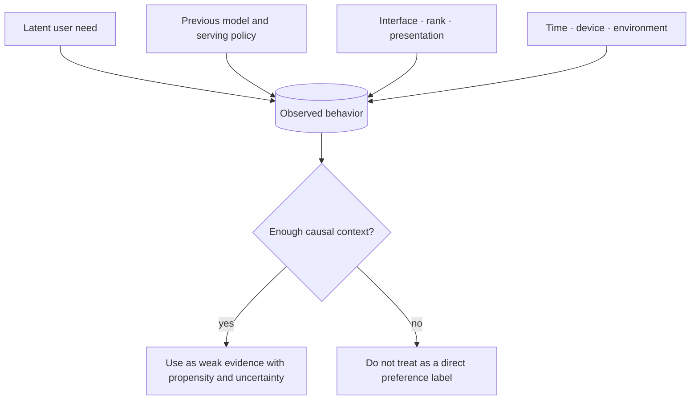

# Data and Feedback: What Is the Model Actually Learning From?

[中文](README.md) · **English**

## Start here: logs are not user intent

Training data is not the world itself. It is the trace left after the world passes through an existing policy, product interface, and logging system.

## A simple example

If a recommender only exposes pop music, a user's pop clicks do not prove that the user only likes pop. The policy first limits the choice set and then uses behavior inside that set as evidence. This is exposure or policy bias.

## Common problems

- **Sparsity:** missing feedback has many possible meanings.
- **Delay:** value may only become visible days or sessions later.
- **Policy bias:** the system only observes feedback on what it chose to expose.
- **Missing longitudinal structure:** isolated events hide how intent changes over time.
- **Ambiguous labels:** dwell, clicks, and likes rarely identify one clean preference.

## Better data design

A useful data contract records the event, the policy that produced exposure, timing, evidence strength, intended training objective, and enough versioned context to reproduce the example.

More rows do not always mean more information. A small number of contextualized corrections may teach more than millions of correlated clicks.

## Connections

- [Representation and memory](../02-memory/README.en.md) turn observations into persistent state.
- [Search](../04-search/README.en.md) determines which future observations are possible.
- [Post-training](../05-post-training/README.en.md) turns feedback into behavior updates.
- [Evaluation](../07-evaluation/README.en.md) tests whether the model learned the target or the bias.
