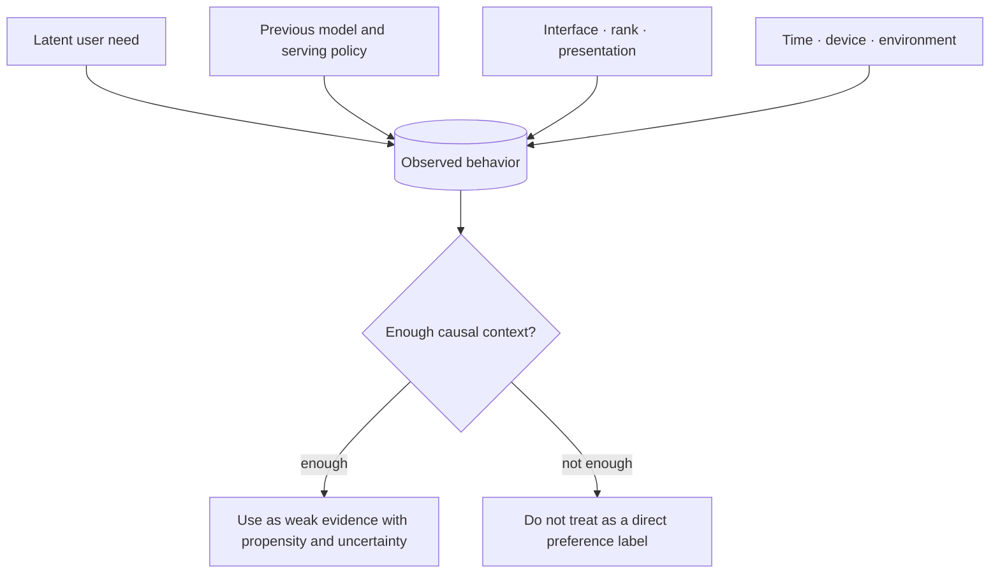

# Data and Feedback: What Is the Model Actually Learning From?

[中文](README.md) · **English**

## Start here: logs are not user intent

The data a model sees is not the world itself. It is **the trace the world leaves after passing through an existing system, a product interface, and logging rules**.

This matters because we routinely mistake “what happened in the logs” for “what the user actually wanted.”

## Start with one click

Suppose a recommender has never shown you jazz, only pop.

You click a few pop songs. The log will say:

```text
user saw pop songs → user clicked pop songs
```

But it cannot prove:

```text
user only likes pop
```

Jazz never entered your choice set. The system first decided what you could see, and then used your clicks to prove that its own decision was right. This is the familiar **policy bias / exposure bias**.

## What one log entry actually mixes together

A click, a dwell, or a reply is usually shaped by all of these at once:



So data is not a clean label. It is the joint product of several mechanisms.

## The five most common problems

### 1. Sparsity

Most people do not explicitly like or explain every result. Missing feedback may mean dislike, but it may also mean the user never saw the result, had no time, lost the connection, or already got the answer from the title.

### 2. Delay

Some outcomes show no value in the moment. A search may only help the user finish a task days later, and a piece of advice may need long-term use before anyone knows whether it fit.

### 3. Policy bias

The system only receives feedback on what it chose to show. The more it relies on old logs, the more likely it is to repeat the blind spots of the old policy.

### 4. Missing longitudinal structure

A single click is easy to record; a change in long-term goals is not. What Personal AGI really needs is “how this person is changing,” not just many disconnected events.

### 5. Ambiguous labels

A long dwell may mean the content was valuable, or that it was hard to understand. A like may be for the opinion, the author, the image, or simply a polite response.

## What better data design looks like

A good data system does not just store more fields. It spells out the semantics of each observation:

- **What happened:** what did the user, the model, the tools, and the environment each do?
- **Why it was visible:** which retrieval, ranking, or product policy produced the exposure?
- **When the feedback occurred:** was it an immediate reaction or a delayed outcome?
- **How strong the evidence is:** an explicit correction usually carries more information than one swipe.
- **Which objective this record can support:** SFT, preference learning, RL, or evaluation only?
- **How to reproduce it:** which model, prompt, candidate set, feature, and data versions were used?

## More data is not more information

A million highly correlated clicks may be worth less than a hundred interactions that carry explicit context and a reason for the correction.

What matters is whether the data adds new information about the goal, the user, or the environment, not whether it adds rows.

## How it connects to other topics

- [Representation and memory](../02-memory/README.en.md) decides how this data becomes long-term state.
- [Search](../04-search/README.en.md) decides which new observations the system will generate.
- [Post-Training](../05-post-training/README.en.md) decides how this feedback changes model behavior.
- [Evaluation](../07-evaluation/README.en.md) checks whether the model merely learned the bias in the data.
- [Human-in-the-Loop](../06-systems/human-in-the-loop.en.md) can provide fewer but clearer correction signals.

## The questions I now ask first

When I get a dataset, I do not start by asking how many rows it has. I ask:

1. Which policy produced this data?
2. Which people, content, or failures never had a chance to be recorded?
3. How far is the observed signal from the real objective?
4. Does it have temporal order and context?
5. If a model optimizes this signal, which loophole is it most likely to exploit?
