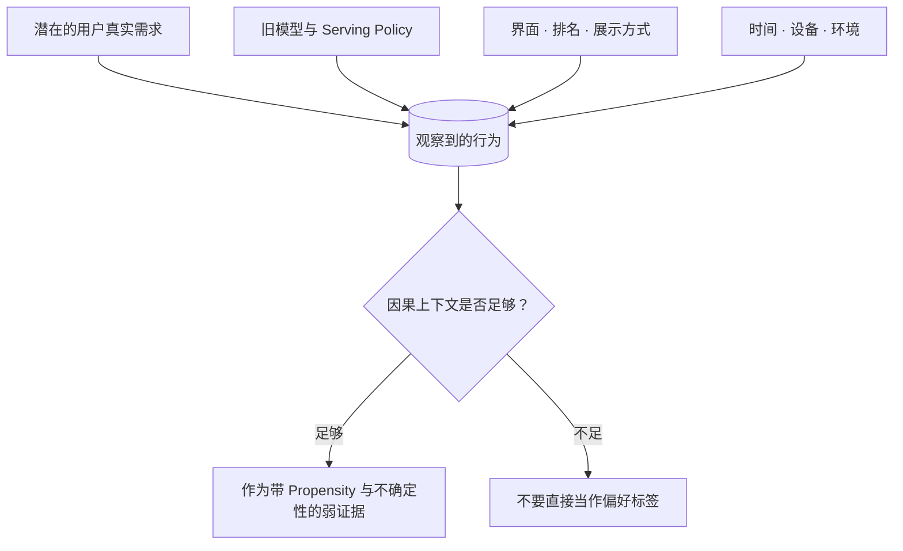

# 数据与反馈：模型到底在从什么里学习？

**中文** · [English](README.en.md)

先从一个简单例子看起：日志里记下的行为，能告诉我们多少用户偏好？然后再读[反馈怎么变成训练目标](feedback-to-objectives.md)，看看没有反馈和负反馈怎么区分，哪些信号值得用来训练。

## 日志记录了行为，不是全部意图

训练日志记录的是**用户在当时的选项、界面和曝光条件下做了什么**。它能提供线索，但不是用户全部的想法和偏好。

这件事很重要，因为我们经常把“日志里发生了什么”误当成“用户真正想要什么”。

## 从一次点击说起

假设一个推荐系统从来没有给你展示过爵士乐，只展示流行音乐。

你点击了几首流行歌。日志里会写：

```text
用户看到了流行歌 → 用户点击了流行歌
```

但它不能证明：

```text
用户只喜欢流行歌
```

因为你根本没机会看到爵士乐。系统先决定展示什么，日志就只能记录这些选项上的反应。这里说的 **策略偏差（policy bias）和曝光偏差（exposure bias）**，指的就是这种影响。

## 一条日志实际上混合了什么

一次点击、停留或回复，往往同时受到这些因素影响：



所以，一个行为标签里往往混着好几种影响，不能直接等同于用户偏好。

## 五个最常见的问题

### 1. 稀疏

大部分人不会对每个结果都明确点赞或解释。没有反馈，可能是不喜欢，也可能是没看到、没时间、网络断了，或者已经从标题得到答案。

### 2. 延迟

有些结果当下看不出价值。一次搜索可能几天后才帮助用户完成任务，一条建议也可能要长期使用后才知道是否合适。

### 3. 策略偏置

系统只会收到自己选择展示内容的反馈。越依赖旧日志，越可能重复旧策略的盲区。

### 4. 只有零散记录，看不到长期变化

记下一次点击很容易，把不同时刻的行为连起来却不容易。如果想做一个长期帮助用户的助手，就得知道需求怎样变化，而不只是保存一堆互不相连的记录。

### 5. 标签含义不清

一次长停留可能表示内容有价值，也可能表示内容难懂。一个点赞可能喜欢观点、作者、图片，甚至只是礼貌回应。

## 什么是更好的数据设计

设计数据时，除了多存一些字段，更重要的是让后来使用数据的人知道这条记录是什么意思：

- **发生了什么**：用户、模型、工具和环境分别做了什么？
- **为什么能看到它**：是哪一个检索、排序或产品策略产生了曝光？
- **反馈何时发生**：是即时反应，还是延迟结果？
- **证据有多强**：明确纠正通常比一次滑动更有信息量。
- **这条数据能支持什么目标**：用于 SFT、偏好学习、RL，还是只适合评估？
- **怎样复现**：当时用了哪个模型、提示词、候选集、特征和数据版本？

## 数据多不等于信息多

一百万次高度相关的点击，可能不如一百次带有明确上下文和纠正原因的交互有价值。

真正要看的是：数据是否增加了关于目标、用户或环境的新信息，而不只是增加行数。

## 接着可以看什么

- [表征与记忆](../02-memory/) 决定这些数据怎样变成长期状态。
- [搜索与检索](../04-search/)影响用户会看到什么，也影响我们能收到什么反馈。
- [后训练](../05-post-training/)讲这些反馈怎样用来调整模型。
- [评估](../07-evaluation/)检查模型学到的是有用的信息，还是数据里的偏差。
- [人工参与](../06-systems/human-in-the-loop.md)介绍怎样收集更明确的纠正意见。

## 我现在会先问的问题

拿到一个数据集时，我不会先问有多少行，而会先问：

1. 这条数据是被什么策略产生的？
2. 哪些人、内容或失败没有机会被记录？
3. 观察到的信号距离真实目标有多远？
4. 它有没有时间顺序和上下文？
5. 如果模型优化这个信号，最可能钻什么空子？
