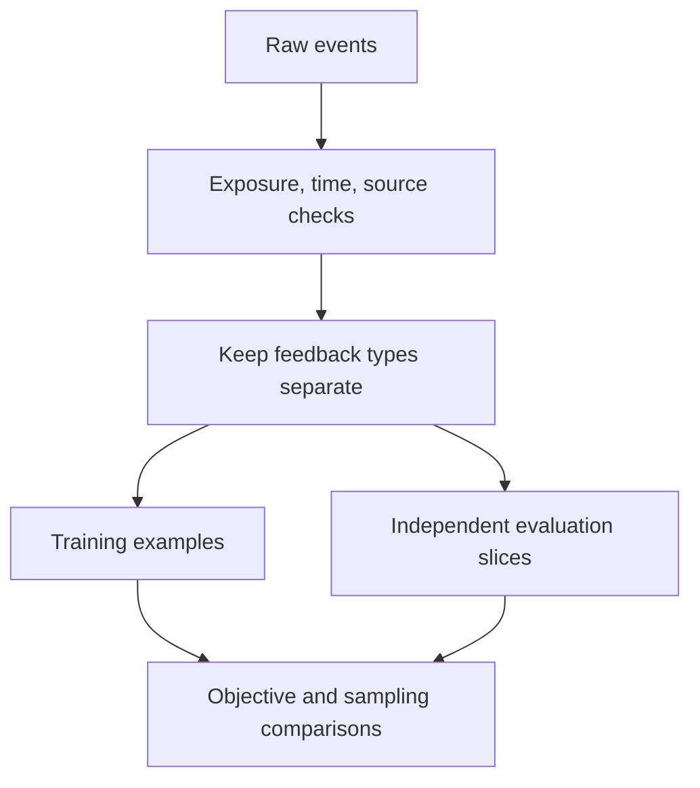

# From feedback to objectives: no click is not a dislike

[中文](feedback-to-objectives.md) · **English**

You receive a click log to train a recommender. Marking clicks as 1 and everything else as 0 is convenient, but “everything else” mixes unshown items, unnoticed impressions, disinterest, and bad timing.

**Before picking a loss, decide what the observation actually supports.** All examples here are synthetic, not company data.

## Separate different kinds of absence

| Observation | What it supports | What it doesn't establish |
| --- | --- | --- |
| No exposure record | No observed encounter | The user rejected the item |
| Shown, not clicked | No click in this position and context | The item is always irrelevant |
| Clicked, then left | The click did not lead to sustained reading | Necessarily poor quality; the answer may already have been found |
| Saved or explicitly endorsed | A more specific positive signal | That it is interchangeable with a click |

Let $x$ be user context, $i$ a candidate, $E$ exposure, and $C$ a click. If clicking requires exposure:

$$
P(C=1\mid x,i)=P(E=1\mid x,i)\,P(C=1\mid E=1,x,i).
$$

Observed clicks depend on both users and the system's exposure choices. Existing logs may not let us separate them. [Recommendations as Treatments](https://arxiv.org/abs/1602.05352) develops propensity-based approaches to selection bias in learning and evaluation; adding weights is not a general guarantee that bias disappears.

## Work through it: more clicks need not mean stronger preference

Consider two article categories with 100 potential exposure opportunities each. To keep the calculation simple, assume random exposure within each category, identical positions, and complete feedback. Click counts below are expected counts.

| Category | Exposure probability | Exposures | Click probability given exposure | Clicks |
| --- | --- | --- | --- | --- |
| A: popular topic | 0.9 | 90 | 0.2 | 18 |
| B: niche topic | 0.1 | 10 | 0.6 | 6 |

A has three times as many clicks as B, but their conditional click rates are 20% and 60%. Under equal exposure, the mean click probability is $(0.2+0.6)/2=0.4$; the observed log has $24/100=0.24$. Users and content did not change. What changed was the opportunity to appear.

This still measures clicks, not satisfaction. Even with equal opportunities, an appealing headline need not indicate valuable content.

## Why does inverse propensity weighting help, and when does it fail?

Let $E_j$ indicate whether opportunity $j$ is observed, $Y_j$ its feedback under the specified exposure conditions, and $e_j$ its observation probability. Inverse propensity weighting (IPW) lets a rarely observed example represent more similar opportunities.

$$
\hat\mu_{\mathrm{IPW}}=\frac{1}{N}\sum_{j=1}^{N}\frac{E_jY_j}{e_j}.
$$

Here $N$ is the number of target opportunities, not the number of observed exposure rows. In the example, $(18/0.9+6/0.1)/200=0.4$. This relates to off-policy evaluation with target-to-logging-policy probability ratios, but the data convention differs; do not copy denominators between them.

```python
opportunities = 200
clicks_and_propensities = [(18, 0.9), (6, 0.1)]
estimate = sum(clicks / propensity for clicks, propensity in clicks_and_propensities) / opportunities
clipped = sum(clicks / max(propensity, 0.25)
              for clicks, propensity in clicks_and_propensities) / opportunities
assert abs(estimate - 0.4) < 1e-12
assert abs(clipped - 0.22) < 1e-12
```

Why can this work? Under ignorable selection, conditional on recorded context and potential feedback, $\mathbb E[E_jY_j/e_j]=Y_j$. This requires sufficient recorded selection variables, correct propensities, consistent outcomes, and nonzero observation probability across the target population.

- **Never exposed:** with $e_j=0$, division cannot reveal the response. You need additional data.
- **Rare exposure:** one example can receive an enormous weight and drive high variance.
- **Clipping:** the code floors propensities at 0.25, reducing extreme weights but changing the estimate to 0.22. Stability trades against bias; report both concerns.
- **Missing selection variables:** a plausible estimated propensity does not guarantee correction of unobserved bias.

“Used IPW” does not mean “removed bias.” When its conditions are unavailable, explaining the data gap is often more useful than forcing an estimator onto it.

## Make labels a checkable contract

Suppose the goal is learning which technical articles people want to finish. Specify at least:

- **Unit:** one user–item encounter, or a week's aggregated behavior?
- **Observation window:** when is feedback complete enough to label? Don't call an unfinished window negative.
- **Negative source:** explicit rejection, exposed-but-unclicked, and random samples carry different evidence.
- **Missingness:** absent exposure or duration must remain distinguishable from zero.
- **Split boundary:** use only information available before prediction; prevent inappropriate user or session leakage.



## Multiple signals are not just an OR

When behaviors differ greatly in frequency, combining them into one positive label can let the common behavior dominate. One option is a shared encoder with separate prediction tasks:

$$
L=\lambda_r L_{\mathrm{retrieval}}+\sum_t\lambda_t L_t.
$$

This is a design to test, not a conclusion. Sparse tasks may learn poorly, and objectives can conflict. Inspect coverage, loss scales, and gradient effects; weights need validation rather than arbitrary values in an architecture diagram.

A sampled contrastive negative is also a training construction. It asks the model to distinguish positives within a candidate set, not proves that every unlabeled candidate is irrelevant. A hard negative is difficult for the current model; it isn't necessarily a verified negative.

## What happens to missing labels in multi-task training?

Suppose examples can have click, save, and explicit-rejection labels. Some exposures have confirmed absence of a save; other logging paths never collected save events. The latter should not silently become zero.

Let $m_{it}\in\{0,1\}$ indicate whether example $i$ has a usable label for task $t$. One task-normalized design is:

$$
L_t=\frac{\sum_i m_{it}\,\ell(\hat y_{it},y_{it})}{\sum_i m_{it}},\qquad \sum_i m_{it}>0.
$$

Skip a task when the batch has no labels for it. In distributed training, aggregate numerators and valid counts as intended. Per-task normalization prevents missing labels alone from diluting that task, but does not automatically balance gradients. Task weights, noise, and interference still need inspection.

Test two otherwise identical examples: one has an unknown save label; the other has a confirmed non-save. Only the second provides negative save supervision. Likewise, scrolling away is not always explicit rejection: some interfaces use scrolling simply to continue browsing.

## A runnable check

This checks a data convention, not true preferences.

```python
events = [
    {"item": "alpha", "exposed": True, "clicked": True},
    {"item": "beta", "exposed": True, "clicked": False},
    {"item": "gamma", "exposed": False, "clicked": False},
]

def observed_label(event):
    if not event["exposed"]:
        return None
    return int(event["clicked"])

assert [observed_label(event) for event in events] == [1, 0, None]
```

Zero means exposed-but-unclicked, not disliked. Treating it as a negative requires an explicit approximation and scope.

## Test whether the signal helps

Hold the model, candidate set, and compute budget fixed when changing labels or sampling. Then hold data fixed when testing architecture. Otherwise attribution becomes difficult. Evaluate overall and predefined subgroup behavior, with a human or behavioral reference not scored by the training teacher alone.

If scores don't move, inspect coverage of the intended population and whether the metric can detect the improvement before buying a larger model. One failed experiment neither disproves the signal nor proves that scale will rescue it.

Another common mistake is declaring a new signal useless because it helps a small population without moving the overall score. The opposite mistake is selecting one winning slice afterward and declaring success. Specify the target population, primary metric, and regression guardrails before testing on independent data. Then distinguish a signal that never reached the intended examples from one that reached them but did not help.

Continue with [dual-encoder objectives](../04-search/dual-encoder.en.md) to see false negatives turn into gradients, or [metric robustness](../07-evaluation/metric-robustness.en.md) to calculate how averages conceal regressions.
