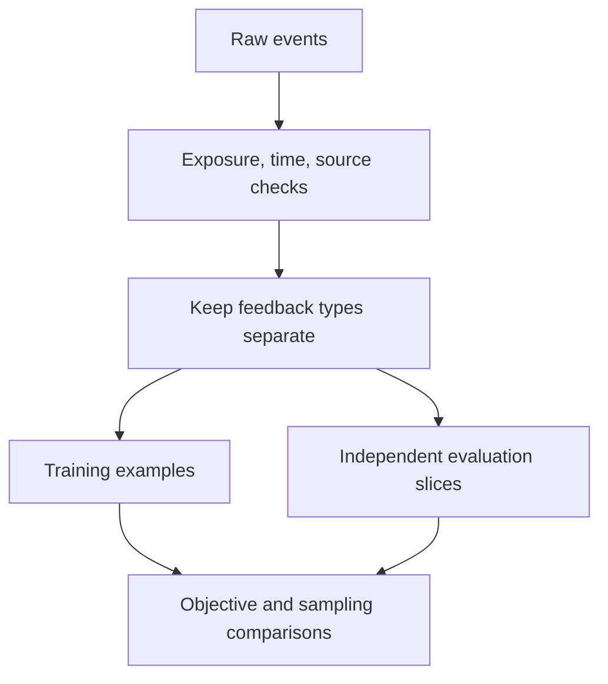

# From feedback to objectives: no click is not a dislike

[中文](feedback-to-objectives.md) · **English**

You receive a click log to train a recommender. Marking clicks as 1 and everything else as 0 is convenient, but “everything else” mixes unshown items, unnoticed impressions, disinterest, and bad timing.

**Before picking a loss, decide what the observation actually supports.** All examples here are synthetic, not company data.

## Separate different kinds of absence

| Observation | What it supports | What it doesn't establish |
| --- | --- | --- |
| No exposure record | No observed encounter | The user rejected the item |
| Shown, not clicked | No click in this position and context | The item is always irrelevant |
| Clicked, then left | The click did not lead to sustained reading | Necessarily poor quality; the answer may already have been found |
| Saved or explicitly endorsed | A more specific positive signal | That it is interchangeable with a click |

Let $x$ be user context, $i$ a candidate, $E$ exposure, and $C$ a click. If clicking requires exposure:

$$
P(C=1\mid x,i)=P(E=1\mid x,i)\,P(C=1\mid E=1,x,i).
$$

Observed clicks depend on both users and the system's exposure choices. Existing logs may not let us separate them. [Recommendations as Treatments](https://arxiv.org/abs/1602.05352) develops propensity-based approaches to selection bias in learning and evaluation; adding weights is not a general guarantee that bias disappears.

## Make labels a checkable contract

Suppose the goal is learning which technical articles people want to finish. Specify at least:

- **Unit:** one user–item encounter, or a week's aggregated behavior?
- **Observation window:** when is feedback complete enough to label? Don't call an unfinished window negative.
- **Negative source:** explicit rejection, exposed-but-unclicked, and random samples carry different evidence.
- **Missingness:** absent exposure or duration must remain distinguishable from zero.
- **Split boundary:** use only information available before prediction; prevent inappropriate user or session leakage.



## Multiple signals are not just an OR

When behaviors differ greatly in frequency, combining them into one positive label can let the common behavior dominate. One option is a shared encoder with separate prediction tasks:

$$
L=\lambda_r L_{\mathrm{retrieval}}+\sum_t\lambda_t L_t.
$$

This is a design to test, not a conclusion. Sparse tasks may learn poorly, and objectives can conflict. Inspect coverage, loss scales, and gradient effects; weights need validation rather than arbitrary values in an architecture diagram.

A sampled contrastive negative is also a training construction. It asks the model to distinguish positives within a candidate set, not proves that every unlabeled candidate is irrelevant. A hard negative is difficult for the current model; it isn't necessarily a verified negative.

## A runnable check

This checks a data convention, not true preferences.

```python
events = [
    {"item": "alpha", "exposed": True, "clicked": True},
    {"item": "beta", "exposed": True, "clicked": False},
    {"item": "gamma", "exposed": False, "clicked": False},
]

def observed_label(event):
    if not event["exposed"]:
        return None
    return int(event["clicked"])

assert [observed_label(event) for event in events] == [1, 0, None]
```

Zero means exposed-but-unclicked, not disliked. Treating it as a negative requires an explicit approximation and scope.

## Test whether the signal helps

Hold the model, candidate set, and compute budget fixed when changing labels or sampling. Then hold data fixed when testing architecture. Otherwise attribution becomes difficult. Evaluate overall and predefined subgroup behavior, with a human or behavioral reference not scored by the training teacher alone.

If scores don't move, inspect coverage of the intended population and whether the metric can detect the improvement before buying a larger model. One failed experiment neither disproves the signal nor proves that scale will rescue it.

Next: [Controlled comparisons and slices](../07-evaluation/ablation-and-slices.en.md).
