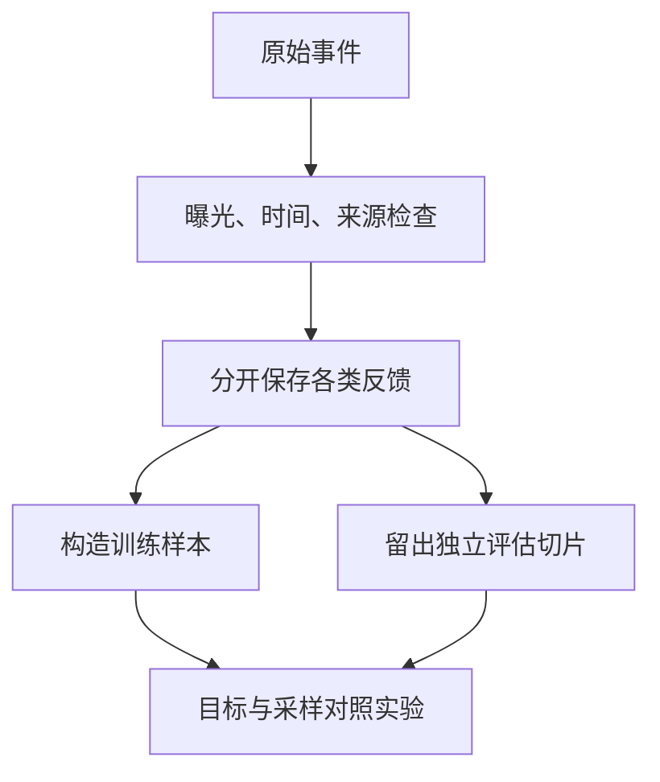

# 从反馈到训练目标：没点，不等于不喜欢

**中文** · [English](feedback-to-objectives.en.md)

你准备训练一个推荐模型，拿到一张点击日志。最省事的做法是把点击记作 1，其他全记作 0。但“其他”里面混着完全不同的情况：没展示、展示了没看见、看见了不感兴趣，还有当时没空。

**先别急着选损失函数，弄清一条反馈到底能说明什么。**下面都是教学例子，不对应任何公司的数据。

## 先把没发生的事分开

| 观察 | 可以说什么 | 还不能说什么 |
| --- | --- | --- |
| 没有曝光记录 | 没有观察到这次接触 | 用户拒绝了内容 |
| 展示后没有点击 | 在这个位置和时间，没有点击 | 内容永远不相关 |
| 点击后立刻离开 | 点击没有转化为持续阅读 | 一定是低质量；也可能已经找到答案 |
| 收藏或明确反馈 | 出现了一种更具体的正向信号 | 它可以和点击不加区分地合并 |

记用户上下文为 $x$，候选为 $i$，曝光为 $E$，点击为 $C$。如果点击必须经过曝光：

$$
P(C=1\mid x,i)=P(E=1\mid x,i)\,P(C=1\mid E=1,x,i).
$$

所以观察到的点击率既和用户有关，也和系统给什么内容曝光有关。我们未必能从现有日志里把两者分开。关于选择偏差和基于 propensity 的学习、评估方法，可以接着读 [Recommendations as Treatments](https://arxiv.org/abs/1602.05352)；这不意味着给数据加权就能自动去掉所有偏差。

## 算一次：点击更多，未必更受欢迎

假设有两类文章，各有 100 次潜在展示机会。为了能手算，先假设每类内部随机曝光，曝光位置相同，反馈完整；表中点击数按期望值填写。

| 文章类别 | 展示概率 | 展示次数 | 展示后的点击概率 | 点击次数 |
| --- | --- | --- | --- | --- |
| A：热门主题 | 0.9 | 90 | 0.2 | 18 |
| B：小众主题 | 0.1 | 10 | 0.6 | 6 |

按点击总数，A 是 B 的三倍。但条件点击率是 20% 和 60%。两类都同等展示时，平均点击概率是 $(0.2+0.6)/2=0.4$；现有日志里只有 $24/100=0.24$。我们没有换用户，也没有换内容，只换了“哪些内容有机会出现”。

这仍然只是点击，不是满意度。即使展示机会一样，标题吸引力和内容价值也未必一样。

## 逆概率加权为什么有用，又在哪里失效？

令 $E_j$ 表示第 $j$ 个机会是否被观察，$Y_j$ 是它在约定曝光条件下的反馈，$e_j$ 是被观察的概率。逆概率加权（inverse propensity weighting, IPW）的直觉是：不容易被看见的样本，在估计中多代表几个类似机会。

$$
\hat\mu_{\mathrm{IPW}}=\frac{1}{N}\sum_{j=1}^{N}\frac{E_jY_j}{e_j}.
$$

这里的 $N$ 是目标机会数，不是观察到的曝光行数。在刚才的例子里，$(18/0.9+6/0.1)/200=0.4$。这和用新策略概率除以旧策略概率的离线策略评估有关，但不是同一个数据约定，不能直接照抄分母。

```python
opportunities = 200
clicks_and_propensities = [(18, 0.9), (6, 0.1)]
estimate = sum(clicks / propensity for clicks, propensity in clicks_and_propensities) / opportunities
clipped = sum(clicks / max(propensity, 0.25)
              for clicks, propensity in clicks_and_propensities) / opportunities
assert abs(estimate - 0.4) < 1e-12
assert abs(clipped - 0.22) < 1e-12
```

为什么公式可能成立？在可忽略选择的条件下，给定已记录的上下文和潜在反馈，$\mathbb E[E_jY_j/e_j]=Y_j$。但这需要被记录的条件足以解释选择、概率正确、反馈含义一致，而且目标人群的曝光概率不能为零。

- **从未展示过**：$e_j=0$ 时，没有办法靠除法知道反馈。需要新的数据，而不是更大的权重。
- **展示概率很小**：一条样本就可能带很大权重，估计方差会很高。
- **截断权重**：代码把小概率抬到 0.25，降低了极端权重，却也把估计改成 0.22。稳定性和偏差之间有取舍，不能只报告更好看的方差。
- **少记了影响选择的变量**：补一个看似合理的概率，也不能保证修正未观察到的偏差。

所以“使用了 IPW”不是“消除了偏差”的同义词。若没有这些条件，先把数据缺口说清楚，往往比硬套估计器更有用。

## 先约定标签到底是什么意思

假设我们要学习“愿意读完的技术文章”。至少写清这几件事：

- **样本单位**：一次用户与内容的接触，还是把一周的行为合成一个样本？
- **观察窗口**：多久后才能决定有没有反馈？窗口未结束的不急着记负例。
- **负例来源**：明确拒绝、曝光未点击、随机采样分别记录，别混成一种证据。
- **缺失值**：没记录曝光、没记录时长，要能和 0 区分。
- **切分边界**：训练只能使用预测发生之前的信息，用户或会话不能随意泄漏到测试集。



## 多信号，不是简单做一个 OR

假设几种行为的数量差很多。如果只要发生其中一种，就统一记为正例，样本最多的那种行为可能主导训练。一种可选方案是共享编码器，但分别预测每类行为：

$$
L=\lambda_r L_{\mathrm{retrieval}}+\sum_t\lambda_t L_t.
$$

这只是一个待验证的方案。样本少的任务可能学不好，不同目标也可能互相干扰。要分别检查样本覆盖、损失的量级和梯度影响；各项权重需要通过实验选择，不能随手定一个比例就算解决了。

对比学习中，采样得到的负样本只是被训练过程当作对照，不保证它们真的不相关。困难负样本强调的是“当前模型不容易区分”，也不等于已经由人工确认不相关。

## 多任务里，没记录的标签怎么算？

假设每个样本可能有点击、收藏、明确拒绝三个标签。有些曝光可以确认没有收藏，另一些日志根本没有接收藏事件。后者不该自动记成 0。

用 $m_{it}\in\{0,1\}$ 表示第 $i$ 个样本的任务 $t$ 是否有可靠标签，一种按任务归一化的设计是：

$$
L_t=\frac{\sum_i m_{it}\,\ell(\hat y_{it},y_{it})}{\sum_i m_{it}},\qquad \sum_i m_{it}>0.
$$

没有标签的任务在这一批跳过；分布式训练还要保证分子和有效计数按预期汇总。每个任务除以自己的有效数量，可以避免它仅因缺标签而被稀释，但不等于不同任务的梯度自动平衡。还要检查任务权重、噪声和冲突。

拿两条完全相同的样本做测试：一条收藏标签未知，一条确认没有收藏。前者不产生收藏监督，后者才产生对应的负向监督。类似地，滑走不一定是明确拒绝——有的界面里滑动只是继续浏览。

## 一个能跑的小检查

下面只做数据约定检查，不是在推断真实偏好。

```python
events = [
    {"item": "alpha", "exposed": True, "clicked": True},
    {"item": "beta", "exposed": True, "clicked": False},
    {"item": "gamma", "exposed": False, "clicked": False},
]

def observed_label(event):
    if not event["exposed"]:
        return None
    return int(event["clicked"])

assert [observed_label(event) for event in events] == [1, 0, None]
```

这里的 0 是“曝光后未点击”，不是“不喜欢”。如果训练要把它当负例，应该说明这个近似和它的适用范围。

## 怎么知道新的信号有用

先固定模型、候选池和计算预算，只改标签或采样；再固定数据，测试架构。否则很难知道是谁起了作用。评估同时看总体和事先定义的用户切片，并留一份不由训练 teacher 打分的人工或行为参考，避免自己证明自己。

如果结果没变，先排查新信号有没有覆盖到目标人群、旧指标能不能识别它，再讨论是不是需要更贵的模型。一次失败既不能证明信号无用，也不能证明只要扩大规模就会成功。

还有一种常见误判：新信号主要来自少数用户，总体分数不变，就宣布它没用。也可能反过来，只挑一个涨了的切片宣布成功。预先约定目标人群、主要指标和不能退化的指标，再留独立数据检查，才能区分“没覆盖到”和“覆盖到了也没帮助”。

接着读[双塔的对比目标](../04-search/dual-encoder.md)，看看错误负例怎样真的变成梯度；或去[指标稳健性](../07-evaluation/metric-robustness.md)，手算一次平均值如何掩盖退化。
