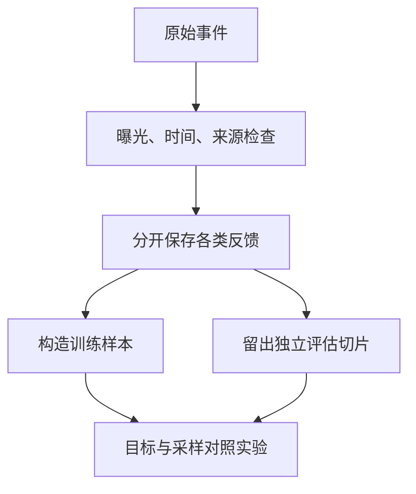

# 从反馈到训练目标：没点，不等于不喜欢

**中文** · [English](feedback-to-objectives.en.md)

你准备训练一个推荐模型，拿到一张点击日志。最省事的做法是把点击记作 1，其他全记作 0。但“其他”里面混着完全不同的情况：没展示、展示了没看见、看见了不感兴趣，还有当时没空。

**这篇先不挑 loss。先把一条反馈到底能说明什么讲清楚。**下面都是教学例子，不对应任何公司的数据。

## 先把没发生的事分开

| 观察 | 可以说什么 | 还不能说什么 |
| --- | --- | --- |
| 没有曝光记录 | 没有观察到这次接触 | 用户拒绝了内容 |
| 展示后没有点击 | 在这个位置和时间，没有点击 | 内容永远不相关 |
| 点击后立刻离开 | 点击没有转化为持续阅读 | 一定是低质量；也可能已经找到答案 |
| 收藏或明确反馈 | 出现了一种更具体的正向信号 | 它可以和点击不加区分地合并 |

记用户上下文为 $x$，候选为 $i$，曝光为 $E$，点击为 $C$。如果点击必须经过曝光：

$$
P(C=1\mid x,i)=P(E=1\mid x,i)\,P(C=1\mid E=1,x,i).
$$

所以观察到的点击率既和用户有关，也和系统给什么内容曝光有关。我们未必能从现有日志里把两者分开。关于选择偏差和基于 propensity 的学习、评估方法，可以接着读 [Recommendations as Treatments](https://arxiv.org/abs/1602.05352)；这不意味着给数据加权就能自动去掉所有偏差。

## 标签写成一份能检查的约定

假设我们要学习“愿意读完的技术文章”。至少写清这几件事：

- **样本单位**：一次 user–item 接触，还是把一周行为合成一个样本？
- **观察窗口**：多久后才能决定有没有反馈？窗口未结束的不急着记负例。
- **负例来源**：明确拒绝、曝光未点击、随机采样分别记录，别混成一种证据。
- **缺失值**：没记录曝光、没记录时长，要能和 0 区分。
- **切分边界**：训练只能使用预测发生之前的信息，用户或会话不能随意泄漏到测试集。



## 多信号，不是简单做一个 OR

假设几种行为的数量差很多。把它们用 OR 合并成一个正例，样本最多的行为可能主导训练。可以先试共享 encoder、分别预测各类行为：

$$
L=\lambda_r L_{\mathrm{retrieval}}+\sum_t\lambda_t L_t.
$$

这只是一个候选设计。稀疏任务可能学不好，不同目标也可能冲突。需要检查各任务的样本覆盖、loss 尺度和梯度影响；权重是要验证的超参数，不是写在图里就成立的比例。

对比学习里的 sampled negative 也只是训练构造。它告诉模型“在这个候选集合里区分正例”，不保证每个未标注候选都真的不相关。hard negative 则是对当前模型难分的候选，也不等于人工确认的负例。

## 一个能跑的小检查

下面只做数据约定检查，不是在推断真实偏好。

```python
events = [
    {"item": "alpha", "exposed": True, "clicked": True},
    {"item": "beta", "exposed": True, "clicked": False},
    {"item": "gamma", "exposed": False, "clicked": False},
]

def observed_label(event):
    if not event["exposed"]:
        return None
    return int(event["clicked"])

assert [observed_label(event) for event in events] == [1, 0, None]
```

这里的 0 是“曝光后未点击”，不是“不喜欢”。如果训练要把它当负例，应该说明这个近似和它的适用范围。

## 怎么知道新的信号有用

先固定模型、候选池和计算预算，只改标签或采样；再固定数据，测试架构。否则很难知道是谁起了作用。评估同时看总体和事先定义的用户切片，并留一份不由训练 teacher 打分的人工或行为参考，避免自己证明自己。

如果结果没变，先排查新信号有没有覆盖到目标人群、旧指标能不能识别它，再讨论是不是需要更贵的模型。一次失败既不能证明信号无用，也不能证明只要扩大规模就会成功。

下一篇：[用对照实验和切片判断改动](../07-evaluation/ablation-and-slices.md)。
