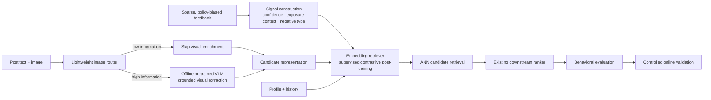
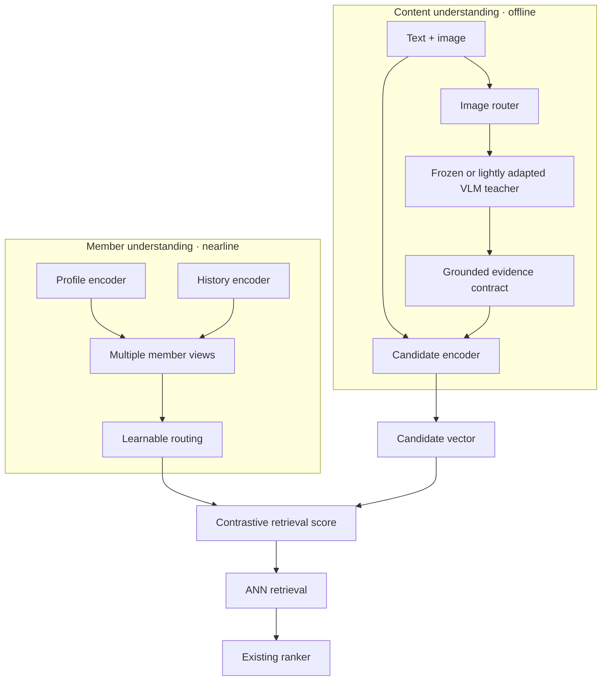
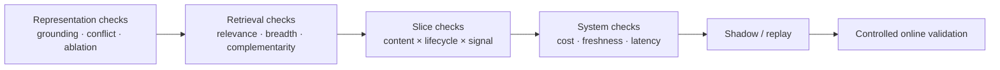

# From Noisy Feedback to a Serving-Efficient Retrieval System

[中文](noise-to-signal-retrieval.md) · **English**

> This is a public and intentionally abstracted design note. It discusses general problems and trade-offs rather than any company's data scale, schemas, model configuration, or production stack.

## In one sentence

The hard part of modern retrieval is often not attaching a larger model. It is:

> **turning sparse, policy-biased behavior into reliable supervision, enriching incomplete content representations, and expanding the candidate space without breaking online serving constraints.**



## 1. Convert noise into signal

Clicks, dwell, and skips are not direct preference labels. Feedback exists only for content exposed by an earlier policy, while missing engagement may simply mean the item was never seen.

Training data should distinguish reliable positives, exposed negatives, semantic hard negatives, and unobserved candidates whose relevance remains unknown. This decision precedes the choice among SFT, preference optimization, and RL: a training algorithm can only amplify the supervision it receives.

## 2. Process images selectively

A text-only embedding misses information contained in screenshots, charts, posters, and natural images. Running a large VLM on every image, however, wastes compute.

A lightweight router first classifies the processing need:

```text
image
→ natural photo / screenshot / slide-like / chart / poster / decorative
→ allocate compute from type and confidence
```

For informative images, a pretrained VLM extracts visible text, important entities, the main visual meaning, evidence absent from the original text, image-text consistency, and confidence. The first version usually does not require VLM fine-tuning; LoRA or SFT becomes useful only after stable domain errors are shown to affect retrieval.

## 3. Post-training: what is actually trained?

The VLM is not the online retriever. It is a replaceable offline **visual teacher** that produces structured evidence with confidence and provenance when content is created or updated:

```json
{
  "visual_type": "photo | screenshot | chart | poster | decorative",
  "visual_evidence": ["visible entities", "readable text", "visual claim"],
  "text_image_relation": "support | complement | conflict | irrelevant",
  "confidence": "calibrated score",
  "provenance": "which region supports each claim"
}
```

A lightweight candidate encoder combines the original text with this evidence and emits a vector that can be precomputed and written to the ANN index. The VLM improves supervision and content understanding without entering every online request.

### Module composition



The member side need not average all evidence into one point. Profile and history can remain separate views or expand into latent intent vectors. A router assigns context-dependent weights. Additional towers are useful only when they contribute complementary relevant candidates rather than duplicating one another.

### Three training layers

**Construct supervision.** Build confidence-aware batches from reliable positives, exposed negatives, semantic hard negatives, and unobserved candidates. Do not label "not seen" as "disliked."

**Supervised contrastive post-training.** Train member–candidate matching with in-batch negatives for scale, exposed negatives that retain policy context, and hard negatives that distinguish semantic similarity from contextual relevance.

**Prevent module collapse.** Add targeted constraints and diagnostics:

- full and text-only inputs should agree when the image is redundant;
- masking the image should produce an explainable score change when visual evidence is essential;
- conflicting text and images should reduce confidence or preserve an explicit conflict state instead of being silently fused;
- routing entropy, view usage, and unique-target contribution should reveal whether every example has collapsed onto one tower.

An abstract objective is:

\[
\mathcal{L}
=\mathcal{L}_{\text{retrieval}}
+\lambda_{r}\mathcal{L}_{\text{routing}}
+\lambda_{m}\mathcal{L}_{\text{modality}}
+\lambda_{c}\mathcal{L}_{\text{calibration}}.
\]

The core remains **supervised contrastive fine-tuning**, not generative GRPO for a fixed candidate-retrieval task. RL addresses a different problem when the objective becomes sequential, such as long-horizon slate reward or exploration policy.

### One complete training and release run

1. **Freeze event time:** build member, content, and exposure snapshots without future information.
2. **Generate visual evidence:** let the router select teacher calls and write outputs to a versioned evidence table.
3. **Compile examples:** bind behavior labels, negative type, member views, original text, and visual evidence to one manifest.
4. **Train the retriever:** keep the teacher frozen while updating member encoders, the candidate encoder, and routing; log each loss and view utilization separately.
5. **Export and replay:** batch-compute candidate vectors, build an isolated ANN index, and run the ablation matrix with a fixed downstream ranker.
6. **Release progressively:** pass representation, retrieval, slice, and systems gates before shadow traffic and controlled online validation.

Image-processing failures must fall back to the original text representation. Missing member views must cause the router to renormalize over the remaining views. **Fallback is part of the training-serving contract, not a patch added after launch.**

The retriever expands the high-quality candidate space. The existing downstream ranker remains responsible for request-level relevance, quality, freshness, and final ordering.

## 4. Keep expensive computation offline

```text
Offline:  image routing → selective VLM → candidate embedding → ANN index
Nearline: profile/history update → cached member representation
Online:   cache lookup → ANN retrieval → existing ranker → final slate
```

Multimodal understanding then improves candidate information without placing generation on every request. Failures should fall back to visible text and finally to the original text embedding rather than blocking index freshness.

## 5. Evaluation: prove that each module matters

> This section specifies an experimental protocol and release gates. It reports no observed results.

An aggregate score can hide subgroup regressions and can misrepresent "more relevant but semantically narrower" as an unconditional improvement. Evaluation should answer five separate questions.

### 5.1 Does the model actually use visual information?

A text-only versus multimodal total score is insufficient because the model may exploit textual priors. Use paired counterfactual tests:

| Input condition | Purpose | Observation |
| --- | --- | --- |
| Full text and image | Normal path | Baseline ranking and confidence |
| Image masked | Modality ablation | Targeted change on visually essential examples |
| Text masked | Image-only probe | Minimum semantics recoverable from the image |
| Image randomly swapped | Prior control | Whether irrelevant images incorrectly change ranking |
| VLM evidence removed | Module ablation | Whether value comes from the router, teacher, or encoder |

The key set is a **visual-essential subset** in which text cannot distinguish the candidates but the image contains task-relevant evidence. Directionally correct, attributable changes on this subset are stronger evidence of visual use than aggregate movement.

### 5.2 What happens when text and image conflict?

Construct semantically matched but factually conflicting pairs alongside non-conflicting controls. Evaluate whether the teacher identifies the conflict and its provenance, whether the candidate encoder avoids compressing contradictory evidence into an overconfident vector, and whether final retrieval or ranking reduces confidence in unreliable candidates rather than merely improving an intermediate conflict classifier.

### 5.3 Does the modality improve the final task?

Hold the candidate-pool size, ANN budget, downstream ranker, and evaluation examples fixed while replacing only the module under test:

```text
T0  text-only candidate representation
T1  + image router
T2  + selective VLM evidence
T3  + modality-aware post-training
T4  + multi-view member routing
```

At each stage, record:

- **end task:** Recall, NDCG, relevant-candidate yield, and the relevant set available to the downstream ranker;
- **breadth:** topic coverage, within-list similarity, and long-tail coverage;
- **complementarity:** unique relevant candidates contributed by the new module;
- **intermediate diagnostics:** routing accuracy, grounding, and conflict detection only to explain end-task changes;
- **systems:** VLM invocation rate, per-item processing cost, index freshness, cache hit rate, and online latency.

Better intermediate metrics without better candidate quality do not justify release. Neither does an end-task change that violates freshness or cost constraints.

### 5.4 Do content and user slices benefit consistently?

Repeat the same experiment on predefined slices rather than selecting groups after observing results:

- **content:** text-rich, visual-essential, screenshots or charts, natural images, long-tail topics, and language;
- **users:** lifecycle, history length, feedback strength, interest concentration, and cold-start severity;
- **cross-slices:** for example, sparse-history × visual-essential, to test whether the new modality helps only already information-rich groups.

Report relevance, breadth, coverage, calibration, and failure rate with sample sizes and confidence intervals. "Consistent benefit" does not require numerically identical gains; it requires verifying that the aggregate does not hide stable, explainable subgroup harm.

### 5.5 An executable release gate



Bind every run to one manifest containing the data snapshot, label definition, teacher and encoder versions, negative sampler, ANN index, ranker version, slice definitions, and random seeds. This makes a change attributable to a module rather than to data or evaluation-recipe drift.

User simulation can stress-test repeated exposure, topic fatigue, and exploration, but it cannot substitute for real users. It is best treated as a failure-discovery layer before online testing rather than a source of final performance claims.

## What the architecture is really optimizing

```text
more reliable supervision
→ more complete user and content representations
→ more complementary relevant candidates
→ a better choice set for the downstream ranker
→ behavioral evaluation and online validation
```

The goal is not to accumulate fashionable modules. It is to make each layer add new, verifiable information to the final decision.
