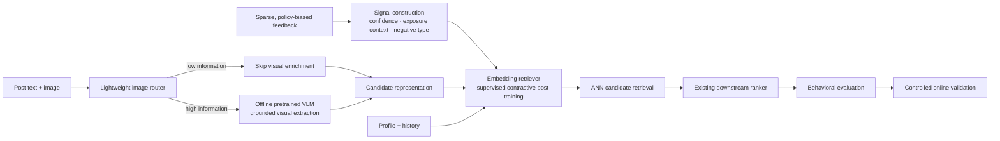

# From Noisy Feedback to a Serving-Efficient Retrieval System

[中文](noise-to-signal-retrieval.md) · **English**

> This is a public and intentionally abstracted design note. It discusses general problems and trade-offs rather than any company's data scale, schemas, model configuration, or production stack.

## In one sentence

The hard part of modern retrieval is often not attaching a larger model. It is:

> **turning sparse, policy-biased behavior into reliable supervision, enriching incomplete content representations, and expanding the candidate space without breaking online serving constraints.**



## 1. Convert noise into signal

Clicks, dwell, and skips are not direct preference labels. Feedback exists only for content exposed by an earlier policy, while missing engagement may simply mean the item was never seen.

Training data should distinguish reliable positives, exposed negatives, semantic hard negatives, and unobserved candidates whose relevance remains unknown. This decision precedes the choice among SFT, preference optimization, and RL: a training algorithm can only amplify the supervision it receives.

## 2. Process images selectively

A text-only embedding misses information contained in screenshots, charts, posters, and natural images. Running a large VLM on every image, however, wastes compute.

A lightweight router first classifies the processing need:

```text
image
→ natural photo / screenshot / slide-like / chart / poster / decorative
→ allocate compute from type and confidence
```

For informative images, a pretrained VLM extracts visible text, important entities, the main visual meaning, evidence absent from the original text, image-text consistency, and confidence. The first version usually does not require VLM fine-tuning; LoRA or SFT becomes useful only after stable domain errors are shown to affect retrieval.

## 3. Post-train a retriever that can actually serve

The VLM is not the online retrieval model. It runs when content is created or updated and produces cacheable evidence. The original text and selected visual evidence are compressed by a text embedding encoder into a candidate vector.

Profile-conditioned and history-conditioned user representations can remain separate when they recover complementary relevant candidates. Profile offers stable long-term evidence; history offers stronger but potentially narrower recent evidence. Routing is justified only when the views contribute unique relevant candidates.

The appropriate objective is supervised contrastive fine-tuning rather than generative GRPO:

\[
\mathcal{L}
=\mathcal{L}_{\text{sampled-softmax}}
+\lambda_1\mathcal{L}_{\text{pairwise}}
+\lambda_2\mathcal{L}_{\text{consistency}}.
\]

The retriever expands the high-quality candidate space. The existing downstream ranker remains responsible for request-level relevance, quality, freshness, and final ordering.

## 4. Keep expensive computation offline

```text
Offline:  image routing → selective VLM → candidate embedding → ANN index
Nearline: profile/history update → cached member representation
Online:   cache lookup → ANN retrieval → existing ranker → final slate
```

Multimodal understanding then improves candidate information without placing generation on every request. Failures should fall back to visible text and finally to the original text embedding rather than blocking index freshness.

## 5. Evaluate behavior, not only aggregate Recall

A useful evaluation combines relevance, semantic breadth, representation or source complementarity, lifecycle and content slices, plus system metrics such as VLM invocation rate, processing cost, index freshness, and online latency.

User simulation can stress-test repeated exposure, topic fatigue, and exploration, but it is not a substitute for real users. Final performance claims should come from controlled online experiments and longer-term observation.

## What the architecture is really optimizing

```text
more reliable supervision
→ more complete user and content representations
→ more complementary relevant candidates
→ a better choice set for the downstream ranker
→ behavioral evaluation and online validation
```

The goal is not to accumulate fashionable modules. It is to make each layer add new, verifiable information to the final decision.
