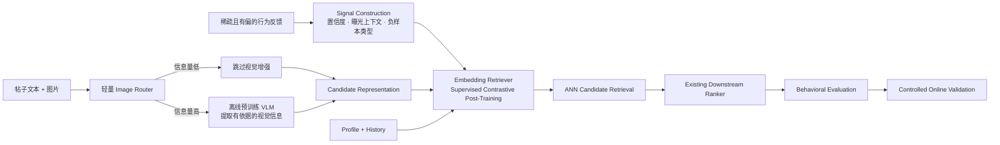

# 从噪声反馈到可服务的现代检索系统

**中文** · [English](noise-to-signal-retrieval.en.md)

> 这是一份公开且刻意抽象化的设计笔记，只讨论通用问题与取舍，不对应任何公司的数据规模、字段、模型配置或生产系统。

## 先用一句话讲清楚

现代检索系统真正困难的地方，不只是换一个更大的模型，而是：

> **怎样把稀疏、受旧策略影响的行为日志变成可靠训练信号，再用更完整的内容表征扩大候选空间，同时不破坏在线 Serving 成本。**



## 1. 先把 Noise 变成 Signal

日志中的点击、停留和跳过不是天然的偏好标签。用户只会对旧系统展示过的内容产生反馈；没有互动，也可能只是没有看到。

训练样本至少要区分：

- **可靠正样本**：有较强行为证据支持；
- **曝光负样本**：确实获得展示机会，但出现明确负向行为；
- **Hard negative**：语义接近或模型高分，但与当前用户上下文不匹配；
- **未观测候选**：没有足够证据判断相关或不相关，不能全部标成负样本。

这一步比先争论 SFT、DPO 还是 RL 更重要。训练算法只能放大收到的监督；如果标签语义不清楚，更复杂的 post-training 只会更稳定地学习错误目标。

## 2. 选择性理解图片，而不是全量运行大模型

Text-only embedding 会漏掉截图、图表、海报和普通照片里的关键信息，但对所有图片运行大 VLM 又会浪费计算。

先用轻量 router 判断处理需求：

```text
image
→ natural photo / screenshot / slide-like / chart / poster / decorative
→ 根据类型和置信度分配计算
```

Router 不需要完整理解图片，只需要回答：**这张图是否包含额外信息，以及应该走哪条处理路径？**

对于高信息量图片，再使用预训练 VLM 提取：

- 可见文字与关键实体；
- 图片、截图或图表表达的主要内容；
- 原文没有明确写出的视觉证据；
- 图文是否一致，以及判断置信度。

第一版通常不需要微调 VLM。先用固定 schema 做结构化抽取；只有出现稳定、可复现且影响下游检索的领域错误时，才考虑 LoRA 或 SFT。

## 3. Post-train 一个能真正上线的 Retriever

VLM 不是在线检索模型。它只在内容创建或更新时离线运行，将视觉信息转成可缓存的内容证据。原文与视觉证据随后由 text embedding encoder 压缩成 candidate vector。

用户侧可以分别保留 profile-conditioned 与 history-conditioned representation。它们的价值不在于“塔更多”，而在于是否找到**互补的相关候选**：

- profile 提供稳定但较弱的长期信号；
- history 提供更强但可能更窄的近期信号；
- routing 只有在两者带来 unique relevant candidates 时才有意义。

这里更准确的训练方式是 **supervised contrastive fine-tuning**，而不是生成式 GRPO：

\[
\mathcal{L}
=\mathcal{L}_{\text{sampled-softmax}}
+\lambda_1\mathcal{L}_{\text{pairwise}}
+\lambda_2\mathcal{L}_{\text{consistency}}.
\]

Retriever 负责扩大高质量候选空间；已有 downstream ranker 继续负责请求级别的精细 relevance、quality、freshness 与最终排序。

## 4. 把复杂计算留在 Offline

```text
Offline:  image routing → selective VLM → candidate embedding → ANN index
Nearline: profile/history update → cached member representation
Online:   cache lookup → ANN retrieval → existing ranker → final slate
```

这样，多模态能力增加的是候选理解，而不是每次请求的生成式推理成本。视觉处理失败时应逐级回退到可见文字，最终回退到纯文本 embedding，不能阻止新内容进入索引。

## 5. Evaluation 不能只看一个 Recall

聚合分数可能同时掩盖用户群体退化，以及“结果更相关、但语义越来越窄”的问题。

因此至少同时检查：

- **relevance**：Recall、NDCG；
- **breadth**：topic coverage、within-list similarity；
- **complementarity**：不同表征或候选源带来的 unique relevant candidates；
- **slices**：lifecycle、反馈强度、内容类型和长尾程度；
- **systems**：VLM 调用率、处理成本、索引 freshness 与在线 latency。

User simulation 可以用于 repeated exposure、topic fatigue 和 exploration 的压力测试，但它不能替代真实用户。最终性能结论仍应来自受控的小流量线上实验与长期观察。

## 这套设计真正优化什么

```text
更可靠的训练信号
→ 更完整的用户与内容表征
→ 更多互补的相关候选
→ downstream ranker 拥有更好的选择空间
→ 用多维评估和线上实验验证真实价值
```

目标不是堆叠热门模块，而是让每一层都为最终决策增加新的、可验证的信息。
