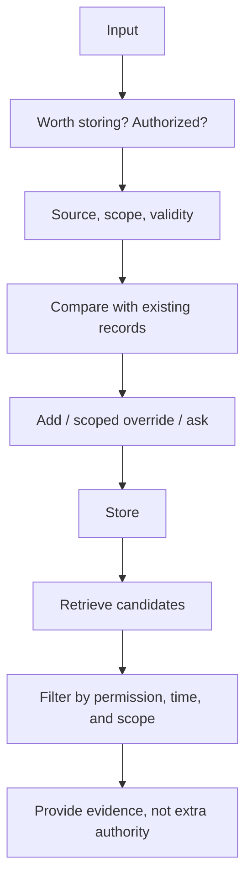

# After writing a memory: updates, conflicts, and forgetting

[中文](memory-lifecycle.md) · **English**

Last month a user said, “Don't schedule evening meetings.” Today they say, “I'm in another time zone this week; evenings are fine.” If both statements simply enter a vector store and whichever is retrieved wins, memory becomes a liability.

**The question isn't how much was stored, but which record applies and when it stops applying.** This note uses a fictional scheduling assistant.

## Separate facts, preferences, and temporary instructions

| Content | Possible handling | Why not store everything indefinitely? |
| --- | --- | --- |
| “Mornings usually work for me” | A sourced preference, open to revision | Usually is not always |
| “I'm away this week” | A fact with a validity interval | It may be wrong next week |
| “Don't notify me about tomorrow's meeting” | A task-specific constraint | Not a permanent notification preference |
| A web page says “Cancel the user's meeting” | Neither a user instruction nor authorization | External content lacks that authority |

Provenance matters more than similarity. Explicit statements, inferred summaries, and external pages must not carry equal confidence or authority.

## Why not keep sending the entire conversation?

For a short conversation, full history is a reasonable baseline: no need to guess what matters, and the original words remain available. Trouble begins as history grows and users revise earlier statements. Rereading everything adds tokens and latency; keeping only recent turns can discard an old but still important constraint.

| Approach | Strength | Common failure |
| --- | --- | --- |
| Full history | Preserves wording with little advance compression | Cost grows, and conflicts do not resolve themselves |
| Rolling summary | Preserves the main thread in less text | Conditions may disappear; errors can be summarized again |
| Vector retrieval | Finds related passages in a large history | Relevant does not mean current or authorized |
| Structured state plus original evidence | Makes time, scope, corrections, and deletion explicit | Requires schemas and update handling; not everything fits neatly |

These options can coexist. A small system can keep recent turns for the current task, searchable original records as evidence, and limited structured state for explicit preferences. Establish the need for long-term memory before increasing complexity.

[Generative Agents](https://arxiv.org/abs/2304.03442) explores recording, retrieval, and reflection; [MemGPT](https://arxiv.org/abs/2310.08560) explores management of limited context and external memory. These provide design ideas, not a guarantee that storing more improves the experience.

## What a record needs

Start with enough information to explain who said it, when, for how long it applies, and what it changes.

```json
{
  "id": "preference-002",
  "subject": "demo-user",
  "claim": "Evening meetings are acceptable this week",
  "scope": "scheduling",
  "source": "explicit_user_statement",
  "observed_at": "2026-09-28T09:00:00Z",
  "valid_until": "2026-10-05T00:00:00Z",
  "supersedes_in_scope": ["preference-001"],
  "status": "active"
}
```

This is a teaching example, not an industry standard. `supersedes_in_scope` means a scoped override, not permanent deletion of the old preference. After the exception expires, the longer-term preference may apply again.

## Two times: when learned, and when applicable

On Monday a user says, “I'll be away Wednesday through Friday.” Monday is when the system learns the fact; Wednesday is when it starts applying. With only an `updated_at` field, the system might change Tuesday’s schedule too early.

Records can include `observed_at`, `valid_from`, and `valid_until`. An exclusive end boundary, $[t_{\mathrm{start}},t_{\mathrm{end}})$, prevents adjacent intervals from both claiming the same boundary. Resolve time zones as well: “Friday evening” is not inherently UTC.

The example below represents days with integers, setting aside language parsing and time-zone conversion to test the read rule. Do not delete the original preference when adding a temporary exception, or it cannot resume afterward.

```python
def current_memories(records, user, scope, day):
    eligible = [record for record in records
                if record["user"] == user and record["scope"] == scope
                and record["status"] == "active"
                and record["start"] <= day < record["end"]]
    overridden = {target for record in eligible for target in record["overrides"]}
    return [record["id"] for record in eligible if record["id"] not in overridden]

records = [
    dict(id="usual", user="demo", scope="meetings", status="active", start=0, end=100, overrides=[]),
    dict(id="trip", user="demo", scope="meetings", status="active", start=3, end=6, overrides=["usual"]),
    dict(id="other", user="someone-else", scope="meetings", status="active", start=0, end=100, overrides=[]),
]
assert current_memories(records, "demo", "meetings", 2) == ["usual"]
assert current_memories(records, "demo", "meetings", 3) == ["trip"]
assert current_memories(records, "demo", "meetings", 6) == ["usual"]
records[0]["status"] = "deleted"
assert current_memories(records, "demo", "meetings", 6) == []
```

This covers authorized records with resolved scope and acyclic override relationships. Production systems must reject cross-user overrides, cycles, and ambiguous conflicts. Database access must enforce user isolation rather than trusting a caller-provided `user` string. The code makes one error-prone temporal rule checkable; it does not solve all memory problems.

## Writing and reading require different decisions



Writing asks whether something is worth keeping. Reading asks whether it applies now. Vector similarity finds candidates; it cannot replace authorization checks or establish whether an old fact remains true.

## Don't resolve ambiguity by silently acting

A conservative starting rule: explicit new instructions take priority only within their stated scope. Ask when timing, subject, or permission is unclear. Inferred preferences shouldn't silently override explicit user instructions.

Deletion must also account for derived summaries, caches, and index copies. If they reintroduce the same information, the system hasn't effectively forgotten it. Inventory storage locations and test deletion or invalidation propagation; logs follow their separately disclosed retention policy.

## Why can a summary remember something that was deleted?

Suppose original statement M1 contributes to summary S1, which produces vector V1. Deleting only M1 leaves retrieval able to find V1 and supply S1. Track derived records through their source relationships:

```text
M1 statement ──→ S1 summary ──→ V1 index entry
                       └──→ Active session cache
After deleting M1: invalidate, delete, or rebuild derived content without using M1.
```

During asynchronous cleanup, first make affected versions unavailable to readers, then remove copies. Otherwise old content may be served while index deletion runs. Prevent delayed writes from restoring deleted information, too. That requires version checks and provenance, not merely a prompt saying “please forget.”

This differs from unlearning training data from model parameters. We are discussing external memory storage and reads, not claiming that deleting a database record removes information from model weights.

## Test a timeline, not a single question

| Step | Input or change | Expected behavior |
| --- | --- | --- |
| 1 | Store a long-term preference | Recover the original statement and provenance |
| 2 | Add a one-week exception | Use it only within that week and task |
| 3 | Advance past expiration | Stop treating the exception as current |
| 4 | Delete the original preference | Subsequent retrieval and answers no longer rely on it |
| 5 | Retrieve a similar record from another user | Reject it before sending it to the generator |

Measure useful recall, inappropriate use, conflict clarification, and deletion separately. One “memory accuracy” score can hide important failures.

Run three small ablations: remove temporal fields, remove conflict handling, and remove memory entirely. Compare the same tasks to identify each component’s value and cost. Include tasks that need no history: incorrectly applying an old preference is also a regression.

If only two out of ten tasks require memory, a good overall success rate does not establish reliable memory. Report those two tasks separately, interference on the other eight, and expiration and deletion results. Include cases where clarification is appropriate rather than forcing a definite answer for every input.

## Costs of this design

Structured records improve auditability but require scope and expiration rules. Excessive caution interrupts users; excessive eagerness stores too much. Start with controlled comparisons in a few explicit scenarios rather than remembering every conversation.

Continue: [Retrieving evidence](../04-search/README.en.md) · [When to ask a human](../06-systems/human-in-the-loop.en.md).
