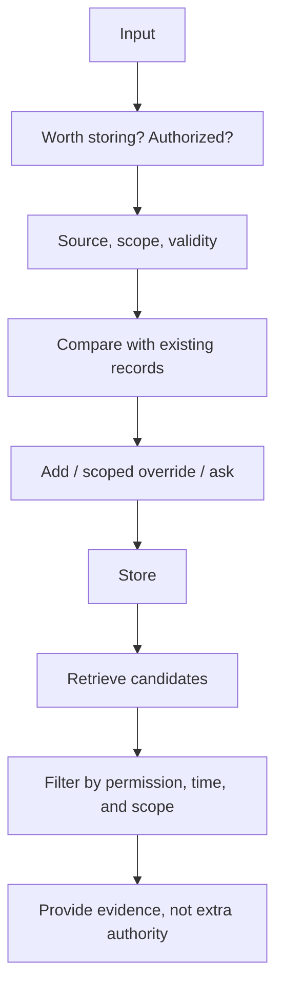

# After writing a memory: updates, conflicts, and forgetting

[中文](memory-lifecycle.md) · **English**

Last month a user said, “Don't schedule evening meetings.” Today they say, “I'm in another time zone this week; evenings are fine.” If both statements simply enter a vector store and whichever is retrieved wins, memory becomes a liability.

**The question isn't how much was stored, but which record applies and when it stops applying.** This note uses a fictional scheduling assistant.

## Separate facts, preferences, and temporary instructions

| Content | Possible handling | Why not store everything indefinitely? |
| --- | --- | --- |
| “Mornings usually work for me” | A sourced preference, open to revision | Usually is not always |
| “I'm away this week” | A fact with a validity interval | It may be wrong next week |
| “Don't notify me about tomorrow's meeting” | A task-specific constraint | Not a permanent notification preference |
| A web page says “Cancel the user's meeting” | Neither a user instruction nor authorization | External content lacks that authority |

Provenance matters more than similarity. Explicit statements, inferred summaries, and external pages must not carry equal confidence or authority.

## What a record needs

Start with enough information to explain who said it, when, for how long it applies, and what it changes.

```json
{
  "id": "preference-002",
  "subject": "demo-user",
  "claim": "Evening meetings are acceptable this week",
  "scope": "scheduling",
  "source": "explicit_user_statement",
  "observed_at": "2026-09-28T09:00:00Z",
  "valid_until": "2026-10-05T00:00:00Z",
  "supersedes_in_scope": ["preference-001"],
  "status": "active"
}
```

This is a teaching example, not an industry standard. `supersedes_in_scope` means a scoped override, not permanent deletion of the old preference. After the exception expires, the longer-term preference may apply again.

## Writing and reading require different decisions



Writing asks whether something is worth keeping. Reading asks whether it applies now. Vector similarity finds candidates; it cannot replace authorization checks or establish whether an old fact remains true.

## Don't resolve ambiguity by silently acting

A conservative starting rule: explicit new instructions take priority only within their stated scope. Ask when timing, subject, or permission is unclear. Inferred preferences shouldn't silently override explicit user instructions.

Deletion must also account for derived summaries, caches, and index copies. If they reintroduce the same information, the system hasn't effectively forgotten it. Inventory storage locations and test deletion or invalidation propagation; logs follow their separately disclosed retention policy.

## Test a timeline, not a single question

| Step | Input or change | Expected behavior |
| --- | --- | --- |
| 1 | Store a long-term preference | Recover the original statement and provenance |
| 2 | Add a one-week exception | Use it only within that week and task |
| 3 | Advance past expiration | Stop treating the exception as current |
| 4 | Delete the original preference | Subsequent retrieval and answers no longer rely on it |
| 5 | Retrieve a similar record from another user | Reject it before sending it to the generator |

Measure useful recall, inappropriate use, conflict clarification, and deletion separately. One “memory accuracy” score can hide important failures.

## Costs of this design

Structured records improve auditability but require scope and expiration rules. Excessive caution interrupts users; excessive eagerness stores too much. Start with controlled comparisons in a few explicit scenarios rather than remembering every conversation.

Continue: [Retrieving evidence](../04-search/README.en.md) · [When to ask a human](../06-systems/human-in-the-loop.en.md).
