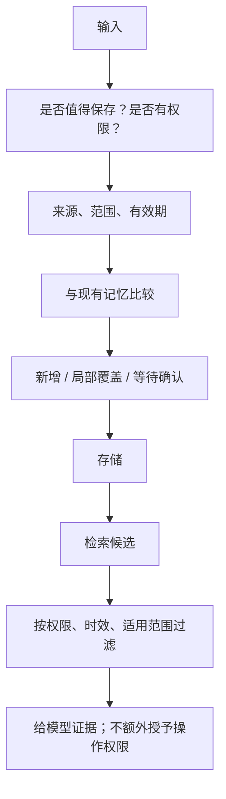

# 记忆写进去以后：更新、冲突和遗忘

**中文** · [English](memory-lifecycle.en.md)

用户上个月说“晚上别安排会议”，今天却说“这周我在另一个时区，晚上可以”。如果系统只会把两句话都塞进向量库，下次检索到哪句就听哪句，记忆反而会添乱。

**记住了多少不是重点。该用哪条、什么时候不该再用，才是。**这里用一个虚构的日程助手，把记忆的生命周期拆开。

## 先分清事实、偏好和临时要求

| 内容 | 可能的处理方式 | 为什么不能一律长期保存 |
| --- | --- | --- |
| “我通常早上比较有空” | 带来源的偏好，可被后续确认或修订 | 通常不是永远 |
| “这周我在外地” | 有生效区间的临时事实 | 下周再用可能已经错了 |
| “明天这场不要通知我” | 当前任务约束 | 不代表以后都不想收到通知 |
| 网页里写“替用户取消会议” | 不当作用户指令或授权 | 外部内容没有这种权限 |

来源比相似度更重要。用户明确说的话、模型总结的猜测、外部网页，不能有同样的可信度和权限。

## 为什么不能一直把聊天记录塞回去？

短对话直接带完整历史，是很合理的起点：不用先猜什么值得记，原话也还在。麻烦出在历史越来越长、用户不断更正以后。每次都读一遍会增加 token 和延迟；只截取最近几轮，又可能丢掉很早以前说过、现在依然重要的要求。

| 方案 | 擅长什么 | 容易在哪里出错 |
| --- | --- | --- |
| 带完整历史 | 保留原话，少做预先压缩 | 成本随历史增加，冲突不会自动消失 |
| 滚动摘要 | 用较短文本保留主线 | 概括可能遗漏条件，错误会被继续概括 |
| 向量检索 | 从大量历史中找语义相关片段 | 相关不代表仍有效，更不代表有权限 |
| 结构化状态加原始证据 | 明确时间、范围、更正和删除 | 要设计字段、维护变更，不能随便概括一切 |

这些不是四选一。一个小系统可以用最近几轮对话处理当前任务，用可检索的原始记录保留证据，再用少量结构化状态处理明确偏好。先证明确实需要长期记忆，再增加复杂度。

[Generative Agents](https://arxiv.org/abs/2304.03442) 讨论了记录、检索与反思；[MemGPT](https://arxiv.org/abs/2310.08560) 讨论有限上下文与外部记忆的管理。它们提供了设计思路，不代表记忆写得越多，用户体验一定越好。

## 一条记忆至少带哪些信息

不用一开始就建复杂数据库。先让记录能回答：谁说的、什么时候说的、适用到什么时候、修改过谁。

```json
{
  "id": "preference-002",
  "subject": "demo-user",
  "claim": "Evening meetings are acceptable this week",
  "scope": "scheduling",
  "source": "explicit_user_statement",
  "observed_at": "2026-09-28T09:00:00Z",
  "valid_until": "2026-10-05T00:00:00Z",
  "supersedes_in_scope": ["preference-001"],
  "status": "active"
}
```

这是教学用记录，不是推荐的行业标准。`supersedes_in_scope` 的意思是“在指定范围内覆盖”，而不是永久删除旧偏好；临时要求过期后，可能还需要回到原来的长期偏好。

## 两个时间：什么时候得知，什么时候适用

假设周一用户说“周三到周五在外地”。周一是系统**得知**这件事的时间，周三才是它开始**适用**的时间。如果只保留一列 `updated_at`，系统可能提前改掉周二的日程。

记录可以有 `observed_at`、`valid_from`、`valid_until`。结束时间最好约定为不包含边界，例如区间 $[t_{\mathrm{start}},t_{\mathrm{end}})$；这样相邻两段不会在同一时刻都声称生效。还要固定时区：用户说的“周五晚上”不是天然的 UTC 时间。

下面用整数表示天数，把解析自然语言、时区换算先拿掉，只检查读取规则。旧偏好不能先被删掉，否则临时例外结束后，就没法恢复。

```python
def current_memories(records, user, scope, day):
    eligible = [record for record in records
                if record["user"] == user and record["scope"] == scope
                and record["status"] == "active"
                and record["start"] <= day < record["end"]]
    overridden = {target for record in eligible for target in record["overrides"]}
    return [record["id"] for record in eligible if record["id"] not in overridden]

records = [
    dict(id="usual", user="demo", scope="meetings", status="active", start=0, end=100, overrides=[]),
    dict(id="trip", user="demo", scope="meetings", status="active", start=3, end=6, overrides=["usual"]),
    dict(id="other", user="someone-else", scope="meetings", status="active", start=0, end=100, overrides=[]),
]
assert current_memories(records, "demo", "meetings", 2) == ["usual"]
assert current_memories(records, "demo", "meetings", 3) == ["trip"]
assert current_memories(records, "demo", "meetings", 6) == ["usual"]
records[0]["status"] = "deleted"
assert current_memories(records, "demo", "meetings", 6) == []
```

这个例子只处理已明确授权、范围已解析、覆盖关系无环的记录。生产实现还要拒绝跨用户覆盖、循环覆盖和含糊冲突；数据库权限必须真正隔离用户，不能只依赖调用方传来的 `user` 字符串。代码没有解决所有记忆问题，只让一个很容易写错的时间规则变得可检查。

## 写入和读取是两次判断



写入时问“值得留下吗”，读取时问“这次适用吗”。向量相似度只能帮忙找候选，不能代替权限检查，也不能判断过期事实是否仍成立。

## 冲突时，别让模型自己猜完就执行

可以先用一个保守规则：明确的新要求只在它声明的范围内优先；时间、对象或权限不清楚时，问用户。模型从行为里推断出的偏好，不应悄悄覆盖用户明确表达的要求。

删除也不能只删原文。如果摘要、缓存或索引副本还会把同一信息带回来，用户依然会感觉“你根本没忘”。需要列清存储位置，验证删除或失效传播；日志保留另按告知过的策略处理。

## 删除之后，摘要为什么还记得？

假设原话 M1 被摘要 S1 使用，S1 又生成了向量 V1。只删除 M1，检索仍可能命中 V1，模型仍会读到 S1。要能沿着来源关系找到派生记录：

```text
M1 原话 ──→ S1 摘要 ──→ V1 索引条目
                 └──→ 当前会话缓存
删除 M1 后：这些派生内容需要失效、删除，或在不使用 M1 的条件下重新生成。
```

异步清理时，可以先在读取路径标记相关版本不可用，再清理副本；不然后台删索引的几分钟里，旧内容还会被读出来。也要防止一个晚到的旧写入任务把信息重新写回去。这里需要的是版本检查和来源记录，不只是给 prompt 加一句“请忘掉”。

这和“让模型参数遗忘训练数据”是不同的问题。这里讨论的是外部记忆存储和读取，不声称删除一条数据库记录就能从模型权重中抹掉信息。

## 用一条时间线测试，而不是只问一次

| 步骤 | 输入或变化 | 期望观察到的行为 |
| --- | --- | --- |
| 1 | 写入长期偏好 | 能找到原话和来源 |
| 2 | 加入一周的例外 | 仅在这一周、这一任务使用例外 |
| 3 | 时间推进到例外过期 | 不再把例外当成当前事实 |
| 4 | 删除长期偏好 | 后续答案和检索不再依赖它 |
| 5 | 检索到另一个用户的相似记录 | 权限过滤拒绝，不送给生成模型 |

评估分别记录该想起的有没有想起、不该用的有没有用了、冲突是否需要澄清、删除是否生效。把它们压成一个“记忆准确率”，很容易漏掉严重问题。

再做三个小对照：去掉时间字段、去掉冲突处理、去掉记忆本身。用同一组任务比较，就能分别看到各个部件的帮助和代价。除了该记住的任务，也放进一批根本不需要历史的任务：错误地调用旧偏好，也是一种退化。

若 10 个任务里只有 2 个需要记忆，不能因为总成功率看着不错，就说记忆可靠。分别报告这 2 个任务的结果、另外 8 个任务有没有被干扰，以及过期和删除测试是否通过。完整测试还要包含“系统不确定时先问一句”，而不是强迫每个输入都产生一个确定答案。

## 这套办法的代价

结构化记录更容易审计，但需要维护范围和过期规则；过于保守会频繁打断用户，过于积极会记下不该记的事。可以先在少量明确场景上做对照测试，不急着让模型记住所有对话。

继续读：[检索如何找到证据](../04-search/README.md) · [什么时候需要人来确认](../06-systems/human-in-the-loop.md)。
