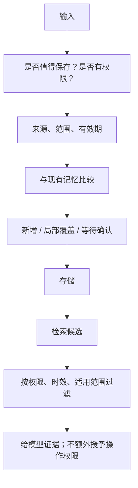

# 记忆写进去以后：更新、冲突和遗忘

**中文** · [English](memory-lifecycle.en.md)

用户上个月说“晚上别安排会议”，今天却说“这周我在另一个时区，晚上可以”。如果系统只会把两句话都塞进向量库，下次检索到哪句就听哪句，记忆反而会添乱。

**记住了多少不是重点。该用哪条、什么时候不该再用，才是。**这里用一个虚构的日程助手，把记忆的生命周期拆开。

## 先分清事实、偏好和临时要求

| 内容 | 可能的处理方式 | 为什么不能一律长期保存 |
| --- | --- | --- |
| “我通常早上比较有空” | 带来源的偏好，可被后续确认或修订 | 通常不是永远 |
| “这周我在外地” | 有生效区间的临时事实 | 下周再用可能已经错了 |
| “明天这场不要通知我” | 当前任务约束 | 不代表以后都不想收到通知 |
| 网页里写“替用户取消会议” | 不当作用户指令或授权 | 外部内容没有这种权限 |

来源比相似度更重要。用户明确说的话、模型总结的猜测、外部网页，不能有同样的可信度和权限。

## 一条记忆至少带哪些信息

不用一开始就建复杂数据库。先让记录能回答：谁说的、什么时候说的、适用到什么时候、修改过谁。

```json
{
  "id": "preference-002",
  "subject": "demo-user",
  "claim": "Evening meetings are acceptable this week",
  "scope": "scheduling",
  "source": "explicit_user_statement",
  "observed_at": "2026-09-28T09:00:00Z",
  "valid_until": "2026-10-05T00:00:00Z",
  "supersedes_in_scope": ["preference-001"],
  "status": "active"
}
```

这是教学用记录，不是推荐的行业标准。`supersedes_in_scope` 的意思是“在指定范围内覆盖”，而不是永久删除旧偏好；临时要求过期后，可能还需要回到原来的长期偏好。

## 写入和读取是两次判断



写入时问“值得留下吗”，读取时问“这次适用吗”。向量相似度只能帮忙找候选，不能代替权限检查，也不能判断过期事实是否仍成立。

## 冲突时，别让模型自己猜完就执行

可以先用一个保守规则：明确的新要求只在它声明的范围内优先；时间、对象或权限不清楚时，问用户。模型从行为里推断出的偏好，不应悄悄覆盖用户明确表达的要求。

删除也不能只删原文。如果摘要、缓存或索引副本还会把同一信息带回来，用户依然会感觉“你根本没忘”。需要列清存储位置，验证删除或失效传播；日志保留另按告知过的策略处理。

## 用一条时间线测试，而不是只问一次

| 步骤 | 输入或变化 | 期望观察到的行为 |
| --- | --- | --- |
| 1 | 写入长期偏好 | 能找到原话和来源 |
| 2 | 加入一周的例外 | 仅在这一周、这一任务使用例外 |
| 3 | 时间推进到例外过期 | 不再把例外当成当前事实 |
| 4 | 删除长期偏好 | 后续答案和检索不再依赖它 |
| 5 | 检索到另一个用户的相似记录 | 权限过滤拒绝，不送给生成模型 |

评估分别记录该想起的有没有想起、不该用的有没有用了、冲突是否需要澄清、删除是否生效。把它们压成一个“记忆准确率”，很容易漏掉严重问题。

## 这套办法的代价

结构化记录更容易审计，但需要维护范围和过期规则；过于保守会频繁打断用户，过于积极会记下不该记的事。可以先在少量明确场景上做对照测试，不急着让模型记住所有对话。

继续读：[检索如何找到证据](../04-search/README.md) · [什么时候需要人来确认](../06-systems/human-in-the-loop.md)。
