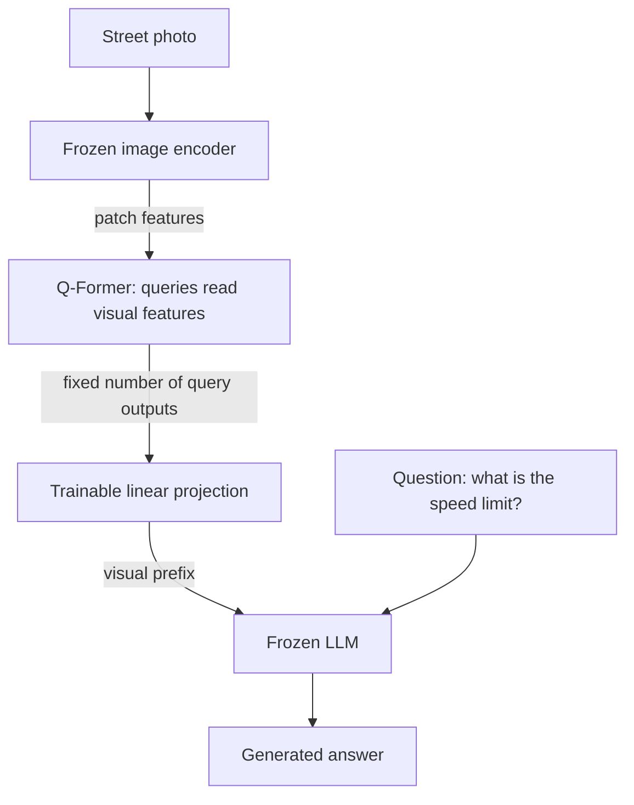
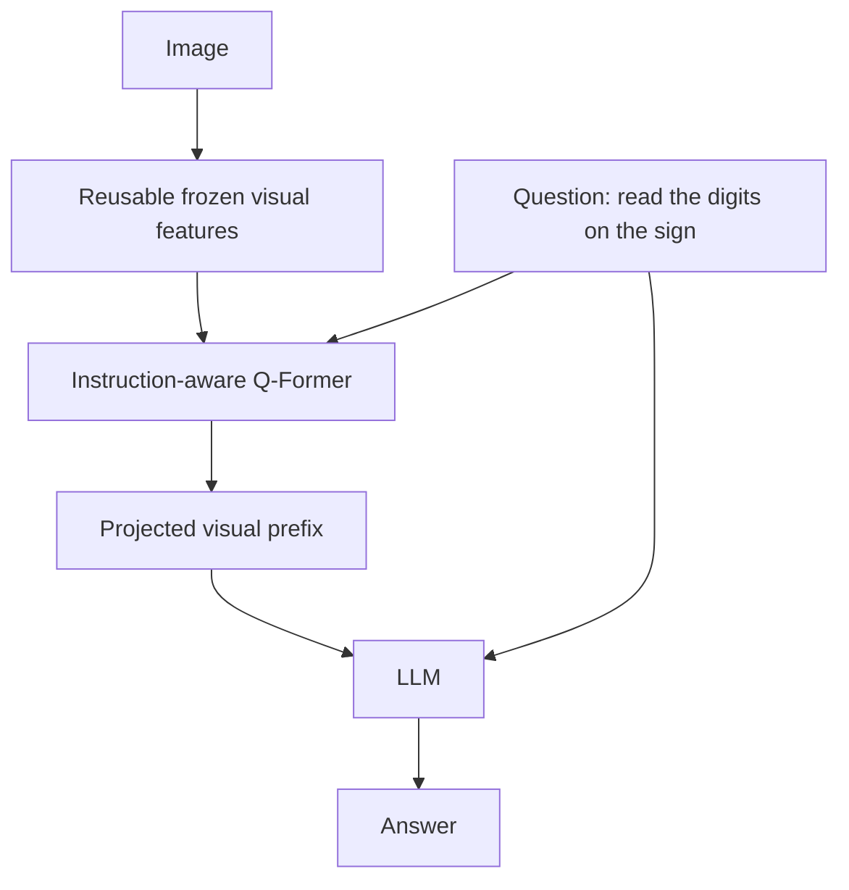

# From BLIP to InstructBLIP: passing visual information to a language model

[中文](blip-and-q-former.md) · **English**

> Reading time: about 14 minutes · Last reviewed: 2026-10

Suppose a photo contains a bicycle, a rider, and a speed-limit sign. Retrieving its caption, deciding whether “pushing the bicycle” is accurate, and answering “what is the speed limit?” require different information.

[CLIP](clip.en.md) introduces image–text vector comparison. Here we move from BLIP's matching and generation objectives to BLIP-2's connection between pretrained models, then to InstructBLIP's question-conditioned feature extraction. These older architectures are useful for understanding design choices, not automatic recommendations for a new deployment.

## BLIP: three objectives, not three names for one score

BLIP's MED architecture supports encoding, fusion, and decoding. The invented street scene below illustrates the objectives; it is not a model measurement.

| Objective | What the model does | Street-scene example | What it may miss alone |
| --- | --- | --- | --- |
| ITC, image–text contrast | Encode separately and find paired candidates | Prefer a cycling caption over a cooking caption | Matching topics need not establish the correct action |
| ITM, image–text matching | Interact across modalities and classify the pair | Distinguish riding from pushing | Judging a pair is not generating an answer |
| LM, language modeling | Predict text from the image and preceding tokens | Generate a description of the rider | Fluent text can omit or invent details |

Original BLIP shares most text-encoder/decoder parameters but separates their self-attention layers. CapFilt addresses data: a captioner adds descriptions, a filter rejects mismatched original and generated descriptions, and the curated data trains a new model. [BLIP, §3](https://arxiv.org/abs/2201.12086)

For example, replacing “happy weekend” with a description of a cyclist may improve visual supervision. But if the person is pushing rather than riding, synthetic text introduces an error. Passing a filter is not factual certification. A useful check would retain a small human-audited set and measure errors in original and generated captions separately, rather than reporting only dataset growth.

High-similarity non-paired examples mined through ITC are also only **candidates for hard negatives**. A different but synonymous caption may be a false negative. Changing the sampler does not establish that a pair is wrong.

### Does stricter filtering always produce better data?

Take four invented image–caption pairs with filter scores `0.9, 0.8, 0.6, 0.4` and manually verified correctness `true, false, true, true`. These are not model measurements, and the scores are not assumed to be calibrated probabilities.

| Threshold | Kept | Precision among retained pairs | Fraction of all candidates retained | Recall of verified correct pairs |
| --- | ---: | ---: | ---: | ---: |
| 0.5 | 3 | 2/3 | 3/4 | 2/3 |
| 0.85 | 1 | 1 | 1/4 | 1/3 |

The higher threshold improves precision but discards two correct descriptions. If discarded examples disproportionately contain rare scenes, long descriptions, or small text, the data becomes cleaner and narrower. Inspect content slices rather than selecting a flattering average.

```python
def filter_report(scores, verified, threshold):
    if len(scores) != len(verified) or not scores:
        raise ValueError("expected paired, nonempty audit records")
    if not all(0 <= score <= 1 for score in scores) or not 0 <= threshold <= 1:
        raise ValueError("scores and threshold must lie in [0, 1]")
    if any(type(label) is not bool for label in verified):
        raise ValueError("audit labels must be booleans")
    selected = [label for score, label in zip(scores, verified) if score >= threshold]
    correct = sum(selected)
    return {
        "kept": len(selected),
        "precision": correct / len(selected) if selected else None,
        "retention": len(selected) / len(scores),
        "recall": correct / sum(verified) if any(verified) else None,
    }

audit = filter_report([0.9, 0.8, 0.6, 0.4], [True, False, True, True], 0.5)
assert audit == {"kept": 3, "precision": 2 / 3, "retention": 0.75, "recall": 2 / 3}
```

Choose thresholds on a development set, then report on a separate audit set. Track original and synthetic captions separately, group duplicate images before splitting, and inspect shared captioner/filter errors. This is a filtering ledger, not a BLIP trainer; cleaner pairs do not establish downstream gains.

## BLIP-2: what is missing between two good models?

A vision encoder extracts features and an LLM generates text, but they do not share an input convention. BLIP-2 trains a Q-Former between them: learned queries extract a fixed set of vectors from visual features. Pretraining first learns vision–language representations, then connects to a frozen LLM for generation; the image encoder stays frozen in both stages. [BLIP-2, §3](https://arxiv.org/abs/2301.12597)



This simplifies stage 2; it is not three models trained from scratch together. A query is a parameter, not a written question or a guaranteed object slot. Compared with a per-patch MLP projector, it introduces content-dependent summarization—and another place to lose information.

## A 32-vector interface cannot promise to retain everything

The paper uses 32 queries of width 768, not a universal connector requirement. With $257\times1024$ visual features and $32\times768$ query outputs, projection produces $32\times D_{\text{LM}}$ inputs. Projection changes width; query count sets visual-prefix length. [BLIP-2, §3.1](https://arxiv.org/abs/2301.12597)

Now do a shape calculation: add 20 text tokens. Passing 257 visual tokens gives a 277-token prefix; passing 32 gives 52. One full prefill attention-score matrix has $277^2=76{,}729$ versus $52^2=2{,}704$ entries. **Their ratio is not whole-model speedup**: vision encoding and Q-Former work still occur, and decoding has different costs.

A summary might retain “person cycling” but lose small digits on the sign. To locate the bottleneck, separately vary resolution, query count, and local crops while holding the remaining model fixed. Changing all three at once cannot isolate the effect of query count.

## The same queries, three visibility rules

Stage 1 needs more than summing three losses. Query–text visibility determines whether information can leak:

| Objective | Queries see text? | Text sees queries? | Text sees text? |
| --- | --- | --- | --- |
| ITC | No | No | Bidirectional |
| ITM | Yes | Yes | Bidirectional |
| ITG, image-grounded generation | No | Yes | Current and preceding inputs only |

These are [BLIP-2's attention masks](https://arxiv.org/abs/2301.12597). ITC encodes separately, ITM permits fusion, and ITG hides future answers. With shifted next-token targets, attending to the current input is not target leakage.

Here is an original two-query, three-text-position demonstration. `True` means visible, not a universal framework convention for boolean masks.

```python
def visibility_mask(objective, query_count, text_count):
    if objective not in {"itc", "itm", "itg"}:
        raise ValueError("Expected itc, itm, or itg")
    if min(query_count, text_count) < 1:
        raise ValueError("Both sequence lengths must be positive")
    total = query_count + text_count
    mask = []
    for row in range(total):
        row_is_query = row < query_count
        allowed = []
        for column in range(total):
            column_is_query = column < query_count
            if objective == "itm":
                visible = True
            elif objective == "itc":
                visible = row_is_query == column_is_query
            elif row_is_query:
                visible = column_is_query
            else:
                visible = column_is_query or column <= row
            allowed.append(visible)
        mask.append(allowed)
    return mask

generation_mask = visibility_mask("itg", 2, 3)
assert generation_mask[0] == [True, True, False, False, False]
assert generation_mask[3] == [True, True, True, True, False]
```

This covers query/text self-attention only, excluding visual cross-attention, padding, and actual Transformer computation. Making ITG fully bidirectional could lower training loss by exposing words unavailable at inference.

Multiple queries also need a scoring rule. The [official implementation](https://github.com/salesforce/LAVIS/blob/main/lavis/models/blip2_models/blip2_qformer.py) takes the maximum query–text similarity for ITC; ITM averages per-query two-class logits. For invented scores `[0.8, 0.1]`, max gives 0.8 and mean gives 0.45. These aggregation rules express different preferences and are not interchangeable. Neither establishes that queries have become identifiable object slots.

## InstructBLIP: tell the connector what to look for

“Describe the scene” and “read the sign” emphasize different details in the same photo. InstructBLIP supplies instructions to both Q-Former and LLM so feature extraction can depend on the task. It instruction-tunes a pretrained BLIP-2 model rather than repeating both pretraining stages for every new task. [InstructBLIP, §2](https://arxiv.org/abs/2305.06500)



This modifies the existing Q-Former's inputs rather than stacking another independent Q-Former. One engineering consequence follows: frozen image features can be reused for an identically preprocessed image, but question-conditioned query outputs generally need recomputation when the question changes. They are not permanent image-only cache entries.

Task mixing matters too. The paper uses square-root dataset-size weights with some manual adjustments. In an invented example with datasets of 100 and 10,000 samples, size-proportional sampling gives about `1 : 100`, equal dataset sampling gives `1 : 1`, and square-root weighting gives `1 : 10`. This redistributes training exposure, not necessarily in favor of the most important task. Inspect each task's validation results.

### How would we test instruction-aware extraction?

Do not compare two differently named checkpoints and stop there. Fix the vision backbone, LLM, query count, image budget, training steps, and data, then compare two connector paths:

| Training / test setting | Question reaches Q-Former? | Question reaches LLM? | Question being tested |
| --- | --- | --- | --- |
| A: instruction-independent connector | No | Yes | Is one visual summary sufficient? |
| B: instruction-aware connector | Yes | Yes | Does knowing the question help extraction? |
| Test-time intervention on B | Replace it with another question | Keep the original question | Does the output depend on the connector's instruction? |

The last row is a diagnostic intervention, not a fair training comparison: it introduces a distribution shift. If A and B also differ in training data or trainable modules, their entire difference cannot be attributed to instruction-aware queries.

Ask several questions about each image: objects, counts, small text, and spatial relations. Hold out image sources or templates so rephrased questions about the same image cannot leak across splits. Report task slices, visual-token count, and latency. Image features may be cached, but question-dependent query outputs cannot be reused unchanged across questions. A cache key should account for preprocessing, encoder/connector versions, and the question.

The original InstructBLIP experiments distinguish instruction-training and held-out datasets. Still check image overlap: different dataset names alone do not establish independence. [Experimental scope](https://arxiv.org/abs/2305.06500)

This is an implementable ablation plan, not training results produced for these notes. Continue with [multimodal fine-tuning](vlm-finetuning.en.md) for freezing and target-mask checks.

## Frozen weights do not remove the backward path

The [InstructBLIP Vicuna implementation](https://github.com/salesforce/LAVIS/blob/main/lavis/models/blip2_models/blip2_vicuna_instruct.py) freezes the vision backbone and LLM while training the connector, including queries, Q-Former, and LLM projection. Inspect the trainable-parameter list rather than taking “only train Q-Former” as an exact parameter inventory.

Let the visual prefix be $z=g_\theta(I)$ and the frozen LLM be $f_\phi$:

$$\frac{\partial L}{\partial\theta}
=\frac{\partial L}{\partial f_\phi}\frac{\partial f_\phi}{\partial z}\frac{\partial z}{\partial\theta}.$$

$\phi$ does not update, but $\partial f_\phi/\partial z$ is still needed. Wrapping the entire LLM forward pass in `no_grad` disconnects the connector's learning signal. Freezing saves parameter gradients and optimizer states, not the forward pass, every activation, or all backward computation.

Reduce this to a scalar: $z=\theta x$, $f(z)=az$, and $L=(az-y)^2$. With fixed $a=2,x=3,y=1$ and $\theta=0.5$, $\partial L/\partial\theta=2(3-1)\times2\times3=24$. The downstream coefficient is untrained, yet gradients must pass through it. Few trainable parameters need not mean little training memory.

## Check whether the information actually gets used

| What stays fixed / changes | Question to answer | Conclusion to avoid |
| --- | --- | --- |
| Fix the question; remove or shuffle images | Does success depend on the correct image? | A drop alone does not prove fine-grained understanding |
| Keep the scene; change a critical digit or action | Does the answer follow the evidence? | A few successes do not establish overall reliability |
| Ask different questions about one image | Does extraction support different tasks? | Attention maps are not causal proof |
| Test small text, counting, and spatial relations separately | What does summarization lose? | One average score is insufficient |

These are proposed checks, not a shared benchmark from all three papers. BLIP's objectives and data, BLIP-2's connector bottleneck, and InstructBLIP's instruction conditioning offer different intervention points. Locate the failure before deciding to change data, increase visual input, or redesign the connector.
