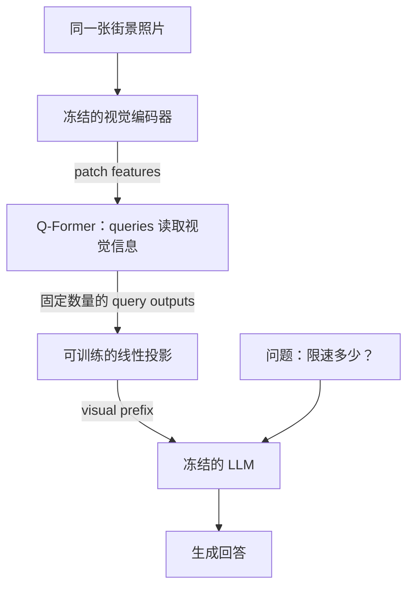
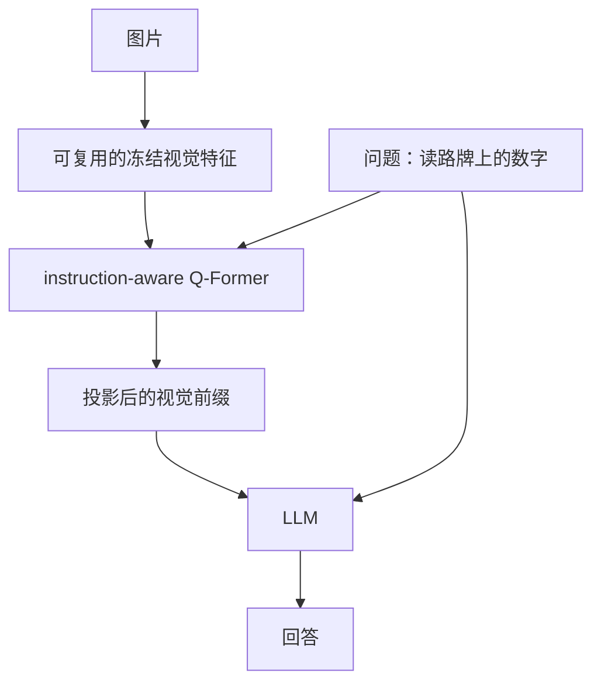

# BLIP 到 InstructBLIP：怎样把视觉信息交给语言模型？

**中文** · [English](blip-and-q-former.en.md)

> 阅读时间：约 14 分钟 · 最近审阅：2026-10

假设一张照片里有自行车、骑车的人，还有一块限速牌。找出与它匹配的描述、判断“人在推车”是否正确、回答“限速多少”，需要用到的信息并不完全一样。

[CLIP](clip.md) 先教我们比较图文向量。这一篇往前走：先看 BLIP 怎样分别训练配对、匹配和生成，再看 BLIP-2 怎样连接现成模型，最后看 InstructBLIP 为什么让问题提前参与视觉特征提取。这里不是推荐旧型号用于新项目，而是借这条路线理解连接模块的选择。

## BLIP：三个目标不是换名字算同一个分数

BLIP 使用可以切换编码、融合与解码方式的 MED 结构。下面用自拟的街景例子区分目标，不是模型实测。

| 目标 | 让模型做什么 | 街景例子 | 单靠它容易漏什么 |
| --- | --- | --- | --- |
| ITC，图文对比 | 分别编码后，在候选中找配对 | 照片应接近骑车描述，而不是做饭描述 | 大致主题匹配，不代表动作细节正确 |
| ITM，图文匹配 | 图文交互后判断是否匹配 | “骑车”与“推车”哪个符合画面 | 会判断，不等于会组织回答 |
| LM，语言建模 | 看图和已有前缀，预测后续文字 | 生成“一个人骑车经过路口” | 句子流畅，仍可能漏掉或编出细节 |

原始 BLIP 的 text encoder 和 decoder 共享大部分参数，但 self-attention 层分开；双向理解和因果生成需要不同的信息流。CapFilt 则处理数据：captioner 补描述，filter 筛掉不匹配的原始或生成描述，再用整理后的数据训练新模型。[BLIP §3](https://arxiv.org/abs/2201.12086)

比如原始文字是“周末快乐”，生成描述补成“一个人骑自行车”。这可能更适合视觉学习，但如果它把“推车”错写成“骑车”，合成数据也会带来错误。过滤器只能按自己的能力判断，不能把“通过过滤”当作事实认证。一个可行的检查是保留少量人工核对样本，分别统计原始描述和生成描述的错误，而不是只看数据量涨了多少。

ITC 挖出的高相似非配对样本，也只是**值得检查的难负例候选**。照片配了另一句同义描述时，它可能是假负例。改变采样方式和证明样本真的错误，是两件事。

### 过滤更严，数据就一定更好吗？

用 4 条自拟图文配对做一个可核对的小例子：filter 分数分别是 `0.9, 0.8, 0.6, 0.4`，人工核对的正确性是 `对、错、对、对`。这些分数不是模型实测，也不假设已经校准成概率。

| 保留门槛 | 留下几条 | 留下的有多准（precision） | 全部候选保留比例 | 原本正确的留下多少（recall） |
| --- | ---: | ---: | ---: | ---: |
| 0.5 | 3 | 2/3 | 3/4 | 2/3 |
| 0.85 | 1 | 1 | 1/4 | 1/3 |

门槛提高后 precision 变好，但丢了两条正确描述。如果丢掉的主要是少见场景、长描述或小字，训练集可能变得更干净，也更单一。应按内容类型分别看，而不是只挑一个漂亮的平均值。

```python
def filter_report(scores, verified, threshold):
    if len(scores) != len(verified) or not scores:
        raise ValueError("expected paired, nonempty audit records")
    if not all(0 <= score <= 1 for score in scores) or not 0 <= threshold <= 1:
        raise ValueError("scores and threshold must lie in [0, 1]")
    if any(type(label) is not bool for label in verified):
        raise ValueError("audit labels must be booleans")
    selected = [label for score, label in zip(scores, verified) if score >= threshold]
    correct = sum(selected)
    return {
        "kept": len(selected),
        "precision": correct / len(selected) if selected else None,
        "retention": len(selected) / len(scores),
        "recall": correct / sum(verified) if any(verified) else None,
    }

audit = filter_report([0.9, 0.8, 0.6, 0.4], [True, False, True, True], 0.5)
assert audit == {"kept": 3, "precision": 2 / 3, "retention": 0.75, "recall": 2 / 3}
```

真实流程里用独立开发集选门槛，再在没有参与选门槛的审计集上报告结果。原始描述与合成描述分开统计，重复图片先分组，留意 captioner 和 filter 是否共享错误。上面只是筛选账本，不是 BLIP 的训练实现，也没有把“更干净”直接换算成下游提升。

## BLIP-2：已经有两个好模型，还缺什么

视觉编码器会提取特征，LLM 会生成文字，但它们并没有约定同一种输入语言。BLIP-2 在两者之间训练 Q-Former：一组可学习的 query 从视觉特征中取信息，输出固定数量的向量，再投影成 LLM 的输入。论文预训练分为视觉语言表示学习、接入冻结 LLM 的生成学习两个阶段；图像编码器在这两个阶段也冻结。[BLIP-2 §3](https://arxiv.org/abs/2301.12597)



图中是第二阶段的简化路径，不是三个模型同时从头训练。query 是参数，不是一条手写问题，也不保证每个 query 固定对应一个物体。与逐 patch 的 MLP projector 相比，它多了内容相关的汇总，同时也多了一个可能丢信息的地方。

## 32 个向量：省下输入，不代表保留一切

论文设置用 32 个 query，隐藏维度 768；这不是所有连接模块都必须遵守的数字。假设视觉输出为 $257\times1024$，Q-Former 输出 $32\times768$，再投影到 LLM 宽度 $D_{\text{LM}}$，则交给 LLM 的是 $32\times D_{\text{LM}}$。投影改变宽度，query 数决定视觉前缀长度。[BLIP-2 §3.1](https://arxiv.org/abs/2301.12597)

下面是形状推算：再加 20 个文本 token，直接接 257 个视觉 token 时前缀长 277，接 32 个时长 52。单层、单头完整 prefill 分数矩阵的元素数从 $277^2=76{,}729$ 变成 $52^2=2{,}704$。这个比值**不是整网加速比**：视觉编码和 Q-Former 也要计算，解码还有另一套成本。

在街景中，汇总表示可能足以描述“人在骑车”，却未必留下限速牌上小字的细节。要知道瓶颈在哪里，可以固定模型其余部分，比较更高分辨率、更多 query 和局部裁剪分别改善了什么；别同时换三个设置后把效果全归给 query 数。

## 同一组 query，三种可见范围

第一阶段不只是把三个 loss 相加。要避免信息泄漏，还得控制 query 和文本能不能互相看见：

| 目标 | query 看文本？ | 文本看 query？ | 文本看文本？ |
| --- | --- | --- | --- |
| ITC | 不可以 | 不可以 | 双向 |
| ITM | 可以 | 可以 | 双向 |
| ITG，图像条件生成 | 不可以 | 可以 | 只能看当前位置及以前的输入 |

这是 [BLIP-2 的 attention mask 设计](https://arxiv.org/abs/2301.12597)。ITC 先各自编码再匹配；ITM 允许充分交互；ITG 不能偷看未来答案。生成训练中，当前位置输入 token 的输出预测下一个 token，所以允许看“自己”不等于答案泄漏。

我们把它缩成 2 个 query、3 个文本位置的教学代码。`True` 表示允许读取；它不是某个框架通用的布尔 mask 约定。

```python
def visibility_mask(objective, query_count, text_count):
    if objective not in {"itc", "itm", "itg"}:
        raise ValueError("Expected itc, itm, or itg")
    if min(query_count, text_count) < 1:
        raise ValueError("Both sequence lengths must be positive")
    total = query_count + text_count
    mask = []
    for row in range(total):
        row_is_query = row < query_count
        allowed = []
        for column in range(total):
            column_is_query = column < query_count
            if objective == "itm":
                visible = True
            elif objective == "itc":
                visible = row_is_query == column_is_query
            elif row_is_query:
                visible = column_is_query
            else:
                visible = column_is_query or column <= row
            allowed.append(visible)
        mask.append(allowed)
    return mask

generation_mask = visibility_mask("itg", 2, 3)
assert generation_mask[0] == [True, True, False, False, False]
assert generation_mask[3] == [True, True, True, True, False]
```

它只演示 query/text 的 self-attention，不包括读图的 cross-attention、padding 和真正的 Transformer。把 ITG 改成全双向后，训练 loss 可能更低，却是在用推理时拿不到的未来文字答题。

ITC 的相似度还要处理“多个 query 对一个文本”。[官方实现](https://github.com/salesforce/LAVIS/blob/main/lavis/models/blip2_models/blip2_qformer.py)先算每个 query 与文本的相似度，再取最大值；ITM 则平均各 query 的二分类 logits。假设两个 query 的配对分数为 `[0.8, 0.1]`：max 是 0.8，mean 是 0.45。它们表达的偏好不同，不能顺手替换；这些分数也不意味着 query 已经学成两个明确的物体槽。

## InstructBLIP：先告诉它要看什么

同一张照片，问“画面里有什么”和问“路牌写了什么”，希望保留的细节不同。InstructBLIP 把指令同时交给 Q-Former 和 LLM，让视觉汇总也受问题影响。它从 BLIP-2 预训练模型继续做 instruction tuning，而不是每个新任务都重跑两阶段预训练。[InstructBLIP §2](https://arxiv.org/abs/2305.06500)



这是修改已有 Q-Former 的输入路径，不是再叠一个独立 Q-Former。工程上也带来取舍：对于同一张经过相同预处理的图片，可以复用冻结视觉编码器的结果；但问题变了，instruction-aware query 输出通常需要重算。问题依赖的特征不能当作永远可缓存的图片常量。

任务数据怎么混也很重要。论文采用数据集大小的平方根加权，并有个别人工调整。用一个自拟例子比较：两个数据集分别有 100 和 10,000 条，按样本数混合约为 `1 : 100`，每个数据集等概率为 `1 : 1`，平方根权重则为 `1 : 10`。它改变训练注意力分配，不保证小数据集一定更重要；仍要分别看各任务的验证结果。

### 怎样验证“先告诉它看什么”有用？

不要只比较两个名字不同的 checkpoint。先固定视觉骨干、LLM、query 数、图片预算、训练步数和数据，再设计两条可对照的连接路径：

| 训练 / 测试设置 | Q-Former 收到问题？ | LLM 收到问题？ | 想回答什么 |
| --- | --- | --- | --- |
| A：不做指令感知的连接路径 | 否 | 是 | 统一视觉摘要够不够用 |
| B：指令感知的连接路径 | 是 | 是 | 汇总阶段知道问题是否有帮助 |
| B 的测试期干预 | 故意换成另一问题 | 保持原问题 | 输出对连接路径输入是否敏感 |

最后一行是干预，不是公平训练对比：它引入了分布变化，只能作为诊断。若 A、B 的训练数据、可训练模块也不同，就不能把全部差异归因于 instruction-aware Q-Former。

准备同图多问的测试组：问主要物体、数量、小字、空间关系；再按图片来源或模板分组留出，避免同图改问法泄漏到测试集。分别报告任务表现、视觉 token 数和延迟。图像特征可以缓存，带问题的 query 输出不能跨问题直接复用；测试缓存键至少包含图片预处理、编码器 / 连接模块版本和问题。

InstructBLIP 原论文区分用于指令训练与留出的 datasets；“held-out dataset”仍要继续检查图片重叠，不能只凭数据集名字不同就断言无泄漏。[实验范围](https://arxiv.org/abs/2305.06500)

这是一份可以实施的消融方案，不是本站已经跑过的训练结果。冻结与目标 mask 怎么检查，可以继续看[多模态微调](vlm-finetuning.md)。

## 冻结模型，不是删掉反向传播

[InstructBLIP 的 Vicuna 实现](https://github.com/salesforce/LAVIS/blob/main/lavis/models/blip2_models/blip2_vicuna_instruct.py)冻结视觉骨干和 LLM，训练连接路径，包括 query、Q-Former 和 LLM 投影。别只根据“只训练 Q-Former”这句简写统计参数，具体配置还要看可训练参数列表。

设视觉前缀 $z=g_\theta(I)$，冻结 LLM 为 $f_\phi$，则：

$$\frac{\partial L}{\partial\theta}
=\frac{\partial L}{\partial f_\phi}\frac{\partial f_\phi}{\partial z}\frac{\partial z}{\partial\theta}.$$

$\phi$ 不更新，但中间的 $\partial f_\phi/\partial z$ 仍然需要。把整个 LLM 前向包在 `no_grad` 中，会断开连接模块需要的梯度。省掉的是冻结参数的梯度和优化器状态，不是 LLM 前向、所有激活或所有反向计算。

再缩成一个标量：$z=\theta x$，$f(z)=az$，$L=(az-y)^2$。固定 $a=2,x=3,y=1,\theta=0.5$，有 $\partial L/\partial\theta=2(3-1)\times2\times3=24$。下游的 $a$ 没训练，梯度照样要经过它。这个例子也解释了为什么“可训练参数很少”不等于训练显存很少。

## 最后看的是信息有没有真的用上

| 保持什么 / 改什么 | 要回答的问题 | 不宜直接下的结论 |
| --- | --- | --- |
| 固定问题，去掉或打乱图片 | 结果是否依赖正确图片 | 分数下降不自动证明细粒度理解 |
| 固定场景，只改关键数字或动作 | 回答会不会随证据改变 | 几个好案例不等于整体可靠 |
| 同图换问题 | 特征提取能否服务不同任务 | attention 热图不是因果证明 |
| 分别测小字、计数、空间关系 | 汇总时哪些信息丢得更多 | 不能只看一个平均分 |

这些是可以自己设计的检查，不是三篇论文的统一 benchmark。BLIP 的数据和目标、BLIP-2 的连接瓶颈、InstructBLIP 的指令感知，分别提供了不同的改动位置。先知道当前失败在哪儿，再决定换数据、增大视觉输入，还是改连接模块。
