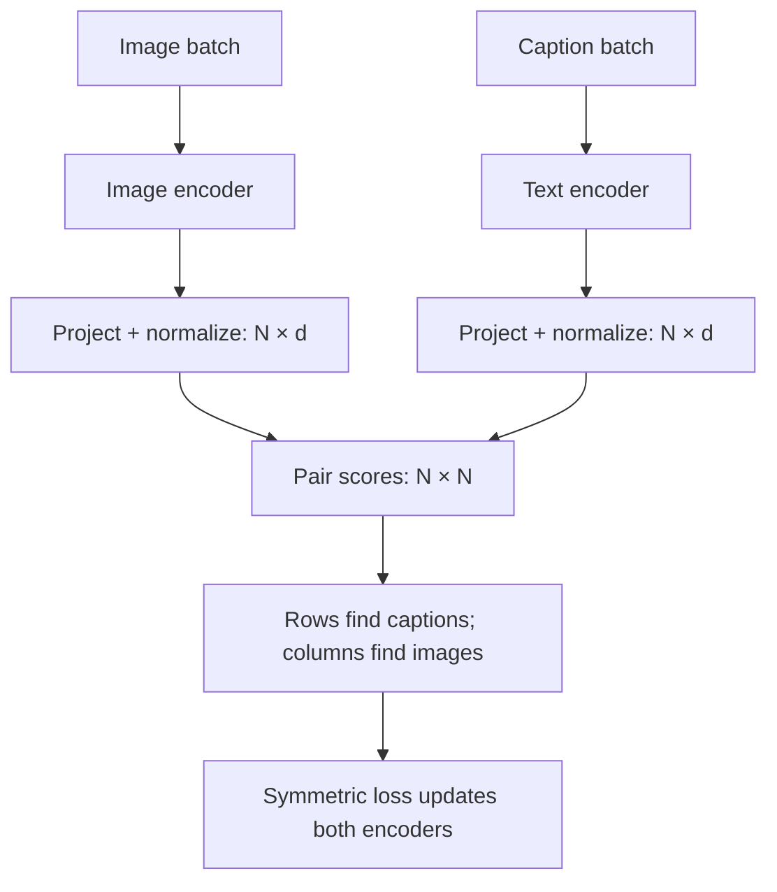

# How CLIP matches images and text

[中文](clip.md) · **English**

> Reading time: about 7 minutes · Level: introductory to intermediate · Last reviewed: 2026-09

Take three images—a cat, a bicycle, and a coffee—and their three captions. Instead of asking for an essay, ask: **which image belongs with which caption?** This is a useful starting point for CLIP.

First review [vectors, cosine, and softmax](../00-foundations/core/embeddings-and-similarity.en.md). This note covers the original 2021 CLIP objective, not a universal recipe for multimodal models.

## Encode separately, then compare

[CLIP](https://arxiv.org/abs/2103.00020) processes images and text with separate encoders, projects to a shared dimension, normalizes, and scores pairs. The paper studied both ResNet and ViT vision branches; CLIP is not synonymous with one vision architecture.



Image tokens do not cross-attend to every caption here. Independent encoding helps retrieval, at the cost of compressing interaction details into vectors.

## Start with a score table

These are **invented teaching scores, not model measurements**. Rows are images; columns are captions. Dataset pairs lie on the diagonal.

| | Cat caption | Bicycle caption | Coffee caption |
| --- | --- | --- | --- |
| Cat image | 0.8 | 0.2 | 0.1 |
| Bicycle image | 0.1 | 0.7 | 0.3 |
| Coffee image | 0.2 | 0.1 | 0.9 |

To retrieve a caption for the cat image, compare row 1. To retrieve an image for the cat caption, compare column 1. **Column probabilities need their own normalization; transposing row probabilities is not equivalent.**

<div class="clip-lab" data-clip-lab data-language="en"><p>The interactive experiment needs JavaScript. You can also use the table: divide scores by temperature, apply softmax along a row or column, then compute −log p for the paired target.</p></div>

## Write the operation as a loss

For normalized image and text vectors $u_i,v_j$, let $s_{ij}=u_i^\top v_j/\tau$. The row objective is:

$$L_{I\to T}=-\frac{1}{N}\sum_{i=1}^{N}\log\frac{\exp(s_{ii})}{\sum_{j=1}^{N}\exp(s_{ij})}.$$

The column objective swaps queries and candidates; $L=(L_{I\to T}+L_{T\to I})/2$. This is the paper's symmetric cross-entropy objective. The [official implementation](https://github.com/openai/CLIP/blob/main/clip/model.py) exponentiates a learned logit scale, corresponding to $1/\tau$ here.

For row 1 at $\tau=1$, the paired probability is about 0.489 and its loss about 0.716. The lab and page calculate the same numbers:

```bash
python 00-foundations/code/multimodal_math.py
python 00-foundations/code/multimodal_math.py --torch
```

The first needs no PyTorch. The second checks the same scores with PyTorch, then updates toy vectors. **It demonstrates loss and gradients, not training a real CLIP model.**

## Three easy mistakes

1. **“Every other pairing is wrong.”** That is the single-positive target assignment, not a real-world guarantee. Two cat images may both suit a cat caption. Duplicate captions treated as negatives create conflicting supervision; try that setting in the experiment.
2. **“Gradient accumulation enlarges the contrastive pool.”** If each microbatch scores only its own candidates, cross-microbatch pairs never enter the denominator. Accumulation does not add them automatically; cross-device candidate sharing also requires an explicit implementation.
3. **“Lower temperature is always better.”** It makes the highest score more decisive, including when that score is wrong. Temperature cannot repair incorrect pair labels.

## Where zero-shot classification comes from

Encode candidate descriptions such as “a photo of a cat,” then compare them with the image. Zero-shot here means no weight update for the downstream classification task—not no pretraining or a guarantee that related concepts were unseen. See the [official CLIP example](https://github.com/openai/CLIP#zero-shot-prediction).

Original CLIP scores classes or pairs; **it does not generate an answer token by token**. To ask what the person on the left is doing, continue with [connecting vision to a language model](vision-to-language.en.md).
