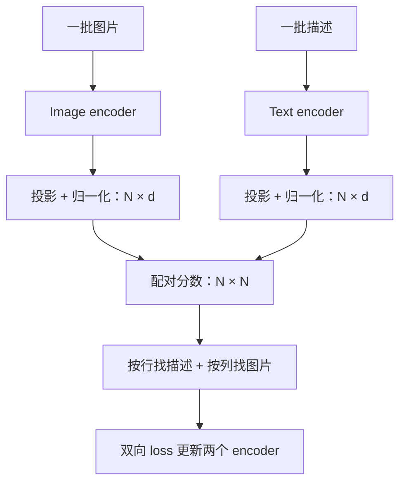

# CLIP 怎样把图片和文字对上

**中文** · [English](clip.en.md)

> 阅读时间：约 9 分钟 · 难度：基础到进阶 · 最近审阅：2026-10

手里有 3 张图：猫、自行车、一杯咖啡；还有 3 句对应描述。先别让模型写作文，只让它回答：**哪张图和哪句话是一对？** 这就是理解 CLIP 很好的起点。

需要先会一点[向量、余弦和 softmax](../00-foundations/core/embeddings-and-similarity.md)。本页讲 2021 年原始 CLIP 的核心目标，不把它当成所有多模态模型的统一配方。

## 图片和文字先分别编码，再比较

[CLIP](https://arxiv.org/abs/2103.00020) 分别用图像编码器和文本编码器处理输入，再把两边的表示投影到相同维度、归一化，计算匹配程度。原论文尝试了 ResNet 和 ViT 作为视觉分支，所以 CLIP 并不等于某一种图像模型。



这里不让图片 token 和每句话直接做交叉注意力。两边可以分别计算，所以适合用来检索；但比较时只能使用已经压缩好的向量，一些细节也可能丢失。

## 先看一张分数表

下面是**虚构教学分数，不是模型测量**。一行是一张图，一列是一句描述，数据配对放在对角线上。

| | 猫的描述 | 自行车的描述 | 咖啡的描述 |
| --- | --- | --- | --- |
| 猫图 | 0.8 | 0.2 | 0.1 |
| 自行车图 | 0.1 | 0.7 | 0.3 |
| 咖啡图 | 0.2 | 0.1 | 0.9 |

找猫图的描述，就沿第一行比较；给定“猫的描述”找图片，就沿第一列比较。**列方向需要重新归一化，不能转置行概率来代替。**

<div class="clip-lab" data-clip-lab data-language="zh"><p>交互实验需要 JavaScript。也可以用上表手算：除以温度，再沿行或列做 softmax；正确配对的 loss 是 −log p。</p></div>

## 把刚才的操作写成 loss

令 $u_i,v_j$ 是归一化后的图像和文本向量，$s_{ij}=u_i^\top v_j/\tau$。按行的目标是：

$$L_{I\to T}=-\frac{1}{N}\sum_{i=1}^{N}\log\frac{\exp(s_{ii})}{\sum_{j=1}^{N}\exp(s_{ij})}.$$

按列同理，交换查询和候选；最终 $L=(L_{I\to T}+L_{T\to I})/2$。这是原论文的双向交叉熵目标。[官方实现](https://github.com/openai/CLIP/blob/main/clip/model.py)用可学习的 logit scale 的指数来缩放相似度，对应这里的 $1/\tau$。

拿第一行、$\tau=1$ 手算，正确项概率约为 0.489，loss 约为 0.716。下面的小实验和页面会算同一组数：

```bash
python 00-foundations/code/multimodal_math.py
python 00-foundations/code/multimodal_math.py --torch
```

第一条不需要 PyTorch；第二条用同样的分数核对结果，再更新一组玩具向量。**它演示 loss 和梯度，不是在训练真实的 CLIP。**

## 最容易想错的 3 件事

先澄清“没有标签”这个说法：CLIP 不需要每张图都配一个人工类别 ID，但图片和文字的配对本身就是监督。网页描述可能很嘈杂，却不是没有学习目标的随意文本。自然语言监督可以减少固定类别的限制，也把配对质量带进了训练问题。[CLIP 论文](https://arxiv.org/abs/2103.00020)

1. **“其他配对都是错的。”** 这是单正例目标的标签安排，不是真实世界保证。两张猫图可能都适合“猫”的描述；相同描述却被互相当成负例，会制造冲突。交互里的“重复描述”就是这个例子。
2. **“积累梯度就等于扩大对比池。”** 如果每个 microbatch 只在内部算分数，跨 microbatch 的配对不会进入分母。累加梯度并不会自动补出这些候选；跨设备候选共享也需要显式实现。
3. **“温度越低越好。”** 它让模型更确信当前最高分；最高分错了，也会更确信地错。调整温度并不能修复配对标签。

## 它怎么做到 zero-shot 分类

把类别写成候选描述，例如 “a photo of a cat”，用 text encoder 得到类别向量，再和图片比较。不为这个下游分类任务更新权重，就是这里的 zero-shot；不是说模型从未训练过、也不保证预训练没见过相关概念。这个用法来自 [CLIP 官方示例](https://github.com/openai/CLIP#zero-shot-prediction)。

它能给类别或图文配对打分，**原始 CLIP 本身不会逐 token 生成回答**。想问“图里左边的人在做什么”，下一篇要补一座桥：[从视觉编码器到会回答问题的 LLM](vision-to-language.md)。

## 0.88 的分数，究竟在说什么

假设一张自行车照片对两个候选的 logits 是 `[2, 0]`。softmax 后，第一个候选约为 0.881。现在增加一个同样得 2 分的候选，logits 变成 `[2, 0, 2]`，第一个候选的概率降到约 0.468。图片、原来的候选和原来的两个分数都没变。

这是一个自拟的 softmax 算例：概率取决于候选列表，不能直接读成“模型有 88% 的把握认对现实中的物体”。做拒识或置信度阈值时，还要在固定协议下校准，特别是所有候选都不合适的时候。

CLIP 的文本分支当然能输出文本向量，但图文训练目标没有自动保证所有文本—文本任务都合适。要拿它做句子检索，应该与专门的文本 embedding baseline 在目标数据上比较。能算余弦，与这个余弦能否反映你要的语义，是两回事。
