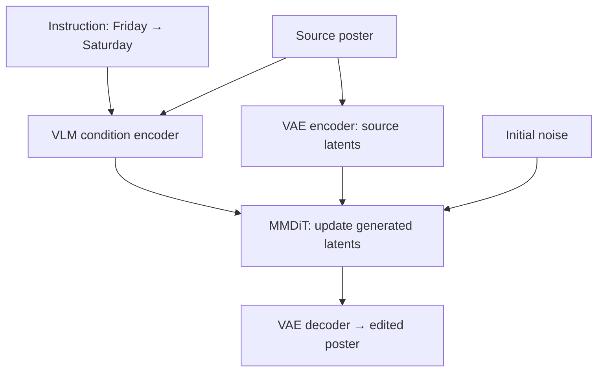

# Qwen-Image: from understanding images to generating them

[中文](image-generation.md) · **English**

> Last reviewed: 2026-10-08 · Prerequisite: [Vision to language](vision-to-language.en.md)

“Change Friday to Saturday on this poster. Leave everything else alone.” The model needs to locate the text, understand the edit, render the new letters, and preserve the background. Being able to describe an image does not automatically provide those abilities.

## Different tasks need different outputs

| Task | Input | Output | An easily missed requirement |
| --- | --- | --- | --- |
| Visual question answering | Image and question | Text tokens | The image must support the answer |
| Text-to-image | Description and random noise | Image latents, decoded into pixels | Approximate semantics are not enough |
| Image editing | Source image, instruction, noise | Edited image | Unrequested changes also count as failures |

The original Qwen-Image uses Qwen2.5-VL for semantic conditioning, a VAE for compressed image representations, and an MMDiT for latent-space generation. Editing sends the source image through both semantic and VAE encoding paths. [Original report](https://arxiv.org/abs/2508.02324)

The semantic path helps specify what to change; the reconstruction path helps retain visual detail. These are different emphases, not perfectly separated information types or a guarantee that the background stays intact.



This diagram describes editing. Pure text-to-image generation has no source-image branch. The VAE does not translate an image into a sentence.

## What flow matching learns

Start with a simple straight path, not a checkpoint's full scheduler. Let the clean image latent be $z$, the noise be $\epsilon$, and time run from noise at 0 to data at 1:

$$
x_t=(1-t)\epsilon+tz,\qquad u_t=z-\epsilon.
$$

Given position $x_t$, time $t$, and condition $c$, the model predicts a direction of travel:

$$
\mathcal L_{FM}=\mathbb E\left[\|v_\theta(x_t,t,c)-u_t\|_2^2\right].
$$

This is velocity regression, not cross-entropy over text tokens. Papers and implementations may reverse the time convention; the velocity sign must change consistently.

For a scalar example, take noise 2 and target 10. At $t=0.25$, the position is 4 and target velocity is 8. A predicted velocity of 6 gives squared error 4. One Euler step of size 0.1 moves the position to 4.6. Real models operate on high-dimensional tensors, with predictions that vary with position and time.

```python
def linear_flow_example(noise, clean, time, prediction, step):
    if not 0 <= time <= 1 or not 0 <= step <= 1 - time:
        raise ValueError("time and step must stay within [0, 1]")
    position = (1 - time) * noise + time * clean
    target_velocity = clean - noise
    loss = (prediction - target_velocity) ** 2
    next_position = position + step * prediction
    return position, target_velocity, loss, next_position

assert linear_flow_example(2, 10, 0.25, 6, 0.1) == (4.0, 8, 4, 4.6)
```

Background: [Flow Matching](https://arxiv.org/abs/2210.02747). This code checks interpolation, direction, and the update. It neither generates images nor reproduces a real noise schedule.

## Separate the 2026 releases from the original design

| Version / source | Change checked in this review | Old assumption to reconsider |
| --- | --- | --- |
| Original Qwen-Image, August 2025 | VLM conditioning, VAE, and MMDiT; generation and editing tasks | A chat model is not directly predicting RGB values |
| Qwen-Image-2.0, May 2026 report | Qwen3-VL conditioning; VAE spatial compression increases from 8 to 16 | Original visual and latent token budgets no longer transfer unchanged |
| Qwen-Image-2.0-RL, June 2026 | Task-specific rewards, GRPO, and on-policy distillation | One aesthetic score does not describe every task |
| Qwen-Image-2.1, September 2026 announcement | Unified generation/editing and transparent-image support announced | A product announcement does not establish a verified local deployment or training recipe |

Sources: [2.0 report](https://arxiv.org/abs/2605.10730), [2.0-RL report](https://arxiv.org/abs/2606.27608), [2.1 announcement](https://qwen.ai/blog?id=qwen-image-2.1). Reports and release announcements provide different levels of evidence; their performance results are not reproduced here.

Check the spatial arithmetic: a 1024 × 1024 image compressed by 8 along each axis has 128 × 128 positions; compression by 16 gives 64 × 64, one quarter as many. **That does not promise one-quarter the memory.** Channels, patchification, model width, and reconstruction quality may also change.

## Why post-training still matters

Lower training error does not necessarily mean a more useful image. Correct letters in an ugly layout and an attractive poster with the wrong date are different failures.

The original report constructs DPO from flow-matching error differences on preferred images, while GRPO optimizes sampled trajectories. The language-model token log-probability formula cannot simply be reused unchanged. [Original post-training section](https://arxiv.org/html/2508.02324v1)

For one editing instruction, separate reward dimensions: target text correctness, edit scope, preservation elsewhere, and visual defects. Check conflicts before choosing weights.

Consider two hypothetical outputs. A writes “Saturday” correctly but changes the background; B preserves the background but still says “Friday.” An aesthetic-only score could reward both. Decide first whether the correct date is a hard requirement or something other scores may compensate for.

Randomness also needs care. A deterministic ODE solver follows a fixed trajectory given the same initial noise; changing the seed can still change the output. An SDE adds randomness along the path. It is not the case that ODE generation has no source of randomness at all.

## A small, useful evaluation set

| Slice | Original example | Check |
| --- | --- | --- |
| Exact text | Friday → Saturday; 8:30 → 9:30 | Exact field match with manual checks for OCR errors |
| Composition | Red cup left of blue book | Objects, colors, and relations separately |
| Local editing | Change title, preserve face and background | Regional differences plus human judgment; allow necessary antialiasing changes |
| Conflicting instructions | “Keep all text unchanged, but replace Friday” | Whether the model identifies the conflict instead of silently guessing |
| Transparency | Preserve subject, remove background | Inspect alpha rather than treating white as transparent |

Do not select only the best output for each prompt. Keep a fixed prompt set and multiple seeds, retain all outputs, and report failure rates. For edits, save the source, target region, and exact model version. That makes version comparisons interpretable.

Continue: [Multimodal fine-tuning: inspect one batch first](vlm-finetuning.en.md) · [LLM-as-a-judge](../07-evaluation/llm-as-a-judge/README.en.md)
