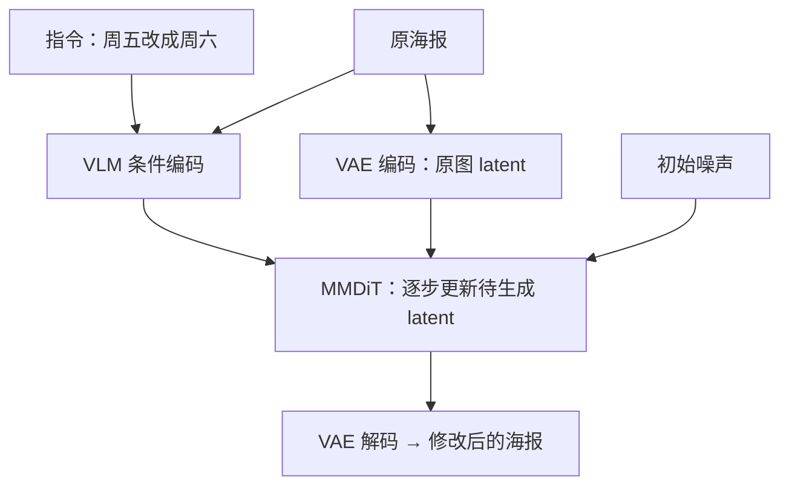

# Qwen-Image：从理解图片到生成图片

**中文** · [English](image-generation.en.md)

> 最近审阅：2026-10-08 · 先读：[图片怎样进入 LLM](vision-to-language.md)

“把海报上的周五改成周六，别动其他地方。”这句话看起来简单，模型却要同时做好几件事：找到文字、理解修改范围、画对新字，还要保留背景。一个会描述图片的 VLM，并不因此就会改图片。

## 两个方向，输出不一样

| 任务 | 输入 | 输出 | 一个容易忽略的要求 |
| --- | --- | --- | --- |
| 看图问答 | 图片、问题 | 文本 token | 答案必须有图中证据 |
| 文生图 | 描述、随机噪声 | 图像 latent，再解码为像素 | 不能只满足大概语义 |
| 图片编辑 | 原图、修改指令、噪声 | 修改后的图片 | 不该改的地方也要保住 |

Qwen-Image 初版用 Qwen2.5-VL 提供语义条件，VAE 提供图像的压缩表示，MMDiT 在 latent 空间里生成图片。编辑时，原图分别走语义编码与 VAE 编码两条路径。[初版报告](https://arxiv.org/abs/2508.02324)

直觉上，语义路径帮助理解“改哪儿、改成什么”，重建路径帮助保留原图细节。两条路径有不同侧重，不是各自只含一种信息，也不保证背景一定不变。



这张图画的是编辑过程。纯文生图没有原图分支；VAE 也不是把图片“翻译成一句话”。

## Flow matching 到底在学什么

先用一个简化的直线路径理解，不把它当作某个 checkpoint 的完整 scheduler。设干净图像 latent 是 $z$，噪声是 $\epsilon$，时间从噪声端的 0 走到数据端的 1：

$$
x_t=(1-t)\epsilon+tz,\qquad u_t=z-\epsilon.
$$

模型接收当前位置 $x_t$、时间 $t$ 和条件 $c$，预测该往哪里走：

$$
\mathcal L_{FM}=\mathbb E\left[\|v_\theta(x_t,t,c)-u_t\|_2^2\right].
$$

这是速度回归目标，不是对一串文字 token 做交叉熵。论文或实现可能把时间方向反过来，速度的符号也要跟着变，不能只抄一边。

拿一维数值算一次：噪声为 2，目标为 10，在 $t=0.25$ 时位置为 4，目标速度为 8。若模型预测 6，平方误差是 4；按步长 0.1 做一次 Euler 更新，位置变为 4.6。真实模型处理的是高维张量，预测速度也会随位置和时间变化。

```python
def linear_flow_example(noise, clean, time, prediction, step):
    if not 0 <= time <= 1 or not 0 <= step <= 1 - time:
        raise ValueError("time and step must stay within [0, 1]")
    position = (1 - time) * noise + time * clean
    target_velocity = clean - noise
    loss = (prediction - target_velocity) ** 2
    next_position = position + step * prediction
    return position, target_velocity, loss, next_position

assert linear_flow_example(2, 10, 0.25, 6, 0.1) == (4.0, 8, 4, 4.6)
```

公式依据：[Flow Matching](https://arxiv.org/abs/2210.02747)。这个代码只检查插值、方向和更新，不会生成图片，也没有复现真实噪声日程。

## 2026 年的变化，和初版分开读

| 版本 / 资料 | 这次核对到的变化 | 不应直接沿用的旧假设 |
| --- | --- | --- |
| 初版 Qwen-Image，2025-08 | VLM 条件、VAE 与 MMDiT；分别学习生成和编辑能力 | 不是让聊天模型直接预测 RGB |
| Qwen-Image-2.0，2026-05 技术报告 | 条件编码器改为 Qwen3-VL；VAE 空间压缩从 8 倍提高到 16 倍 | 初版的视觉与 latent 长度预算不能原样照搬 |
| Qwen-Image-2.0-RL，2026-06 | 按任务设计奖励，用 GRPO 与 on-policy distillation 整合策略 | 不是给所有图片一个“美观分”就够了 |
| Qwen-Image-2.1，2026-09 发布说明 | 宣布统一生成与编辑，并支持透明图像 | 产品发布说明不等于已验证本地部署和训练配方 |

来源：[2.0 报告](https://arxiv.org/abs/2605.10730)、[2.0-RL 报告](https://arxiv.org/abs/2606.27608)、[2.1 官方发布](https://qwen.ai/blog?id=qwen-image-2.1)。这里区分报告内容与发布公告，没有复现它们的性能结果。

空间压缩值得自己算：1024 × 1024 图片，边长除以 8 后是 128 × 128 个位置；除以 16 后是 64 × 64，位置数变为四分之一。**这不是显存变为四分之一的承诺**，因为通道数、patchification、模型宽度和重建质量也可能改变。

## 为什么还需要后训练

训练误差降低，不代表用户更喜欢结果。海报里字画对了但布局难看，和画得漂亮却写错日期，是两类问题。

初版报告中的 DPO 根据偏好图像的 flow-matching 误差构造目标；GRPO 则对采样轨迹做优化。不能把语言模型 token 的 log-prob 公式不加修改地套过来。[初版后训练部分](https://arxiv.org/html/2508.02324v1)

对同一句编辑指令，可以把奖励拆成：目标文字是否正确、修改范围是否正确、其余区域是否保留、图片是否有明显破损。先检查这些维度是否冲突，再讨论加权。

例如两张虚构输出：A 写对“周六”却换了背景；B 保住背景却仍写“周五”。如果标准只看美观，很可能两个都被打高分。训练前应明确：日期正确是不是硬性要求，还是可以被其他分数补偿？

另一个容易误解的点是随机性。给定同一个初始噪声，确定性 ODE 求解会走固定轨迹；换一个 seed，输出仍会变。SDE 额外引入沿途的随机性，不是说 ODE 生成从来没有随机来源。

## 一个小而有用的评估集

| 切片 | 自拟样例 | 检查方式 |
| --- | --- | --- |
| 精确文字 | 周五 → 周六；8:30 → 9:30 | 字段完全匹配，人工检查 OCR 的错 |
| 组合关系 | 红杯在蓝书左边 | 分别检查对象、颜色与位置 |
| 局部编辑 | 只改标题，不改人脸与背景 | 区域差异配合人工判断，允许必要抗锯齿变化 |
| 指令冲突 | “不改任何字，但把周五改周六” | 是否指出矛盾，而非悄悄猜一个要求 |
| 透明输出 | 主体保留、背景透明 | 检查 alpha，不把白底当透明 |

生成有随机性，别每个 prompt 只挑一张最好看的。固定 prompt 集，保留多 seed 输出，报告失败比例；编辑还要保存原图、修改区域和具体模型版本。这样才知道换版本后到底好在哪里。

继续读：[多模态微调：先检查一批数据](vlm-finetuning.md) · [LLM-as-a-judge](../07-evaluation/llm-as-a-judge/README.md)
