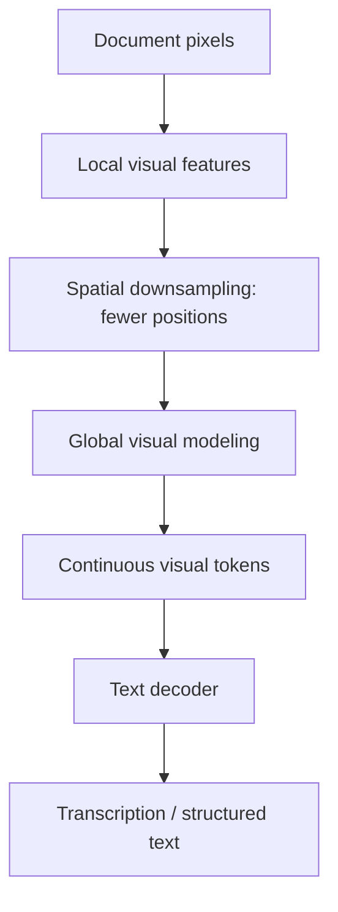

# DeepSeek-OCR: does rendering text as an image really save work?

[中文](ocr-compression.md) · **English**

> Last reviewed: 2026-10 · Prerequisites: [ViT](vit.en.md), [KV cache](../00-foundations/deep-dives/kv-cache-and-inference.en.md)

A document occupies 2000 text tokens but only 200 visual tokens after image encoding: a tenfold saving? Only in input length. We still need to ask whether characters and structure survived, and how much image encoding cost.

## Separate three tasks

| Task | Required output | Evaluation |
| --- | --- | --- |
| OCR transcription | Accurate text and reading order | Character/word error and field accuracy |
| Document understanding | Answers grounded in layout and content | Answer and supporting evidence correctness |
| Context compression | Shorter representations preserving downstream information | Task performance, reconstruction, and total cost at a given budget |

Transcribing text does not prove table reasoning. Answering one question does not prove preservation of the entire source. DeepSeek-OCR connects visual encoding and text decoding to investigate optical context compression, not to establish that long-context modeling is solved. [Paper](https://arxiv.org/abs/2510.18234)

## DeepEncoder does not compress a written summary

DeepEncoder applies primarily window-based visual processing, downsamples, and applies global visual modeling. Its continuous representations feed an MoE text decoder. It does not first write “a financial report” and then ask an LLM to reconstruct everything. [Architecture](https://arxiv.org/html/2510.18234v1)

The paper's 1024-input example starts with $64\times64=4096$ patches. Two spatial stride-two stages produce $16\times16=256$ positions. Each side becomes one quarter as long; the position count becomes one sixteenth. [DeepEncoder §3.2](https://arxiv.org/html/2510.18234v1)

## OCR 2: organizing reading order as well as compression

The 2026 DeepSeek-OCR 2 uses DeepEncoder V2. It retains visual compression and replaces the subsequent CLIP module with a compact language-model architecture. Visual tokens form a prefix; learnable causal-flow queries read them through a specialized attention mask, and query representations feed the text decoder. [OCR 2 report, §3](https://arxiv.org/html/2601.20552v1)

The question is no longer only how many tokens represent a page, but how the decoder should read the relationships between them. Columns, side notes, and table footnotes do not always follow left-to-right, top-to-bottom patch order.

For example, a left column contains an argument and a right column contains an advertisement. Scanning across each row interleaves unrelated paragraphs; transcription should preserve their separate order. Test a synthetic two-column page for reading order and character accuracy separately. “Causal” here describes information dependencies inside the model, not statistical causal inference or evidence of human-like eye movements.

## An incomplete but useful budget

For a teaching document with 2000 text tokens and 200 visual representations, nominal compression is:

$$r=\frac{N_{text}}{N_{vision}}=\frac{2000}{200}=10.$$

Characters, words, and tokens are different units. Do not insert “2000 Chinese characters” or “2000 English words” directly into the formula; specify a tokenizer and count first.

With a 100-token question, input length changes from 2100 to 300. Under the same language backbone and cache dtype, raw input KV storage becomes approximately $300/2100=1/7$. This excludes the visual encoder and generated output.

If the task is full transcription, output may still contain 2000 tokens. Autoregressive generation remains, so a tenfold input reduction is not a tenfold total speedup. A short downstream question has a different cost profile.

## A consequential error can be one character

One fictional invoice says `¥1,280.00`; another says `¥1,230.00`. Almost all text matches, but the important field differs. One wrong field among 100 can coexist with excellent average character accuracy while the accounting fails.

Include synthetic random IDs, similar digits, decimal points, units, shifted columns, and faint small text—not only natural prose. Language priors cannot reliably guess these, making them useful evidence-use tests.

An independent study uses semantic corruption to probe language-prior dependence. It motivates separating pixel reading from plausible completion. Its conclusions depend on the protocol; they do not establish identical behavior for every OCR model and document. [Independent audit](https://arxiv.org/abs/2601.03714)

## A fair experimental design

| Hold fixed | Vary | Report together |
| --- | --- | --- |
| Synthetic document and questions | Resolution and compression budget | Field accuracy and character error |
| Output-length limit | Native text versus document images | Total latency, visual encoding time, input/output tokens |
| Fonts and layout | Natural text versus random strings | Dependence on language priors |
| Facts | Column or reading order | Preservation of layout relationships |

Keep source images and text when changing budgets. Do not let the same OCR model supply all validation labels: its errors would become the answer key.

## When converting to images is not worthwhile

For clean structured text, native-text retrieval or chunking may be simpler. Scans, complex layouts, and joint image reasoning can justify the visual route. Compression should still preserve a path back to original evidence.

Lowering the resolution of old material is a resource-allocation research idea, not an automatic ability to identify unimportant memories. Dates, names, and decimal points might disappear first. Blur is not validated intelligent forgetting.

Continue: [Understanding versus generating images](image-generation.en.md) · [Evaluation and slices](../07-evaluation/ablation-and-slices.en.md)
