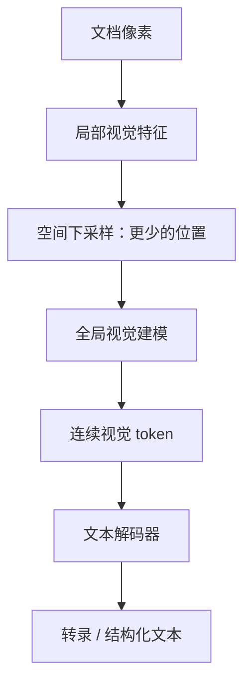

# DeepSeek-OCR：把文字变成图片，真的省了吗？

**中文** · [English](ocr-compression.en.md)

> 最近审阅：2026-10 · 先读：[ViT](vit.md)、[KV cache](../00-foundations/deep-dives/kv-cache-and-inference.md)

如果一页文档原本占 2000 个文本 token，改成图片后只用 200 个视觉 token 送给 LLM，看起来省了 10 倍。但这只是输入长度的账。字有没有读错？表格结构有没有丢？图像编码花了多少时间？这些都要继续算。

## 先分清 3 个任务

| 任务 | 要交出的东西 | 怎么验 |
| --- | --- | --- |
| OCR 转录 | 尽量准确的文字与阅读顺序 | 字符/词错误率、字段准确率 |
| 文档理解 | 根据布局和内容回答 | 答案与对应证据是否正确 |
| 上下文压缩 | 用较短表示保留后续任务需要的信息 | 压缩预算下的任务表现、恢复能力与总成本 |

能抄回文字，不等于能推理整张表；能回答一道题，也不等于所有原文都被保留下来。DeepSeek-OCR 把视觉编码和文本解码联系起来，用来研究光学上下文压缩，但不能据此宣布长上下文问题已解决。[论文](https://arxiv.org/abs/2510.18234)

## DeepEncoder 压的不是一段摘要

DeepEncoder 先用以窗口注意力为主的视觉模块，再下采样，接全局视觉模块；压缩后的连续视觉表示交给 MoE 文本解码器。不是先生成“这是一页报表”这样的短 caption，再让 LLM 猜回原文。[架构说明](https://arxiv.org/html/2510.18234v1)

论文的 1024 输入示例先产生 $64\times64=4096$ 个 patch，再经两次空间步长 2 的下采样得到 $16\times16=256$ 个位置。空间边长缩为四分之一，位置数才是十六分之一。[DeepEncoder §3.2](https://arxiv.org/html/2510.18234v1)

## OCR 2：除了压缩，还要组织阅读顺序

2026 年的 DeepSeek-OCR 2 使用 DeepEncoder V2：保留前面的视觉压缩，把后面的 CLIP 模块换成小型语言模型结构。视觉 token 作为前缀，可学习的 causal-flow queries 通过专门的 attention mask 读取它们，输出 query 表征再交给文本解码器。[OCR 2 报告 §3](https://arxiv.org/html/2601.20552v1)

区别在于：不只问“能用多少 token 装下这一页”，还问“后面的解码器应该按什么关系读取这些信息”。双栏文章、侧边注释、表格脚注，未必按从左到右、从上到下的 patch 顺序就能读通。

例如左栏写一段论证，右栏是广告。逐行横扫会把两段内容交错；正确转录应先保持各自段落。可以用这种自制双栏页测试阅读顺序，再单独测字符准确率。这里的 causal 指模型内的信息依赖，不是统计意义上的因果推断，也不证明它复现了人的眼动。

## 一笔不完整、但有用的预算

设一份教学文档 tokenized 后长 2000，视觉表示长 200，则名义压缩比为：

$$r=\frac{N_{text}}{N_{vision}}=\frac{2000}{200}=10.$$

文字数量与 token 数不是同一个单位。中文 2000 字、英文 2000 词，不应直接放进这个式子；先指定 tokenizer 再计数。

如果问题占 100 个 token，输入长度从 2100 变为 300。在同一语言主干、相同 cache dtype 的假设下，输入部分的原始 KV 存储约变为 $300/2100=1/7$。但还没算视觉编码器，也没算输出。

假如任务要求把整页抄回来，输出可能仍是 2000 个 token。自回归生成没消失，所以“输入压缩 10 倍”不能变成“总推理快 10 倍”。如果后续只问一个短问题，成本结构又不同。

## 最危险的错，往往只差一个字符

一张虚构发票写着 `¥1,280.00`，另一张写 `¥1,230.00`。整体文本几乎一致，但关键字段不同。若 100 个字段错了 1 个，平均字符准确率仍可能很好看，账却对不上。

因此，教学实验不只测自然段落，还可以自制：随机编号、相近数字、小数点、单位、列错位、低对比度小字。它们不靠语言常识就能猜对，更适合检查模型到底看见了多少。

独立研究通过打乱文本语义来测试语言先验的影响，提醒我们区分“读出了像素”与“补出了合理句子”。其结论依赖测试协议，不能一概推到所有 OCR 模型或所有文档。[独立审计论文](https://arxiv.org/abs/2601.03714)

## 怎么设计一个公平实验

| 固定项 | 变化项 | 同时报告 |
| --- | --- | --- |
| 同一份合成文档与问题 | 分辨率、压缩预算 | 字段准确率、字符错误率 |
| 相同生成长度上限 | 原生文字 vs 文档图片 | 总延迟、视觉编码时间、输入/输出 token |
| 相同字体和版面 | 自然文字 vs 随机字符串 | 对语言先验的依赖 |
| 相同事实 | 调整列顺序或阅读顺序 | 布局关系是否保留 |

调预算时保留原图和原文，方便追查。验证集不能只由同一个 OCR 模型生成标注；否则它自己的错也会成为标准答案。

## 什么时候不值得转成图片

已有干净、结构清楚的文本时，原生文本检索或分块可能更简单。扫描件、复杂布局或需要联合看图时，视觉路线才可能补上额外价值。即使选择压缩，也应保留回查原文的路径。

把旧内容降分辨率，可以是资源分配策略的研究设想；它不自动具备“知道哪些记忆不重要”的能力。丢掉的恰好可能是日期、姓名或小数点。别把模糊当成经过验证的智能遗忘。

继续读：[视觉理解与图片生成的区别](image-generation.md) · [评估与切片](../07-evaluation/ablation-and-slices.md)
