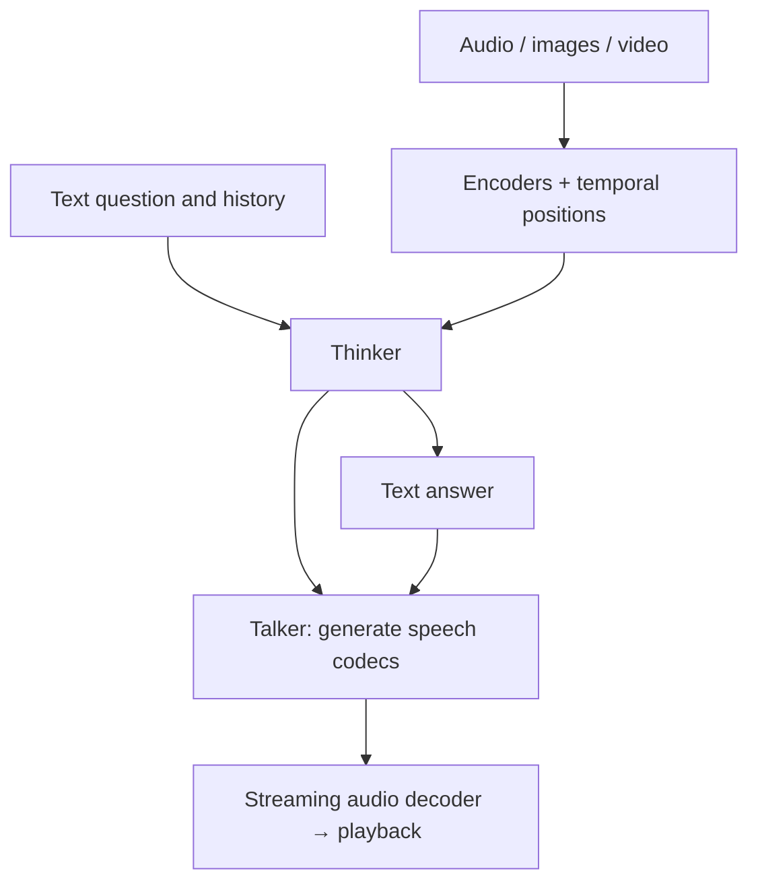

# Omni: understanding inputs and speaking without the wait

[中文](omni-streaming.md) · **English**

> Last reviewed: 2026-10 · Prerequisite: [Qwen-VL](qwen-vl.en.md)

“Which button did he point at when he said ‘here’?” Transcription alone loses the gesture; isolated frames lose its timing. An audiovisual model must align the evidence before answering. If it speaks, correctness is only part of the experience: waiting, stuttering, and interruption matter too.

## End-to-end is not the only starting point

| Route | How it works | Benefit | Cost |
| --- | --- | --- | --- |
| ASR → LLM → TTS | Transcribe, answer, synthesize | Replace and evaluate modules separately | Transcripts can discard prosody, sounds, and speaker cues |
| Unified perception and speech generation | Audiovisual representations participate directly | Can retain non-textual evidence | More complex training, synchronization, and debugging |
| Multimodal input, text output | Consume audio/video and answer in text | Removes synthesis and playback stages | Not suitable for every real-time interaction |

Meeting summaries and conversational tutoring need different latency, acoustic, and interruption capabilities. A model named Omni does not remove that design decision.

## What do Thinker and Talker produce?

In Qwen2.5-Omni, Thinker processes multimodal inputs and generates text. Talker uses relevant representations and textual information to generate speech tokens, which an audio decoder turns into waveforms. Qwen3-Omni retains this division but changes the interface and uses multiple codebooks with a causal ConvNet for streaming synthesis. [2.5 report](https://arxiv.org/abs/2503.20215), [3 report](https://arxiv.org/abs/2509.17765)



This shows responsibilities; exact connections depend on the version. In particular, removing Thinker's high-level text representations in version 3 **does not mean Talker need not know the words to speak**. Separate hidden representations, discrete text tokens, and multimodal conditions. [Qwen3-Omni §2](https://arxiv.org/html/2509.17765v1)

## Sample rate, frame rate, and token rate differ

Waveform samples are not model tokens. Consider an independent example: two seconds of mono audio at 16 kHz contain 32,000 samples. A 25 ms window contains 400 samples; a 10 ms hop contains 160. Without centered padding, this gives:

$$1+\left\lfloor\frac{32000-400}{160}\right\rfloor=198$$

spectrogram frames. Encoder downsampling changes the count again. The 2.5 report describes roughly 40 ms per audio representation; version 3 describes roughly 80 ms. Neither is the waveform sample rate. [2.5 input processing](https://arxiv.org/html/2503.20215v1), [3 input processing](https://arxiv.org/html/2509.17765v1)

```python
def frame_count(sample_count, window_samples, hop_samples):
    values = (sample_count, window_samples, hop_samples)
    if any(type(value) is not int for value in values):
        raise ValueError("counts must be integers")
    if sample_count < 0 or window_samples <= 0 or hop_samples <= 0:
        raise ValueError("invalid frame configuration")
    if sample_count < window_samples:
        return 0
    return 1 + (sample_count - window_samples) // hop_samples

assert frame_count(32000, 400, 160) == 198
```

Real processors may pad, center windows, or retain partial tails. Inspect those settings before declaring an output wrong because it differs from 198.

## Synchronization is more than concatenating two lists

Suppose a button lights up at 1.20 seconds and “here” occurs at 1.24. If video sampling retains only frames at zero and two seconds, precise audio timestamps cannot restore the missing image.

Two questions remain separate: **was the evidence sampled**, and **was sampled evidence aligned**? Positional encoding addresses part of the second, not the first.

A reproducible test is a short video with a button changing color each second and speech naming its color. Shift audio by half a second, then restore synchronization. Compare event localization and answers, not merely transcription.

## Streaming: a fast first sound can still stutter

Multiple codebooks represent a speech frame through several discrete codes, completed by the main network and subsequent prediction modules. A causal audio decoder uses available context instead of waiting for future chunks. Computation and buffering still take time. [Qwen3-Omni report](https://arxiv.org/abs/2509.17765)

A hypothetical serial first-packet budget: 160 ms of input accumulation, 30 ms encoding, 90 ms initial generation, 20 ms waveform decoding, and 40 ms playback buffering total 340 ms. Pipelining can overlap some work, not erase every wait.

| Metric | What it asks |
| --- | --- |
| First-packet / first-audio latency | When does the user first hear the response? |
| Real-time factor (RTF) | Generation time divided by audio duration; below one is a prerequisite for sustained real-time generation |
| Chunk gaps and jitter | Can playback stall even when average throughput is sufficient? |
| Interruption recovery | Does old audio continue after an interruption, and is state cleared? |
| Semantic and acoustic quality | Is the content correct, intelligible, natural, and stable? |

A paper's latency under specified conditions is not a universal serving guarantee. Networking, scheduling, and browser audio buffers can alter the experience.

## 2026: from streaming answers to multimodal agents

Later releases go beyond Qwen3-Omni. Qwen3.5-Omni introduces ARIA to align text and speech units during streaming generation. Its understanding-side audio representations run at 6.25 Hz, or roughly one position per 160 ms. The previous 80 ms assumption no longer estimates its input length. [3.5 report](https://arxiv.org/abs/2604.15804)

The September 2026 Qwen3.8-Omni report extends the discussion to tool-using audiovisual tasks, a hybrid language backbone, and spatial audio, alongside a realtime interaction harness. The model handles understanding and generation; the harness manages context, tools, and asynchronous work. [3.8 report](https://arxiv.org/abs/2609.25611)

Consider an independent system example. You ask an assistant to review a video shot, then say “Never mind, look at the next one” before its tool returns. Stopping playback is insufficient: the system must cancel or isolate the old result so a late answer does not contaminate the new turn. A model with fast first-packet latency can still fail here.

| Layer | Behavior to test | What another layer cannot establish |
| --- | --- | --- |
| Perception model | Events, speakers, and timestamps | Tool-use ability does not prove correct perception |
| Generation model | Text–speech consistency and omitted words | Natural speech does not prove factual accuracy |
| Harness | Cancellation, retries, concurrent tools, context updates | Model benchmarks do not cover every runtime state |
| Product policy | Recording permission and history retention | A longer context does not authorize permanent storage |

These reports update the design references; this page does not reproduce their production results. Fix inputs, service versions, and concurrency when running your own experiments.

## Separate training and evaluation responsibilities

Understanding needs recognition, localization, and cross-modal question answering. Generation must preserve content while maintaining intelligibility, voice consistency, and streaming stability. Optimizing naturalness alone can make an incorrect answer sound better.

Retain text-only, audio-only, consistent audiovisual, conflicting audiovisual, missing-modality, and noisy cases. Anchor evaluation in human-checkable timestamps and content labels; another model's fluent judgment should not be the only evidence.

Next: [Limits of OCR compression](ocr-compression.en.md). Shorter input does not guarantee that important evidence survived.
