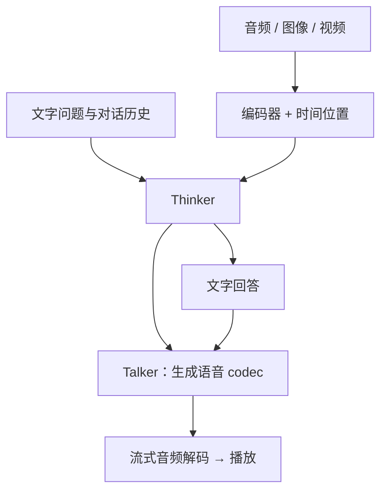

# Omni：听懂、看懂，再及时开口

**中文** · [English](omni-streaming.en.md)

> 最近审阅：2026-10 · 先读：[Qwen-VL](qwen-vl.md)

你指着视频问：“他说‘这里’的时候，指的是哪一个按钮？”只转录声音，会丢掉手势；只看关键帧，又不知道“这里”对应哪个时刻。音视频模型要先把证据对上时间，再回答。如果还要说出来，回答正确只是第一步，等待、卡顿和打断也影响体验。

## 不必一开始就端到端

| 路线 | 怎么工作 | 好处 | 代价 |
| --- | --- | --- | --- |
| ASR → LLM → TTS | 先转录，再回答，最后合成语音 | 模块容易替换、单独评估 | 转录可能丢失语气、音效与说话人线索 |
| 统一感知 + 语音生成 | 音视频表征直接参与模型计算 | 有机会保留非文字信息 | 训练、同步、排错更复杂 |
| 只输出文字的多模态模型 | 输入音视频，回答以文字呈现 | 少一段合成与播放链路 | 不适合所有实时交互 |

选择取决于任务。会议纪要与陪练对话不需要同一套延迟、声学和打断能力。不要因为模型名字有 Omni，就跳过这一步。

## Thinker 和 Talker 分别交出什么

Qwen2.5-Omni 中，Thinker 处理多模态输入并生成文字；Talker 根据相关表征与文本信息生成语音 token，再由音频解码模块还原波形。Qwen3-Omni 保留分工，改变了两侧的信息接口，并使用多码本与因果 ConvNet 做流式语音合成。[2.5 报告](https://arxiv.org/abs/2503.20215)、[3 报告](https://arxiv.org/abs/2509.17765)



这是分工图，具体连线随版本而变。尤其是“3 不再使用 Thinker 的高层文本表征”，**不是说它不需要知道要说哪些文字**。要区分 hidden representations、离散文本 token 和多模态条件。[Qwen3-Omni §2](https://arxiv.org/html/2509.17765v1)

## 采样率、帧率与 token 率不要混用

波形的每个采样点不是一个模型 token。先算一个独立的小例子：2 秒、16 kHz 的单通道音频有 32,000 个样本。25 ms 窗口占 400 个样本，10 ms 步长占 160 个。若不居中补零，可得到：

$$1+\left\lfloor\frac{32000-400}{160}\right\rfloor=198$$

个频谱帧。编码器之后还会下采样，因此频谱帧数又不等于输出表征数。2.5 报告中的音频表征约对应 40 ms，3 中约对应 80 ms；这也不是音频波形采样率。[2.5 输入处理](https://arxiv.org/html/2503.20215v1)、[3 输入处理](https://arxiv.org/html/2509.17765v1)

```python
def frame_count(sample_count, window_samples, hop_samples):
    values = (sample_count, window_samples, hop_samples)
    if any(type(value) is not int for value in values):
        raise ValueError("counts must be integers")
    if sample_count < 0 or window_samples <= 0 or hop_samples <= 0:
        raise ValueError("invalid frame configuration")
    if sample_count < window_samples:
        return 0
    return 1 + (sample_count - window_samples) // hop_samples

assert frame_count(32000, 400, 160) == 198
```

真实实现可能补零、居中或对尾部补帧，所以不要拿 198 去断言某个 processor 输出错了。先核对它的配置。

## 同步不是把两个列表拼在一起

假设按钮亮起在 1.20 秒，“这里”在 1.24 秒。如果视频只采到 0 秒和 2 秒的帧，音频时间戳再精确，也找不回没采到的画面。

这说明两个不同问题：**有没有采到证据**，以及**采到的证据有没有对齐**。位置编码解决后一个问题的一部分，不能凭空解决前一个。

可以自制一段短视频：每秒切换一次按钮颜色，配合报颜色的语音。先故意把音轨平移 0.5 秒，再恢复同步。比较事件定位和问答，而不是只看模型能否复述音轨。

## 流式：先听到声音，不等于全程不卡

多码本（multi-codebook）可把一帧语音拆成多个离散表示，主网络与后续预测模块配合补全；因果音频解码器只依赖已有上下文，避免为了未来片段一直等。它们仍需要计算与缓冲，不是零延迟。[Qwen3-Omni 官方报告](https://arxiv.org/abs/2509.17765)

下面只是假设串行、无重叠的首包账：输入积累 160 ms、编码 30 ms、首个生成片段 90 ms、波形解码 20 ms、播放缓冲 40 ms，共 340 ms。流水线可重叠一部分，但不能直接删掉全部等待。

| 指标 | 实际问什么 |
| --- | --- |
| 首包 / 首音频延迟 | 用户什么时候第一次听到回答 |
| 实时率（RTF） | 生成耗时除以音频时长；小于 1 才有持续实时生成的基础 |
| 分块间隔与抖动 | 平均够快时，是否仍出现断续 |
| 打断恢复 | 用户插话后，旧音频是否继续播放，状态是否清理 |
| 语义与声学质量 | 说对了什么，以及是否清楚、自然、稳定 |

论文在特定条件下报告的首包延迟不能当成所有部署的服务承诺。网络、调度和浏览器音频缓冲都可能改变体验。

## 2026：从流式问答到多模态 Agent

后续模型没有停在 Qwen3-Omni。Qwen3.5-Omni 的报告引入 ARIA，在流式生成时动态对齐文字与语音单元；理解侧音频表征为 6.25 Hz，即约每 160 ms 一个位置。不能继续拿上一版的 80 ms 估算它的输入长度。[3.5 报告](https://arxiv.org/abs/2604.15804)

2026-09 的 Qwen3.8-Omni 报告进一步讨论带工具的音视频任务、混合语言主干与空间音频，并配套发布实时交互 harness。模型与应用的分工也更明确：模型处理理解和生成，harness 管上下文、工具与异步任务。[3.8 报告](https://arxiv.org/abs/2609.25611)

举个独立的系统例子：你让助手回看视频里的一个镜头，它还没查完，你已经说“算了，看下一段”。这时不能只停止音频播放，还要取消或隔离旧工具结果，避免迟到的回答污染当前对话。首包很快的模型，也可能在这个环节出错。

| 层次 | 要验证的行为 | 不能由另一层替代的检查 |
| --- | --- | --- |
| 感知模型 | 事件、说话人与时间是否读对 | 能调用工具不证明感知正确 |
| 生成模型 | 文字与语音是否一致、是否漏字 | 声音自然不证明事实正确 |
| Harness | 取消、重试、并发工具和上下文更新 | 模型 benchmark 不覆盖全部运行时状态 |
| 产品协议 | 是否允许录音、保留哪些历史 | 更长 context 不代表获得了永久保存权限 |

这些新报告提供了更新的设计参考，不是本页对其线上效果的复现。做自己的实验时，仍应固定输入、服务版本和并发条件。

## 训练和测试也按模块拆

理解侧需要识别、事件定位、跨模态问答等任务；生成侧要兼顾文字内容、可懂度、音色一致性和流式稳定性。只优化声音自然度，可能让一个错误答案说得更好听。

测试时至少保留：纯文本、纯音频、音视频一致、音视频冲突、缺失模态和噪声输入。用人工可核对的时间标签和内容标签做锚点，不把另一个模型的流畅评价当成唯一证据。

下一篇：[OCR 压缩的边界](ocr-compression.md)。它同样提醒我们：输入变短，不代表重要信息都还在。
