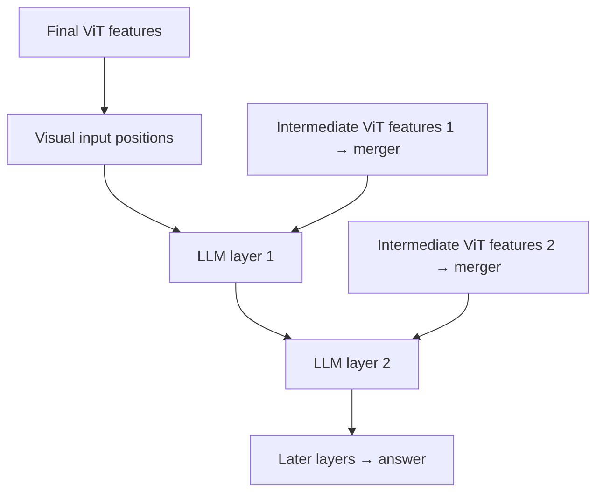

# Qwen-VL: should a larger image always receive more tokens?

[中文](qwen-vl.md) · **English**

> Last reviewed: 2026-10 · Prerequisites: [ViT](vit.en.md), [RoPE](../00-foundations/deep-dives/position-and-context.en.md)

An icon and a dense train timetable need different information budgets. Yet unrestricted growth in visual tokens lets a single tall image slow down the model. One useful thread through Qwen-VL is how it preserves detail while controlling these costs.

This is an architecture walkthrough, not a leaderboard. Always record the model variant, processor, and inference budget together.

## What changed between versions?

| Version | Main question | Design change |
| --- | --- | --- |
| Qwen-VL | How can images connect to Qwen? | 256 learned queries read visual features through cross-attention |
| Qwen2-VL | How can different sizes, images, and video share an interface? | Dynamic visual length, spatial merging, M-RoPE |
| Qwen2.5-VL | How can high-resolution cost and video timing be handled? | Visual window attention and time IDs aligned with actual time |
| Qwen3-VL | Can visual evidence reach deeper into the LLM? | DeepStack, interleaved axis frequencies, explicit video timestamps |

Sources: [Qwen-VL](https://arxiv.org/abs/2308.12966), [Qwen2-VL](https://qwenlm.github.io/blog/qwen2-vl/), [Qwen2.5-VL](https://qwenlm.github.io/blog/qwen2.5-vl/), [official Qwen3-VL overview](https://github.com/QwenLM/Qwen3-VL).

## Fixed queries and dynamic tokens are different budgets

Qwen-VL's learned queries read a visual sequence into a fixed number of vectors. That does not mean the preceding vision encoder processes only 256 patches. [Qwen-VL §2](https://arxiv.org/html/2308.12966v3)

Spatial merging in Qwen2 variants retains size-dependent sequence lengths. For patch width 14 and $2\times2$ merging, when processed dimensions are divisible by 28:

$$N_{visual}=\frac{H}{28}\frac{W}{28}.$$

| Processed size | Patches before merging | Visual positions after merging |
| --- | --- | --- |
| 280 × 280 | 400 | 100 |
| 280 × 560 | 800 | 200 |
| 560 × 560 | 1600 | 400 |

These sizes simplify arithmetic; they are not serving recommendations. The formula excludes text, boundary markers, and video's temporal dimension. Inspect the processor's actual grids and sequences.

```python
def merged_image_tokens(height, width, patch_size=14, merge_size=2):
    dimensions = (height, width, patch_size, merge_size)
    if any(type(value) is not int or value <= 0 for value in dimensions):
        raise ValueError("dimensions must be positive integers")
    factor = patch_size * merge_size
    if height % factor or width % factor:
        raise ValueError("use processed dimensions divisible by patch times merge")
    return (height // factor) * (width // factor)

assert merged_image_tokens(280, 560) == 200
assert merged_image_tokens(560, 560) == 400
```

Dynamic resolution does not mean untouched pixels. Grid alignment and minimum/maximum pixel budgets can still trigger resizing. Pixel scale is not physical scale either: without a reference, a cat occupying 1000 pixels is not necessarily larger than one occupying 100.

## M-RoPE: which relationships belong in positions?

Text needs order; images need rows and columns; video also needs time. M-RoPE assigns temporal, height, and width positions to different rotary channels. [Qwen2-VL architecture](https://qwenlm.github.io/blog/qwen2-vl/)

For a teaching example, let an image start at position 7 with a merged grid of two rows and three columns:

| Visual position | Time | Height | Width |
| --- | --- | --- | --- |
| Top left | 7 | 7 | 7 |
| Top middle | 7 | 7 | 8 |
| Top right | 7 | 7 | 9 |
| Bottom left | 7 | 8 | 7 |

A still image shares time but not row/column coordinates. A text token uses equal values on its three axes; **different text tokens do not all receive the same position**.

Consider frames at two and four seconds. Changing sampling FPS can change frame indices without changing event times. Qwen2.5-VL ties temporal positions to actual time. Qwen3-VL uses textual timestamps before frames and interleaves rotary frequencies across axes. Keep these version-specific choices separate. [2.5 report](https://arxiv.org/abs/2502.13923), [3 report](https://arxiv.org/abs/2511.21631)

## Which computation does window attention save?

With $N$ visual tokens and at most $w$ per window, global attention uses roughly $N^2$ scores per layer, versus $Nw$ for fixed windows. At $N=1024,w=64$, these are 1,048,576 and 65,536.

However, Qwen2.5-VL retains some global-attention layers and uses RMSNorm. It is neither normalization-free nor a wholly linear-complexity visual encoder or VLM. [Official visual-encoder description](https://qwenlm.github.io/blog/qwen2.5-vl/)

Local windows preserve local interactions but do not directly connect distant regions. Global layers provide that exchange. The resulting sequence still consumes LLM context and KV cache.

## DeepStack: more than adding tokens at the input

Qwen3-VL projects intermediate ViT features through dedicated mergers and adds them at visual positions in early LLM layers. These residual additions preserve positions rather than repeatedly concatenating another full sequence. [Qwen3-VL §2.2](https://arxiv.org/abs/2511.21631)



Only two injections are drawn to illustrate the route, not a layer configuration. If one visual hidden state is `[1, 2]` and its additional feature is `[0.5, -0.5]`, the result is `[1.5, 1.5]`. Sequence length stays unchanged; extracting, merging, and storing intermediate features still costs work.

## 2026: vision also enters the general-purpose model line

Qwen3.5's public model card describes early vision–language fusion alongside a hybrid language backbone combining Gated DeltaNet and attention. Visual capability is no longer confined to separately named VL releases. The specific example here is the public 397B-A17B checkpoint, not a configuration for every size. [Official model card](https://huggingface.co/Qwen/Qwen3.5-397B-A17B)

Model selection therefore involves more than comparing vision encoders. Ask how long image–text sequences enter the backbone, which layers retain KV, and which summarize history in recurrent state. Fixed recurrent state does not make the entire hybrid model's cache independent of sequence length.

The earlier patch=14 and merge=2 example belongs to the Qwen2 series, not every later release. Recalculate the input budget from the new checkpoint's processor configuration. A documented context limit also does not establish useful performance at that length for every visual task.

## Separate architecture comparisons from data changes

To test dynamic resolution, fix data, output length, and decoding while sweeping visual budgets. To test DeepStack, keep the encoder and training budget matched where possible. Two checkpoints differing in data, size, and objectives cannot isolate the effect of one module.

| Question | Small experiment | Record |
| --- | --- | --- |
| Is small text preserved? | Change font size, not content | Font size, resolution, visual tokens, field accuracy |
| Does layout matter? | Swap timetable columns | Image variant and answer changes |
| Is video timing understood? | Change sampling FPS for the same event | Timestamp error, not only answer scores |
| Is extra budget worthwhile? | Sweep pixel limits on a fixed test set | Accuracy, time to first token, peak memory |

Continue: [Streaming audio and video with Omni](omni-streaming.en.md) · [Fine-tuning and independent evaluation](vlm-finetuning.en.md)
