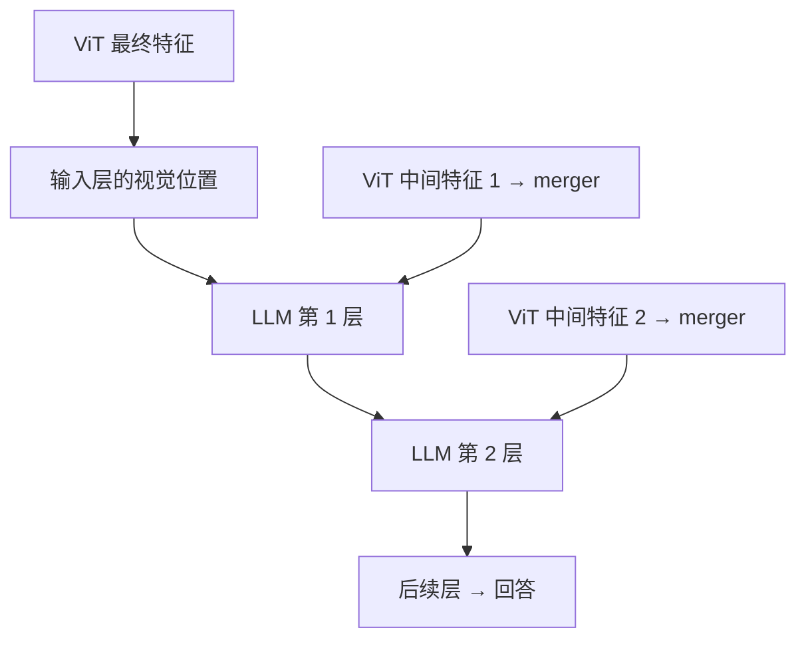

# Qwen-VL：图片越大，就该用越多 token 吗？

**中文** · [English](qwen-vl.en.md)

> 最近审阅：2026-10 · 先读：[ViT](vit.md)、[RoPE](../00-foundations/deep-dives/position-and-context.md)

一张图标和一张密密麻麻的车站时刻表，显然不需要同样的信息预算。但如果任由图片越大、token 越多，模型又可能被一张长图拖慢。Qwen-VL 家族的一条主线，就是怎样保留细节，同时控制这些成本。

这里讲各代设计上的变化，不做排行榜。具体模型尺寸、processor 和推理预算仍要跟版本一起记录。

## 先看版本之间到底变了什么

| 版本 | 关键问题 | 设计上的变化 |
| --- | --- | --- |
| Qwen-VL | 怎样把图像接进 Qwen | 256 个可学习 query 用 cross-attention 读取视觉特征 |
| Qwen2-VL | 不同尺寸、图片与视频怎么统一 | 动态视觉长度，空间合并，M-RoPE |
| Qwen2.5-VL | 高分辨率成本和视频时间怎么处理 | 视觉窗口注意力、时间 ID 对齐真实时间 |
| Qwen3-VL | 视觉信息能否更深入地进入 LLM | DeepStack、多轴频率交错、显式视频时间戳 |

依据：[Qwen-VL](https://arxiv.org/abs/2308.12966)、[Qwen2-VL](https://qwenlm.github.io/blog/qwen2-vl/)、[Qwen2.5-VL](https://qwenlm.github.io/blog/qwen2.5-vl/)、[Qwen3-VL 官方说明](https://github.com/QwenLM/Qwen3-VL)。

## 固定 query 与动态 token 是两笔不同的账

Qwen-VL 的固定 query 可以把长视觉序列读成固定数量的向量。这不代表前面的视觉编码器也只处理 256 个 patch。[Qwen-VL §2](https://arxiv.org/html/2308.12966v3)

Qwen2 系列的空间合并则保留与图片尺寸有关的长度。以 patch 边长 14、相邻 $2\times2$ 合并为例，处理后的尺寸若都能被 28 整除，视觉内容长度是：

$$N_{visual}=\frac{H}{28}\frac{W}{28}.$$

| 处理后尺寸 | 合并前 patch 数 | 合并后视觉位置 |
| --- | --- | --- |
| 280 × 280 | 400 | 100 |
| 280 × 560 | 800 | 200 |
| 560 × 560 | 1600 | 400 |

这些是便于手算的输入，不是推荐的线上分辨率。公式不含文字、边界标记或视频的时间维；应以 processor 实际输出的 grid 和序列为准。

```python
def merged_image_tokens(height, width, patch_size=14, merge_size=2):
    dimensions = (height, width, patch_size, merge_size)
    if any(type(value) is not int or value <= 0 for value in dimensions):
        raise ValueError("dimensions must be positive integers")
    factor = patch_size * merge_size
    if height % factor or width % factor:
        raise ValueError("use processed dimensions divisible by patch times merge")
    return (height // factor) * (width // factor)

assert merged_image_tokens(280, 560) == 200
assert merged_image_tokens(560, 560) == 400
```

动态分辨率并不等于原图像素一动不动。对齐 patch 网格、限制最少/最多像素，仍可能触发 resize。也别把像素尺度误当物理尺度：只看一张没有参照物的图片，不能因为猫占 1000 像素，就知道它比占 100 像素的猫更大。

## M-RoPE：序号里要有哪几种关系

一段文字只需一维顺序；图像还需要行列；视频还需要时间。M-RoPE 给不同旋转通道分配时间、高度和宽度位置。[Qwen2-VL 架构说明](https://qwenlm.github.io/blog/qwen2-vl/)

教学上，设图片从位置 7 开始，合并后的网格是 2 行 3 列：

| 视觉位置 | 时间 | 高度 | 宽度 |
| --- | --- | --- | --- |
| 左上 | 7 | 7 | 7 |
| 中上 | 7 | 7 | 8 |
| 右上 | 7 | 7 | 9 |
| 左下 | 7 | 8 | 7 |

一张静态图的时间相同，但行列不同。文本 token 的三个轴使用相同的位置值，**不是整段文本的所有 token 都用同一个位置值**。

例如 2 秒和 4 秒的两帧：若视频采样率变了，帧编号可能变成另一组数字，实际时间却没变。Qwen2.5-VL 把时间位置关联到实际时间；Qwen3-VL 用帧前的文字时间戳表达时间，并交错分配各轴的旋转频率。这两种版本策略不要混写。[2.5 报告](https://arxiv.org/abs/2502.13923)、[3 报告](https://arxiv.org/abs/2511.21631)

## 窗口注意力省哪部分计算

假设有 $N$ 个视觉 token，每个窗口最多 $w$ 个。单层全局 attention 有约 $N^2$ 个分数；固定窗口的一层约为 $Nw$。拿 $N=1024,w=64$ 举例，分别为 1,048,576 和 65,536。

但是，Qwen2.5-VL 仍保留部分全局 attention 层，还使用 RMSNorm。不能把它写成“没有归一化”，也不能把整个视觉编码器或整个 VLM 都称为线性复杂度。[官方视觉编码器说明](https://qwenlm.github.io/blog/qwen2.5-vl/)

局部窗口适合保住细节，却不直接连接远处区域。全局层负责补这种交流；进入 LLM 后的视觉序列仍然要占 context 和 KV cache。

## DeepStack：不只是把更多 token 塞进第一层

Qwen3-VL 把 ViT 不同深度的特征，经各自 merger 加到 LLM 前几层的视觉位置上。它保留序列位置，通过残差相加补信息，而不是每层都再拼一份完整序列。[Qwen3-VL §2.2](https://arxiv.org/abs/2511.21631)



图只画 2 次注入，帮助看清路径，不是模型层数配置。假设某个视觉位置的 hidden state 是 `[1, 2]`，这一层的补充特征是 `[0.5, -0.5]`，相加得到 `[1.5, 1.5]`。位置数没增加，但中间特征提取、merger 和存储并不是零成本。

## 2026：视觉能力也进入通用模型主线

Qwen3.5 的公开模型卡把图文早期融合与混合语言主干放在一起介绍：视觉能力不再只看单独的 VL 型号，语言侧还结合 Gated DeltaNet 与 attention。这里以公开的 397B-A17B 型号为例，不把其配置推广到所有尺寸。[官方模型卡](https://huggingface.co/Qwen/Qwen3.5-397B-A17B)

这会改变选型时的问题：不只比较“哪个视觉编码器更强”，还要看长图文序列怎样进入语言主干，哪些层保留 KV，哪些层压进递归状态。后者在固定状态里汇总历史，但不能因此说混合模型的全部缓存都不随长度增长。

所以，前面的 patch=14 和 merge=2 是 Qwen2 系列的算例，不是所有新版本的通用常数。换 checkpoint 时，从 processor 配置重新算输入预算；部署文档里的上下文上限也不等于每种视觉任务都能有效用满。

## 复现时把架构和数据分开比较

要判断动态分辨率有没有用，先固定数据、输出长度和解码方式，再扫视觉预算；要判断 DeepStack 有没有用，尽量固定视觉编码器和训练预算。不要拿两个同时换过数据、模型尺寸和训练目标的 checkpoint，把全部差异归功于一个模块。

| 想验证的问题 | 小实验 | 需要记录 |
| --- | --- | --- |
| 小字是否保住 | 相同内容改字号，不改答案 | 字号、分辨率、视觉 token、字段准确率 |
| 是否看布局 | 交换时刻表两列 | 图片版本与回答变化 |
| 视频是否理解时间 | 同一事件改变采样 FPS | 时间戳误差，不只问答分数 |
| 增加预算是否值得 | 固定测试集扫像素上限 | 精度、首 token 延迟、峰值显存 |

接下来：[Omni 的流式音视频](omni-streaming.md) · [微调与独立评估](vlm-finetuning.md)
