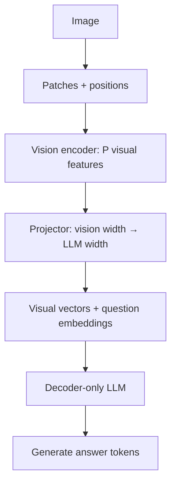

# How images enter a language model

[中文](vision-to-language.md) · **English**

> Reading time: about 7 minutes · Level: intermediate · Last reviewed: 2026-09

CLIP can score an image against a caption, but it does not continue with a written answer. A visual language model needs usable visual inputs and a training objective that teaches it to answer.

We follow **ViT + projector + decoder-only LLM**, not a universal VLM architecture. Read [CLIP](clip.en.md) and [Decoder-only](../00-foundations/core/decoder-only.en.md) first if needed.

## An image need not become one vector

[ViT](https://arxiv.org/abs/2010.11929) divides an image into patches, flattens and projects them, adds position information, and applies a Transformer.

Take a **teaching configuration**, not a product default: a $224\times224$ RGB image with $16\times16$ patches. There are $14\times14=196$ patches, each containing $16\times16\times3=768$ raw values. Their projected features can remain a sequence rather than immediately becoming one global vector. Original ViT classification adds a class token, so include one extra position when counting that sequence.

Visual inputs are often continuous features, not discrete vocabulary IDs. A projector changes feature width; **an ordinary tokenwise linear layer or MLP does not automatically reduce token count**. Length compression needs pooling, a resampler, or another explicit mechanism.

## Matching dimensions is not matching meaning

Mapping $d_v$ to $d_{LM}$ makes the matrices compatible. It does not, by itself, teach the LLM what the visual features mean.

The original [LLaVA training recipe](https://arxiv.org/abs/2304.08485) gives a concrete example:

| Stage | Updated parameters | Purpose |
| --- | --- | --- |
| Image–text alignment | Projector; vision encoder and LLM frozen | Make visual features usable as language-model conditioning |
| Visual instruction tuning | Projector and LLM; vision encoder frozen | Learn to answer using the image and question |

This is one paper's recipe, not a rule that all VLMs freeze vision. Check each alternative against its data, trainable modules, and compute constraints.

## Which positions receive loss

In this answer-generation teaching setup, the input contains the image, question, and true answer prefix. The objective predicts the next answer token. Visual, question, and padding positions do not directly contribute to answer-only loss, but they can influence predictions and carry gradients to trainable modules.

$$L=-\frac{1}{M}\sum_{t\in\mathcal A}\log p_\theta(a_t\mid I,q,a_{<t}),\qquad M=|\mathcal A|.$$

$\mathcal A$ contains scored answer positions. This differs from the contrastive objective of matching images with captions. To check shifting and masks, revisit [one language-model training step](../00-foundations/deep-dives/training-step.en.md).

## Three design trade-offs worth asking about

- **Detail versus length:** with fixed-size patches and one image scale, doubling both image dimensions gives four times as many patches. The dense attention score matrix over those tokens has sixteen times as many entries. End-to-end cost also depends on text length, implementation, and compression; this does not imply a sixteen-fold runtime increase.
- **Freezing versus adaptation:** training fewer modules can reduce their gradient and optimizer-state costs, but forward computation and some activation costs remain. Measure the effect on domain adaptation rather than assuming it.
- **Descriptions versus evidence:** a fluent caption may omit small text, spatial relations, or details needed by the question. OCR or higher resolution should address a specific information gap, not be added automatically.

## Test more than a plausible answer

Make paired synthetic images with checkable answers. For “Is the red square left of the circle?”, swap only the shapes' positions; the answer should change. Hold the prompt and decoding settings fixed and compare:

| Input change | What to check | What it does not establish |
| --- | --- | --- |
| Move the relevant object | Whether the answer follows decisive visual evidence | General spatial reasoning from one successful example |
| Supply a mismatched image | Whether the model follows the question's suggestion blindly | Correct understanding merely because the score dropped |
| Remove the image or mask a region | Which evidence affects the answer | A clean causal interpretation of degradation on out-of-distribution black images |
| Ask about an invisible attribute | Whether the model acknowledges missing information | Reliability from a longer explanation |

These are proposed teaching experiments, not measured claims about a model. Track small text, counting, and spatial relations separately rather than relying only on aggregate accuracy.

Connect these checks to [controlled comparisons and slices](../07-evaluation/ablation-and-slices.en.md) before deciding whether more training is necessary.
