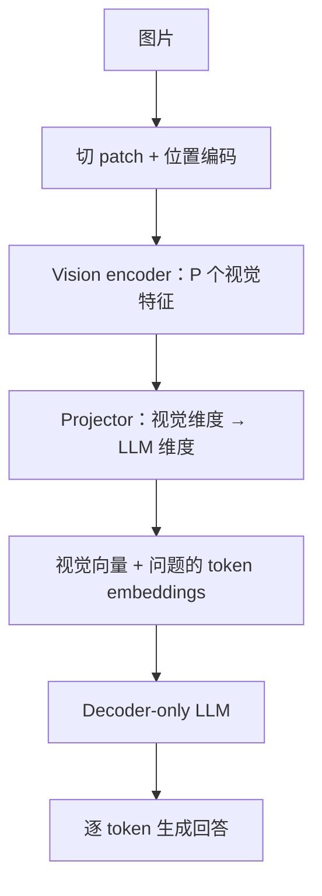

# 图片怎样进入语言模型

**中文** · [English](vision-to-language.en.md)

> 阅读时间：约 7 分钟 · 难度：进阶 · 最近审阅：2026-09

CLIP 能说“这张图更像这句描述”，但不会接着写答案。要让语言模型读图，我们需要把视觉信息变成它能利用的输入，再用合适的目标教它回答。

这里选一条常见路线来讲：**ViT 提取视觉特征，投影层（projector）连接两侧，再由 decoder-only LLM 生成回答**。不是所有视觉语言模型都这样搭。先读 [CLIP](clip.md) 和 [Decoder-only](../00-foundations/core/decoder-only.md)，会更容易跟上。

## 图片不是一个词，也不是只能变成一个向量

[ViT](https://arxiv.org/abs/2010.11929) 把图片切成 patch，展平并线性投影，加上位置信息，再交给 Transformer。

下面只算一个**教学配置**，不是某个产品的默认值：一张 $224\times224$ RGB 图片，每块 $16\times16$。共有 $14\times14=196$ 块，每块原始维度 $16\times16\times3=768$。投影后，196 个向量可以保留成序列，不必立刻压成一个全局向量。原始 ViT 分类还会加入 class token，算序列长度时要另加 1。

视觉向量通常是连续特征，不必先变成词表里的离散 ID。这里的 projector 可以改变每个向量的维度；**普通逐 token 线性层或 MLP 不会自动减少 token 数量**。压缩长度需要另加 pooling、resampler 或其他机制。

## 对齐维度，还不等于对齐含义

把 $d_v$ 维投影成 $d_{LM}$ 维，只解决了“矩阵能接上”。如果 LLM 从没学过这些向量的意义，单靠维度正确不会读图。

原始 [LLaVA 的训练设计](https://arxiv.org/abs/2304.08485)提供了一个清楚的例子：

| 阶段 | 哪些参数更新 | 要解决什么 |
| --- | --- | --- |
| 图文对齐 | projector；视觉 encoder 和 LLM 冻结 | 让视觉特征成为语言模型能使用的条件 |
| 视觉指令微调 | projector 和 LLM；视觉 encoder 冻结 | 学习结合图片和问题给出回答 |

这是这篇论文采用的训练方案，不代表 VLM 都要冻结视觉分支。读其他方案时，仍要看用了什么数据、训练了哪些模块，以及算力是否够用。

## 训练时，loss 算在哪里

在这个回答生成的教学设置中，输入含图片、问题和真实答案前缀；目标是预测答案中的下一个 token。视觉位置、问题和 padding 不直接计入 answer-only loss，但仍可能影响答案，梯度也可能经过它们流向可训练模块。

$$L=-\frac{1}{M}\sum_{t\in\mathcal A}\log p_\theta(a_t\mid I,q,a_{<t}),\qquad M=|\mathcal A|.$$

$\mathcal A$ 是计分的答案位置。它与“图片和哪句话配对”的对比 loss 不是同一个问题。需要检查 shift 和 mask 时，回到[一次语言模型训练](../00-foundations/deep-dives/training-step.md)。

## 设计上最值得问的 3 个取舍

- **细节与长度**：在固定 patch 大小、单尺度的例子里，边长翻倍，patch 数变成 4 倍；只看这些 token 的 dense attention 分数矩阵，元素数变成 16 倍。完整运行成本还取决于文本长度、attention 实现和压缩方式，不能直接说“整体慢 16 倍”。
- **冻结与适配**：少训练一些模块，通常能减少它们的梯度和优化器状态，但不等于没有前向计算或 activation 成本。是否损失领域适配能力，要用实验回答。
- **描述与证据**：流畅 caption 可能漏掉题目需要的小字、位置或关系。保留 OCR 文本或更高分辨率不是万能答案，要看目标任务究竟缺哪种信息。

## 别只问它答得像不像

用自己制作、答案可核对的小图做成对测试。例如同样的问题“红色方块在圆的左边吗”，只交换两个形状的位置，正确答案就应该改变。保持 prompt 和解码设置不变，再比较：

| 输入改动 | 想检查什么 | 不能据此直接断言什么 |
| --- | --- | --- |
| 只改变目标对象的位置 | 回答是否跟关键视觉证据变化 | 一个例子通过就有通用空间推理能力 |
| 给不匹配的图片 | 是否盲从问题里的暗示 | 分数下降就证明原来理解正确 |
| 去图或遮住关键区域 | 哪部分证据影响了回答 | 黑图等分布外输入的退化就是干净的因果证据 |
| 问图中根本不可见的属性 | 能否承认信息不足 | 更长的解释就是更可靠 |

这是一组建议的教学实验，不是任何模型的实测结论。按小字、计数、位置关系等类型分别记录，比一个总正确率更容易找到问题。

接下来可以把这些检查接到[对照实验与切片](../07-evaluation/ablation-and-slices.md)，再考虑是否真的需要继续训练模型。
