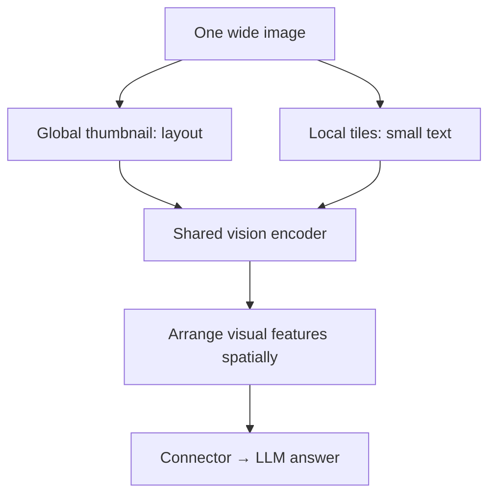

# LLaVA and DeepSeek-VL: where should visual detail survive?

[中文](vlm-designs.md) · **English**

> Last reviewed: 2026-10 · Prerequisite: [Vision to language](vision-to-language.en.md)

A thumbnail may be enough to identify a restaurant's signature dish. Reading its price in a small corner requires preserving tiny text. The image is the same, but the information needed is not: **a capable language model cannot recover evidence erased during preprocessing.**

We follow that problem from connectors to resolution, visual sequence length, and training scope. Numerical examples below are teaching calculations, not measured model results.

## LLaVA: start with a simple connection

Original LLaVA projects visual features into the LLM input space. Connector alignment precedes visual instruction tuning; the latter updates the projector and LLM while freezing the vision encoder. Generating instructions from captions and boxes does not mean the data-generating model directly saw the image. [Original paper](https://arxiv.org/abs/2304.08485)

Think of one example: the image supplies the menu, the question specifies what to read, and the answer supplies supervision. More captions saying “a restaurant menu” may not teach price reading. Examine the interface and the data together.

| Version | Connector and visual-input emphasis | Important distinction |
| --- | --- | --- |
| Original LLaVA | Linear projection connects visual features to an LLM | This is not a new image classifier |
| LLaVA-1.5 | A 336-resolution encoder, two-layer MLP, and data changes | An MLP alone does not reduce sequence length |
| LLaVA-NeXT (2024-01) | AnyRes: a global thumbnail plus local tiles | Do not assign NeXT's default configuration to every 1.5 variant |

Version references: [LLaVA-1.5 report](https://arxiv.org/abs/2310.03744), [NeXT announcement](https://llava-vl.github.io/blog/2024-01-30-llava-next/). The 1.5 report also studies higher-resolution extensions; name the variant being compared.

## AnyRes: retain both layout and local detail

Squeezing a wide menu into a square can shrink or distort letters. Cropping alone can lose which column a price belongs to. The thumbnail retains layout; local tiles retain detail.



A simplified budget: each view is $336\times336$, with patch width 14, retaining $24\times24=576$ patch features. Four local tiles plus one thumbnail give $5\times576=2880$ visual positions. Actual lengths also depend on unpadding, newlines, and separators.

Suppose the question and history occupy 120 positions. One view gives length 696; five give 3000. Dense attention score-element counts differ by $(3000/696)^2\approx18.58$. **That is not a measured 18.58-fold latency increase**: vision computation, matrix multiplication, caching, and kernels remain outside this calculation.

Tiling is not free accuracy. With a limited budget, compare a thumbnail, a thumbnail plus selected tiles, and localization followed by cropping. The last saves input length but adds a call and can fail at localization.

## DeepSeek-VL: combining different visual features

Original DeepSeek-VL combines lower-resolution SigLIP semantics with higher-resolution SAM-B detail in a fixed visual sequence. VL2 instead uses dynamically tiled SigLIP features, spatial compression, and an MoE language model. MLA addresses language-side KV cache, not image preprocessing. [VL report](https://arxiv.org/abs/2403.05525), [VL2 report](https://arxiv.org/abs/2412.10302)

This changes more than a model name. Fixed length simplifies budgeting. Dynamic length allocates more space to difficult images, but complicates batching, admission control, and tail latency.

| Approach | What it saves | What it costs |
| --- | --- | --- |
| Fixed visual sequence | More predictable LLM input length | Simple and complex images receive similar budgets |
| Dynamic tiles | Avoids one global visual-attention pass over the entire huge image | Cross-tile relationships still need fusion; LLM sequences grow |
| Spatial merging | Fewer positions from neighboring features | Tiny letters and boundaries can become harder to preserve |
| MoE / MLA | Active computation and cache representation, respectively | Weight storage, routing, and communication remain |

## Compression is not just dividing by four

VL2 merges each $27\times27$ feature grid into $14\times14$ positions, then adds row markers and a view separator. For a local layout of $r$ rows and $c$ columns, its reported arrangement gives:

$$N=210+1+14r(14c+1).$$

The 210 positions contain the global view and its row markers; 1 separates views. Spatial rearrangement moves neighbors into channels; it does not write a textual summary. [VL2 §2](https://arxiv.org/html/2412.10302v1)

A two-row, three-column layout yields 1415, not $7\times196=1372$. The remaining 43 positions carry structure.

```python
def vl2_sequence_length(tile_rows, tile_columns):
    if any(type(value) is not int or value < 1
           for value in (tile_rows, tile_columns)):
        raise ValueError("tile counts must be positive integers")
    return 210 + 1 + 14 * tile_rows * (14 * tile_columns + 1)

assert vl2_sequence_length(2, 3) == 1415
assert vl2_sequence_length(1, 1) == 421
```

This is a length calculator, not an image processor. It neither selects a layout nor implements special multi-image policies.

## Stage names do not specify trainable parameters

“Alignment” does not always mean projector-only training. VL2 initially updates its visual encoder and adaptor while freezing the LLM; subsequent pretraining and SFT update all modules. Adapting to dynamic high-resolution inputs also changes the visual branch. [VL2 §4](https://arxiv.org/html/2412.10302v1)

Record trainable parameter names rather than only “SFT.” Also preserve processed token counts, data mixtures, loss masks, and resolution limits. Otherwise a processor change may silently change the experiment.

## Did the additional detail actually help?

Create three versions of one menu: the original, one with only the target price changed, and one where the price is unreadable. Fix the prompt and decoding configuration. Does the answer follow the price, and does the model stop guessing when evidence disappears?

Report accuracy separately for small text, layout, and cross-tile relationships, alongside visual tokens, time to first token, and peak memory. An aggregate gain alone cannot distinguish improved evidence use from better guesses about common menus.

Continue: [Qwen-VL positions and resolution](qwen-vl.en.md) · [Multimodal fine-tuning checks](vlm-finetuning.en.md)
