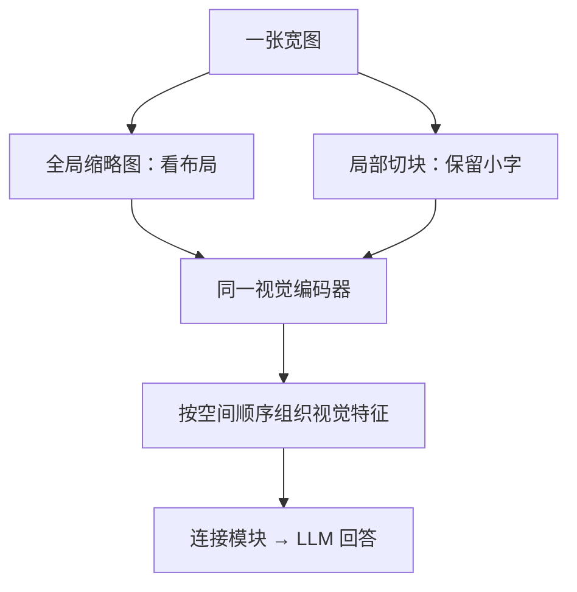

# LLaVA 与 DeepSeek-VL：细节该留在哪里？

**中文** · [English](vlm-designs.en.md)

> 最近审阅：2026-10 · 先读：[图片怎样进入 LLM](vision-to-language.md)

给模型看一张餐厅菜单，问招牌菜是什么，缩略图可能就够。问右下角那道菜多少钱，就必须保住小字。两道题用的是同一张图，难点却不一样：**语言模型再会推理，也读不回预处理时已经抹掉的字。**

这篇沿着这件事看几个模型：先把接口接好，再考虑图片分辨率、视觉 token 数和训练范围。下面的算例都是教学用，不是模型实测。

## LLaVA：先把最简单的连接跑通

原始 LLaVA 把视觉特征投影到 LLM 的输入空间。训练分成连接模块对齐和视觉指令微调，后者更新 projector 与 LLM，视觉编码器保持冻结。用 captions 和位置框生成指令数据，不等于生成数据的模型直接看过原图。[原论文](https://arxiv.org/abs/2304.08485)

可以把训练样本想成：图片提供菜单，问题规定读哪里，答案提供监督。只增加“这是一张菜单”的 caption，未必能教好价格读取。接口和数据必须一起看。

| 版本 | 连接与视觉输入的重点 | 阅读时别混在一起 |
| --- | --- | --- |
| 原始 LLaVA | 线性投影，把视觉特征接给 LLM | 不是训练一个新的图像分类器 |
| LLaVA-1.5 | 336 分辨率视觉编码器、两层 MLP，以及数据配方调整 | MLP 本身不会减少 token 数 |
| LLaVA-NeXT（2024-01） | AnyRes：全局缩略图加局部切块 | 不把 NeXT 的 AnyRes 默认配置倒写成全部 1.5 的配置 |

版本依据：[LLaVA-1.5 报告](https://arxiv.org/abs/2310.03744)、[NeXT 发布说明](https://llava-vl.github.io/blog/2024-01-30-llava-next/)。1.5 报告也研究高分辨率扩展，比较时要写具体变体。

## AnyRes：看全貌，再看局部

把长菜单硬缩成方图，字可能变小或变形；只切块，又容易不知道某一行属于哪个栏目。全局图保留布局，局部块保留细节。



算一个简化预算：每个视图为 $336\times336$，patch 边长为 14，保留 $24\times24=576$ 个 patch 特征。4 个局部块加 1 张全局图，就是 $5\times576=2880$ 个视觉位置。这里只算 patch 特征，实际还要看去 padding、换行和分隔符。

假设问题和历史占 120 个位置：单视图输入长 696，多视图长 3000。若只比较 dense attention 的分数元素数量，比例为 $(3000/696)^2\approx18.58$。这**不是实际延迟增加 18.58 倍**：视觉分支、矩阵乘法、缓存与 kernel 都还没算。

所以切块不是白送的精度。预算有限时，可以比较：全局图、全局加少量块、先定位再裁图。最后一种省输入长度，却多一次调用，还可能第一步就找错位置。

## DeepSeek-VL：两种视觉特征怎么合起来

DeepSeek-VL 初版采用低分辨率 SigLIP 与高分辨率 SAM-B 的组合，分别提供语义与细节，再融合到固定视觉序列中。VL2 换成动态切块的 SigLIP 编码器，接空间压缩模块和 MoE 语言模型；MLA 处理的是语言侧 KV cache，而不是图片预处理。[VL 报告](https://arxiv.org/abs/2403.05525)、[VL2 报告](https://arxiv.org/abs/2412.10302)

两种设计的区别不只是“一个模型换成另一个”。固定长度容易估预算；动态长度能给复杂图片更多空间，但组 batch、限流与长尾延迟都会更难。

| 方案 | 省在哪里 | 代价在哪里 |
| --- | --- | --- |
| 固定视觉序列 | LLM 输入长度较可控 | 复杂图片和简单图片用相近预算 |
| 动态切块 | 不必让整张超大图做一次全局视觉 attention | 块之间关系仍要融合，LLM 序列会增长 |
| 空间合并 | 相邻特征压成较少位置 | 很小的字或边界可能更难保留 |
| MoE / MLA | 分别控制激活计算和缓存表示 | 权重存储、路由、通信仍然存在 |

## 别把 token 压缩只算成除以 4

VL2 的每块特征从 $27\times27$ 合并到 $14\times14$，还要加入行尾和视图分隔符。按论文的排列，若局部块为 $r$ 行、$c$ 列，总长度为：

$$N=210+1+14r(14c+1).$$

210 是全局视图连同行尾标记；1 是视图分隔符。这里的空间重排把邻居移到通道维，不是先做文字摘要。[VL2 §2](https://arxiv.org/html/2412.10302v1)

用一个 2 行 3 列布局复算，结果是 1415，不是 $7\times196=1372$；差的 43 个就是结构标记。

```python
def vl2_sequence_length(tile_rows, tile_columns):
    if any(type(value) is not int or value < 1
           for value in (tile_rows, tile_columns)):
        raise ValueError("tile counts must be positive integers")
    return 210 + 1 + 14 * tile_rows * (14 * tile_columns + 1)

assert vl2_sequence_length(2, 3) == 1415
assert vl2_sequence_length(1, 1) == 421
```

这是长度计算器，不是图像 processor：它没有替你选布局，也不模拟多图时的特殊策略。

## 训练阶段不能靠名字猜

“对齐阶段”不等于一定只训练 projector。VL2 第一阶段同时更新视觉编码器和适配器，冻结 LLM；后续预训练和 SFT 更新全部模块。模型想适应动态高分辨率，视觉分支也需要调整。[VL2 §4](https://arxiv.org/html/2412.10302v1)

实际复现实验时，记录 trainable parameter names，而不是只写“做了 SFT”。还要保存处理后 token 数、训练数据配比、loss mask 和分辨率限制。否则换一次 processor，就可能不是原来的实验了。

## 怎么知道增加的细节真的有用

准备同一菜单的 3 个版本：原图、只把价格改掉的图、价格不可辨认的图。固定问题和解码设置，比较模型是否随价格变化回答、是否在证据不足时停止猜测。

按小字、版面关系、跨块信息分别记正确率，再报告视觉 token、首 token 延迟和峰值显存。只有总分上涨，看不出究竟是视觉证据更好，还是模型更会套常见菜单的答案。

继续读：[Qwen-VL 的位置与分辨率](qwen-vl.md) · [多模态微调检查](vlm-finetuning.md)
