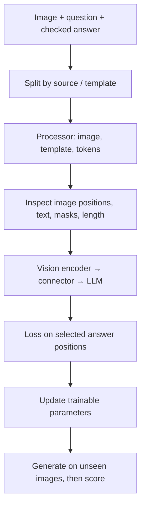

# Multimodal fine-tuning: inspect one batch before training

[中文](vlm-finetuning.md) · **English**

> Last reviewed: 2026-10-09 · Prerequisites: [SFT](../05-post-training/sft-and-its-ceiling.en.md), [One training step](../00-foundations/deep-dives/training-step.en.md)

You show a timetable and ask when the last bus leaves. The answer is “22:40.” Training loss falls, but the model still answers 22:40 when the image is hidden. It may have learned the dataset's most common answer rather than how to read a timetable.

Fine-tuning first needs evidence that the data teaches the intended skill. Starting a training process is only one step.

## Check whether fine-tuning addresses the failure

| Observed failure | First intervention | Why |
| --- | --- | --- |
| Text is already blurred in the input | Adjust resolution or crops | SFT cannot recover discarded pixels |
| Correct answers, inconsistent format | Specify a schema and examples before deciding on SFT | Updating the whole model may be unnecessary |
| Repeated mistakes on domain layouts or terms | Collect grounded task examples; consider adaptation | There may be a genuine domain gap |
| Insufficient evidence | Include unanswerable examples and allow uncertainty | Inventing an answer is not improvement |
| Good results only on public questions | Split by template, source, and time | Check memorization and leakage first |

Do not combine OCR, question answering, and localization into one undefined “multimodal capability” score. Coordinate outputs also need a coordinate system, resize policy, and image identifiers.

## From one sample to its loss



Save a sample ID, image hash, source, question, answer, and evidence location. Crops from one image or one template with altered numbers may leak across splits. Group first, split second; do not independently randomize every exported row.

A processor does more than tokenize text. It handles images, visual placeholders, and model-specific grid information. Match it to the checkpoint instead of assuming a hard-coded image token ID works everywhere. [Transformers Qwen3-VL documentation](https://huggingface.co/docs/transformers/model_doc/qwen3_vl)

## Captioning needs its own data and evaluation contract

Captioning is not timetable question answering. Imagine a desk photograph: a cup of tea beside an open book. “A cup of tea beside a book” is grounded. “Someone has finished reading and is enjoying afternoon tea” sounds natural but invents a story the image cannot establish.

[COCO Captions](https://arxiv.org/abs/1504.00325) is one public starting point for image-to-description SFT. It provides multiple human descriptions for an image. Split by image, not by individual caption; one description in training and another in testing still leaks the picture. Follow the official split and usage terms, then check that your processing hasn't introduced overlap. A new random split is not automatically better.

| Preparation | Captioning | Timetable question answering |
| --- | --- | --- |
| Input | Image + description instruction | Image + specific question |
| Target | A grounded description; alternatives may be valid | Supported field or an unanswerable response |
| Main errors | Invented objects, relations, actions; omitted subjects | Wrong digits, confused fields, answering without evidence |
| Evaluation | Multi-reference text metrics + independent visual-fact checks | Field accuracy + unanswerability recognition |

A BLEU, ROUGE, or CIDEr change does not automatically establish better visual grounding. Separate mentioning another visible object from inventing one. An evaluator also needs the image or independently checked facts. No COCO images were downloaded or redistributed here, and no model result is reported; this section defines the example and evaluation setup.

## Inspect the supervised positions

Consider this processed sequence, with invented token IDs:

| Position | Content | Input ID | Target label |
| --- | --- | --- | --- |
| 0 | Start marker | 10 | -100 |
| 1 | Image placeholder | 99 | -100 |
| 2 | Question | 20 | -100 |
| 3 | Assistant start | 30 | -100 |
| 4 | 22:40 | 40 | 40 |
| 5 | End of answer | 2 | 2 |
| 6 | Padding | 0 | -100 |

This configuration supervises the answer and its end marker; it is not the only definition of SFT. `-100` excludes a loss position. It does not remove the input or stop attention from seeing the image.

```python
def answer_labels(token_ids, answer_mask, attention_mask, image_mask):
    if len({len(token_ids), len(answer_mask), len(attention_mask), len(image_mask)}) != 1:
        raise ValueError("all masks must match token_ids")
    masks = (*answer_mask, *attention_mask, *image_mask)
    if any(type(value) is not bool for value in masks):
        raise ValueError("masks must contain booleans")
    labels = [
        token if answer and visible and not image else -100
        for token, answer, visible, image in zip(
            token_ids, answer_mask, attention_mask, image_mask
        )
    ]
    if not any(label != -100 for label in labels[1:]):
        raise ValueError("no target survives the causal shift")
    return labels

labels = answer_labels(
    [10, 99, 20, 30, 40, 2, 0],
    [False, False, False, False, True, True, False],
    [True, True, True, True, True, True, False],
    [False, True, False, False, False, False, False],
)
assert labels == [-100, -100, -100, -100, 40, 2, -100]
```

This is a mask example, not a production collator. A chat template determines real answer spans; splitting on a guessed string is unreliable. A causal LM usually shifts once inside the model or loss: logits at position 3 predict label 4. Do not shift in both preprocessing and the model.

With two supervised positions, the loss is:

$$
\mathcal L=-\frac{\log p(22{:}40\mid\text{image, question})+\log p(\text{EOS}\mid\text{image, question, answer})}{2}.
$$

Long answers contribute more tokens. Mixing long OCR transcriptions with short answers produces different weighting under token averaging, example averaging, and task weighting. Record the choice.

## Length, freezing, and memory

TRL v0.29.0 warns against unchecked VLM sequence truncation because it can remove image tokens. Its `max_length=None` recommendation disables that truncation; it does not provide unlimited memory. Still constrain image dimensions, image count, and text length, and inspect length tails. `assistant_only_loss` also requires a template that returns the relevant mask; enabling a flag is not sufficient validation. [Versioned TRL documentation](https://huggingface.co/docs/trl/v0.29.0/en/sft_trainer)

| Trainable scope | What to test first | Cost or limitation |
| --- | --- | --- |
| Connector only | Whether the vision–language interface can adapt | Limited change to underlying visual and language abilities |
| LLM LoRA | Output conventions and domain question answering | Does not directly update a frozen vision encoder |
| Visual adaptation too | Whether the new image distribution needs earlier feature changes | Greater data requirements and risk to general capability |
| Full fine-tuning | Broad adaptation with sufficient data | More optimizer state, activations, and forgetting risk |

Freezing parameters does not always justify wrapping the whole branch in `no_grad`. If a trainable module precedes a frozen one, gradients must still pass through the latter. See the [Q-Former gradient example](blip-and-q-former.en.md).

Separate weights, gradients, optimizer state, activations, and temporary tensors. More images or longer visual sequences can substantially increase peak memory at the same parameter count. Record per-device microbatch, processed token counts, precision, checkpointing, and attention implementation before deciding how many GPUs are needed.

## From a small experiment to an interpretable result

1. **No-training baseline:** evaluate the original checkpoint, retaining prompts, processor, and generation settings.
2. **Inspect one batch:** decode text and check resized images, valid labels, image order, and gradients; reject empty targets.
3. **Overfit a tiny set:** check the training path with a few manually verified examples. Memorizing them does not establish generalization.
4. **Train under a fixed protocol:** vary one factor, such as LoRA targets or image budget, and record versions and seeds.
5. **Independent generation:** do not provide the gold answer as a prefix; report results by template, source, and content type.

## What must survive the run so someone else can continue it?

A training command alone is insufficient. The model name may stay unchanged while remote weights, the processor, or the template change.

| Artifact | Minimum contents | What it helps diagnose |
| --- | --- | --- |
| Version manifest | Model / processor revisions, code commit, dependency versions | What actually changed between runs |
| Data manifest | Image ID / hash, split, task, original size, processed budget | Leakage, wrong images, memory-heavy length tails |
| Parameter manifest | Actual trainable parameter names, LoRA targets, frozen modules | Adapting only language while expecting visual updates |
| Training log | Valid target-token counts, per-task loss, gradient norms, skipped examples and reasons | Loss changes caused by masks or sample composition |
| Resource log | Microbatch, accumulation, effective batch, peak memory, step time | The conditions behind a GPU-count claim |
| Generation record | Fixed input, checkpoint, decoding settings, output, independent score | Falling training loss without improved generation |

TensorBoard, MLflow, SwanLab, or local JSONL can record this. Consistent fields matter more than the product name. Keep credentials in environment variables and don't upload raw images, full conversations, or private fields to third-party logging by default.

Before a long run, save a small checkpoint, reload it, and repeat a fixed forward pass or generation check. A LoRA adapter still needs the correct base model and processor. Check consistency before and after merging weights. Resuming training also requires optimizer, scheduler, random-state, and data-progress considerations. The [post-training practice notes](../practice/post-training/experiments-and-release.en.md) organize these artifacts into one experiment record.

This page supplies a checked mask example and an experiment protocol, **not a reproduced GPU fine-tuning result**. Its framework entry uses the versioned documentation above. On a version upgrade, repeat the batch checks rather than presenting an old environment list as a universal 2026 setup.

## Counterfactual images reveal more than one overall score

Keep the original timetable, then make three versions: change only the last departure time, hide that field, and use a matching layout with different numbers. Expected behavior is to follow the new time, acknowledge missing evidence, and read the new values.

| Check | What it can reveal | What it cannot establish alone |
| --- | --- | --- |
| Remove the image | Whether text priors suffice | A score drop does not prove correct visual reasoning |
| Change one field | Whether answers follow visual facts | Does not cover every layout or semantic skill |
| Conflict between image and text | Whether inconsistencies are noticed | Neither modality is always authoritative |
| Unseen templates | Reliance on layout memorization | Domain and temporal transfer still need testing |

Track field accuracy, unanswerable detection, output format, latency, and memory. Report which settings help which slices. Without measurements, retain the experiment plan rather than claiming significant gains. This page validates teaching mask code, not end-to-end GPU fine-tuning; use the [official Qwen3-VL fine-tuning project](https://github.com/QwenLM/Qwen3-VL/tree/main/qwen-vl-finetune) for a real run and pin its commit.
