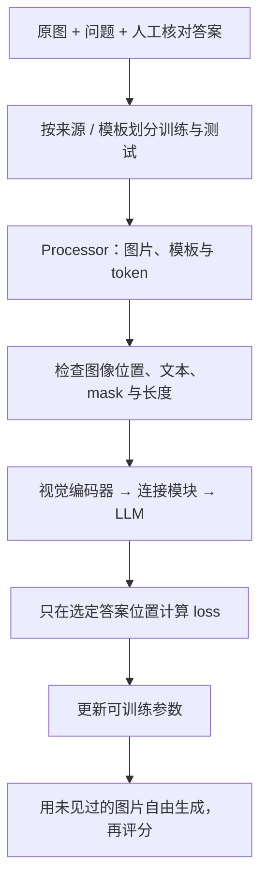

# 多模态微调：先检查一批数据，再开始训练

**中文** · [English](vlm-finetuning.en.md)

> 最近审阅：2026-10-09 · 先读：[SFT](../05-post-training/sft-and-its-ceiling.md)、[一次训练怎么走](../00-foundations/deep-dives/training-step.md)

给模型一张时刻表，问“末班车几点？”，标准答案是“22:40”。训练 loss 在降，你却发现遮住图片后它还是回答 22:40。可能模型根本没学会看图，只记住了这个数据集里最常见的答案。

微调首先要证明数据教的是你想要的能力。把训练命令跑起来只是其中一步。

## 先判断问题能不能靠微调解决

| 观察到的错误 | 先试什么 | 为什么 |
| --- | --- | --- |
| 字在输入里已经糊了 | 调分辨率或裁图 | SFT 不能恢复已经丢掉的像素 |
| 能答对，但格式不稳定 | 明确 schema、少量示范，再评估是否需要 SFT | 不一定要更新整个模型 |
| 特定布局、术语经常错 | 收集有证据的任务样本，考虑适配训练 | 可能存在真实领域差异 |
| 问题本身没有足够证据 | 加不可回答样本，允许说明不确定 | 编造一个答案不是改进 |
| 只在公开题目上表现好 | 换模板、来源和时间切分 | 先排查记忆与数据泄漏 |

不要把 OCR、问答、定位混成一个“多模态能力”总分。如果输出需要坐标，还要定义坐标系、图片缩放和多图编号。

## 一条训练样本怎么走到 loss



保存 `sample_id`、图片哈希、来源、问题、答案和证据位置。划分数据时，同一张图的不同裁剪、同一个模板换几个数字，都可能互相泄漏。先分组再划分，不要把导出的每一行独立随机分配。

Processor 不只是 tokenizer。它还负责图像处理、视觉占位符和模型要求的 grid 信息。必须与 checkpoint 匹配；不要凭一个固定 token ID 猜所有模型的图片标记。[Transformers Qwen3-VL 文档](https://huggingface.co/docs/transformers/model_doc/qwen3_vl)

## 如果练的是图片描述，数据和尺子也要跟着换

图片描述（captioning）和时刻表问答不是同一个任务。虚构一张桌面照片：一杯茶放在打开的书旁边。一个合理答案是“书旁放着一杯茶”；“有人刚读完书，正在享受下午茶”虽然顺口，却加上了画面无法证明的故事。

可以用 [COCO Captions](https://arxiv.org/abs/1504.00325) 练习图片到描述的 SFT。它为同一张图提供多份人工描述；划分时应以图片为单位，不能把一份描述放训练、另一份放测试。先遵循官方 split 与使用条款，再检查自己二次处理有没有产生重叠，不必为了“重新随机”破坏既有协议。

| 准备环节 | 图片描述 | 时刻表问答 |
| --- | --- | --- |
| 输入 | 图片 + 描述任务说明 | 图片 + 具体问题 |
| 目标 | 一份有依据的描述；可以不唯一 | 有证据支持的字段或不可回答 |
| 重点错误 | 编造物体、关系、动作；漏掉主体 | 读错数字、字段混淆、无证据也回答 |
| 检查方式 | 多参考文本指标 + 独立的视觉事实检查 | 字段准确率 + 不可回答识别 |

BLEU、ROUGE 或 CIDEr 的变化不自动代表视觉事实更准确。把“多提到了一个物体”和“多编造了一个物体”分开看；评估器也要看图，或使用独立核对的事实。这里没有下载、重新分发 COCO 图片，也没有跑模型效果；这一段说明怎样把样本和评估协议搭起来。

## 看清哪些位置真的参与训练

假设处理后的一条序列如下，token ID 为教学用：

| 位置 | 内容 | 输入 ID | 目标 label |
| --- | --- | --- | --- |
| 0 | 开始标记 | 10 | -100 |
| 1 | 图像占位 | 99 | -100 |
| 2 | 问题 | 20 | -100 |
| 3 | 回答开始 | 30 | -100 |
| 4 | 22:40 | 40 | 40 |
| 5 | 回答结束 | 2 | 2 |
| 6 | padding | 0 | -100 |

这里选择只监督答案和结束标记；它是一种训练配置，不是 SFT 的唯一定义。`-100` 表示忽略 loss，不表示删掉输入，也不表示 attention 看不见图片。

```python
def answer_labels(token_ids, answer_mask, attention_mask, image_mask):
    if len({len(token_ids), len(answer_mask), len(attention_mask), len(image_mask)}) != 1:
        raise ValueError("all masks must match token_ids")
    masks = (*answer_mask, *attention_mask, *image_mask)
    if any(type(value) is not bool for value in masks):
        raise ValueError("masks must contain booleans")
    labels = [
        token if answer and visible and not image else -100
        for token, answer, visible, image in zip(
            token_ids, answer_mask, attention_mask, image_mask
        )
    ]
    if not any(label != -100 for label in labels[1:]):
        raise ValueError("no target survives the causal shift")
    return labels

labels = answer_labels(
    [10, 99, 20, 30, 40, 2, 0],
    [False, False, False, False, True, True, False],
    [True, True, True, True, True, True, False],
    [False, True, False, False, False, False, False],
)
assert labels == [-100, -100, -100, -100, 40, 2, -100]
```

这是 mask 算例，不是生产 collator。真实答案区间由 chat template 确定，不能简单按某个字符串切分。Causal LM 通常在模型或 loss 内做一次 shift：位置 3 的 logits 预测 label 4；不要在数据处理和模型里各移一次。

答案有 2 个有效位置，损失为：

$$
\mathcal L=-\frac{\log p(22{:}40\mid\text{图、问题})+\log p(\text{EOS}\mid\text{图、问题、答案})}{2}.
$$

长答案会贡献更多 token。若混合 OCR 长转录与简短问答，token 平均、样本平均和按任务加权会给出不同权重，要在实验记录里说明。

## 长度、冻结与显存

TRL v0.29.0 的 VLM 指南建议避免未经检查的序列截断，因为可能切掉图像 token；其中 `max_length=None` 是关闭这种截断，不是无限显存。仍要在数据侧限制图片尺寸、张数、文本长度，并检查高分位长度。`assistant_only_loss` 也依赖能返回相应 mask 的模板，不能只开一个参数就认为完成了验证。[固定版本的 TRL 文档](https://huggingface.co/docs/trl/v0.29.0/en/sft_trainer)

| 更新范围 | 适合先验证什么 | 代价与限制 |
| --- | --- | --- |
| 只训练连接模块 | 视觉与语言接口能否接通 | 语言和视觉能力的调整范围有限 |
| LLM 的 LoRA | 输出习惯、领域问答能否改善 | 不直接修改被冻结的视觉编码器 |
| 同时适配视觉侧 | 新图像分布是否需要更早的特征调整 | 数据要求更高，可能损伤通用能力 |
| 全参数微调 | 足够数据下的整体适配 | 优化器状态、激活和遗忘风险更大 |

冻结参数不总是能对整条分支用 `no_grad`：如果可训练模块在冻结模块前面，梯度仍需穿过后者。[Q-Former 的冻结梯度例子](blip-and-q-former.md)可以帮助理解。

显存至少分成权重、梯度、优化器状态、激活和临时张量。相同参数量，图片多、视觉序列长，也可能让峰值显存大很多。先记录单卡 microbatch、处理后 token 数、精度、checkpointing 与 attention 实现，再讨论需要几张卡；不要只按“几 B 模型”估计。

## 从小实验到可信的结果

1. **无训练基线**：同一测试集测原 checkpoint，保留 prompt、processor 和生成配置。
2. **一批数据检查**：解码文本，查看缩放后的图片、有效 labels、图文顺序和梯度；确认没有全空目标。
3. **小集过拟合**：用少量人工可核对样本检查训练链路；能记住它们只证明链路可能通，不证明泛化。
4. **固定协议训练**：只改一个因素，例如 LoRA 目标模块或图片预算，记录版本和随机种子。
5. **独立生成测试**：不用标准答案作前缀，按模板、来源和内容类型报告结果。

## 一次实验要留下什么，别人才能接着做

不要只留下训练命令。命令里的模型名字没变，远端权重、processor 或模板也可能已经变了。

| 保存的东西 | 至少记录什么 | 用来排查什么 |
| --- | --- | --- |
| 版本清单 | 模型与 processor revision、训练代码 commit、依赖版本 | 重跑时到底换了哪部分 |
| 数据清单 | 图片 ID / 哈希、split、任务、原图尺寸和处理后预算 | 泄漏、错图、长样本显存峰值 |
| 参数清单 | 实际可训练参数名、LoRA 目标、冻结范围 | 以为在训视觉模块，其实只改了语言侧 |
| 训练记录 | 有效目标 token 数、各任务 loss、梯度范数、跳过样本及原因 | loss 下降是否来自样本构成或 mask 改变 |
| 资源记录 | microbatch、累积步数、有效 batch、峰值显存、步耗时 | “需要多少卡”对应哪套条件 |
| 生成样例 | 固定输入、checkpoint、生成配置、输出、独立评分 | 训练 loss 好看，生成却没有改善 |

TensorBoard、MLflow、SwanLab 或一个本地 JSONL 都可以承担记录；先保证字段一致，不必为了工具名称换整套流程。密钥放环境变量，默认不往第三方日志上传原图、完整对话或隐私字段。

开始长跑前，保存一个小 checkpoint，再重载做同一批前向或生成。只有 LoRA adapter 时，还需准确的基座与 processor；合并权重前后也要核对一致性。要继续训练，单有模型权重不够，还要考虑优化器、scheduler、随机数与数据进度。本站的[后训练实验实践](../practice/post-training/experiments-and-release.md)把这些产物放进同一份实验记录。

这里提供的是可核对的 mask 示例与实验流程，**不是已复现的 GPU 微调报告**。框架入口使用上面的固定版本文档；迁移到新版本时重新跑一批数据检查，不把旧环境清单称作“2026 通用配置”。

## 反事实图片比一个总分更有用

对时刻表例子，保留原图，再做“只改末班车时间”“遮住该字段”“换一张布局相同但数字不同的表”三个版本。预期分别是跟随新时间、说明证据不足、读取新数字。

| 检查 | 能发现什么 | 不能单独证明什么 |
| --- | --- | --- |
| 去掉图片 | 文本先验是否足以猜答案 | 分数下降不自动证明视觉推理正确 |
| 只改一个字段 | 回答是否跟随视觉事实 | 不能覆盖全部布局与语义能力 |
| 图文冲突 | 是否能识别不一致 | 偏向图片或文字都不一定总正确 |
| 未见模板 | 是否依赖版式记忆 | 还需要检查领域与时间迁移 |

评分至少同时看字段准确率、不可回答识别、输出格式、延迟和显存。报告哪些设置改善了哪些切片；没有实测结果时，就保留实验方案，不写“显著提升”。本页验证的是教学 mask 代码，尚未运行端到端 GPU 微调；实际训练可从 [Qwen3-VL 官方微调工程](https://github.com/QwenLM/Qwen3-VL/tree/main/qwen-vl-finetune)开始，并固定提交版本。
