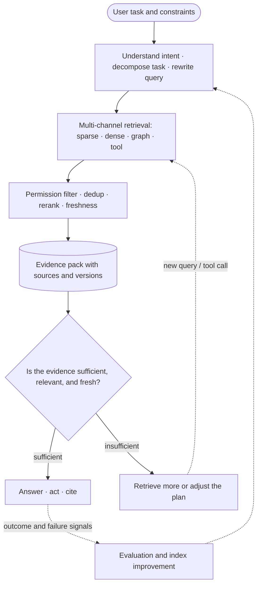

# Search: How Does a Model Find What It Does Not Currently Know?

[中文](README.md) · **English**

## Start here: search is a decision process

Search is not just finding the most similar content in a database. It helps the model, when information is incomplete, decide **what to look for, where to look, which evidence is still missing, and when it can stop**.

## Start with a question the model cannot answer

The user says: “Find that paper about agent memory I mentioned last time.”

The system may need to:

1. work out which part of the history “last time” refers to;
2. judge whether the user remembers the title, the author, or the topic;
3. search personal conversations, notes, and public paper collections;
4. disambiguate among several similar results;
5. ask the user a follow-up question first if the evidence is still not enough.

This is no longer a nearest-neighbor lookup. It is a small reasoning process.

## The basic search pipeline

Every step can become the bottleneck. If a candidate is never retrieved, no model downstream can make up for it, however strong; if the evidence is ranked wrongly, the model may be led astray by irrelevant content; and if the context is too long, the important information may be buried.

## Why one vector is often not enough

Dual-encoder retrieval usually compresses the query and the item into one vector each and then computes a similarity. This is cheap and suits large-scale candidate retrieval, but compressing too early loses detail.

For example, “an Italy itinerary suitable for bringing my parents, with lots of natural scenery and not too tiring” contains several conditions at once. One vector may emphasize “Italy travel” while weakening “parents” and “not too tiring.”

Common improvements include:

- multiple vectors that represent different intents or facets;
- late interaction, which preserves token-level matching;
- encoding the profile, the history, and the current query separately;
- hybrid search that combines sparse, dense, and structured retrieval;
- a reranker that makes finer interaction-based judgments over a small candidate set.

## Relevance is not the only objective

If all ten results are highly similar, recall may look fine, but the user has gained no additional choice.

Search also has to consider:

- **Coverage**: are all the important directions covered?
- **Diversity**: are the results just repetitions of the same topic?
- **Novelty**: does it offer content the user might like but has not yet seen?
- **Freshness**: is the information out of date?
- **Authority**: is the evidence reliable?
- **Uncertainty**: does the system know that key evidence is still missing?

## How search connects to agents

In an agent, search can become an action. The model has to decide whether to:

- answer directly;
- retrieve more evidence;
- call a tool;
- ask the user to clarify;
- or admit that it cannot complete the task reliably right now.

This turns search from “returning documents” into “managing the process of acquiring information.”

## How to evaluate

Beyond Recall / NDCG, you can also check:

- whether the key evidence made it into the context;
- whether the results cover different intents;
- whether errors concentrate in new users, short histories, or long queries;
- whether the end task really improves once retrieval is added;
- whether the system keeps searching or asks the right follow-up question when evidence is insufficient.

## Continue reading

- [Representation and memory](../02-memory/README.en.md)
- [Data and feedback](../01-data-and-feedback/README.en.md)
- [Evaluation](../07-evaluation/README.en.md)
- [Agent Observability](../06-systems/agent-observability.en.md)

## Reference papers

- [Dense Passage Retrieval](https://arxiv.org/abs/2004.04906)
- [ColBERT](https://arxiv.org/abs/2004.12832)
- [Retrieval-Augmented Generation](https://arxiv.org/abs/2005.11401)
- [ReAct](https://arxiv.org/abs/2210.03629)
