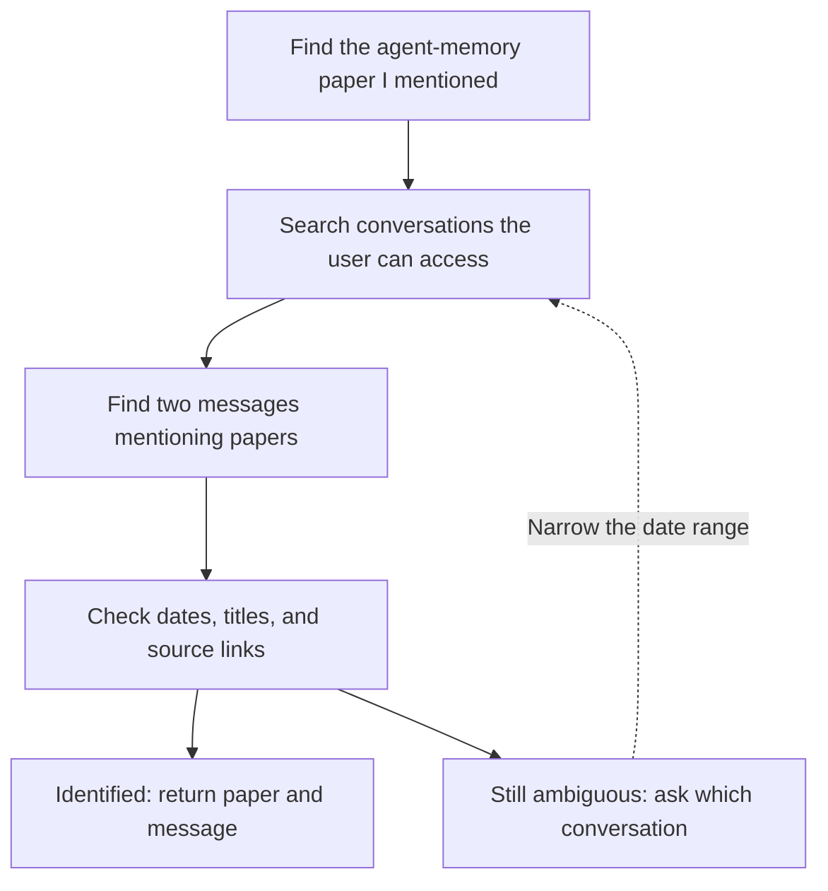

# Search: How Does a Model Find What It Does Not Currently Know?

[中文](README.md) · **English**

This overview follows the complete path. You do not need to finish the whole section before building a search system; start with your current question.

| What do you want to understand? | Start here | What you should be able to explain |
| --- | --- | --- |
| Why can keyword matches rank poorly? | [TF-IDF and BM25](tfidf-and-bm25.en.md) | How repetition and document length affect scores |
| How does text become a searchable vector? | [Dual encoders](dual-encoder.en.md) | What can be precomputed and how training uses positives and negatives |
| Qwen Embedding or BGE? | [Specific model comparison](embedding-models.en.md) | Why inputs, pooling, and indexes must remain compatible |
| How do retrieval paths work together? | [Hybrid retrieval and reranking](hybrid-and-reranking.en.md) | Fusion and comparisons under equal budgets |

The notes begin with intuition and small examples, then develop the arithmetic and implementation. Stop after the mechanism if that is what you need; return to the code and debugging when you are ready to build.

## Start here: search is a decision process

Search is not just finding the most similar content in a database. It helps the model, when information is incomplete, decide **what to look for, where to look, which evidence is still missing, and when it can stop**.

## Start with a question the model cannot answer

The user says: “Find that paper about agent memory I mentioned last time.”

The system may need to:

1. work out which part of the history “last time” refers to;
2. judge whether the user remembers the title, the author, or the topic;
3. search personal conversations, notes, and public paper collections;
4. disambiguate among several similar results;
5. ask the user a follow-up question first if the evidence is still not enough.

A single nearest-neighbor lookup may not settle this: the system first needs to choose where to search, then check what it found.

## The basic search pipeline

```mermaid
flowchart TB
    query["Find the agent-memory paper I mentioned"] --> history["Search conversations the user can access"]
    history --> matches["Find two messages mentioning papers"]
    matches --> check["Check dates, titles, and source links"]
    check --> found["Identified: return paper and message"]
    check --> unclear["Still ambiguous: ask which conversation"]
    unclear -. "Narrow the date range" .-> history
```

Each step can fail. Missing a relevant candidate leaves the downstream model without that evidence; poor ranking can introduce distracting material; and a crowded context can make important information harder to use.

## Why one vector is often not enough

Dual-encoder retrieval usually encodes the query and item into one vector each, then computes a similarity. This supports efficient retrieval over a large collection. But with a fixed dimension and similarity function, the representation may miss distinctions the task needs. That is a hypothesis to test, not proof that single-vector retrieval cannot work.

For example, “an Italy itinerary suitable for bringing my parents, with lots of natural scenery and not too tiring” contains several conditions at once. One vector may emphasize “Italy travel” while weakening “parents” and “not too tiring.”

Common improvements include:

- multiple vectors that represent different intents or facets;
- late interaction, which preserves token-level matching;
- encoding the profile, the history, and the current query separately;
- hybrid search that combines sparse, dense, and structured retrieval;
- a reranker that makes finer interaction-based judgments over a small candidate set.

Each extra retrieval path can add compute, storage, and deduplication costs. Hold the total candidate budget fixed and test whether the new path recovers relevant items the original missed. Simply retrieving more candidates does not show that the representation is better.

## Relevance is not the only objective

If all ten results are highly similar, recall may look fine, but the user has gained no additional choice.

Search also has to consider:

- **Coverage**: are all the important directions covered?
- **Diversity**: are the results just repetitions of the same topic?
- **Novelty**: does it offer content the user might like but has not yet seen?
- **Freshness**: is the information out of date?
- **Authority**: is the evidence reliable?
- **Uncertainty**: does the system know that key evidence is still missing?

## How search connects to agents

In an agent, search can become an action. The model has to decide whether to:

- answer directly;
- retrieve more evidence;
- call a tool;
- ask the user to clarify;
- or admit that it cannot complete the task reliably right now.

This turns search from “returning documents” into “managing the process of acquiring information.”

## How to evaluate

Beyond Recall / NDCG, you can also check:

- whether the key evidence made it into the context;
- whether the results cover different intents;
- whether errors concentrate in new users, short histories, or long queries;
- whether the end task really improves once retrieval is added;
- whether the system keeps searching or asks the right follow-up question when evidence is insufficient.

## Continue reading

- [Vector indexes: IVF and PQ](vector-indexes.en.md): memory accounting, distance examples, and index tradeoffs.
- [RAG: evidence and evaluation](rag-evidence.en.md): why finding the document can still produce a wrong answer.
- [Representation and memory](../02-memory/README.en.md)
- [Data and feedback](../01-data-and-feedback/README.en.md)
- [Evaluation](../07-evaluation/README.en.md)
- [Agent Observability](../06-systems/agent-observability.en.md)

## Reference papers

- [Dense Passage Retrieval](https://arxiv.org/abs/2004.04906)
- [ColBERT](https://arxiv.org/abs/2004.12832)
- [Retrieval-Augmented Generation](https://arxiv.org/abs/2005.11401)
- [ReAct](https://arxiv.org/abs/2210.03629)
