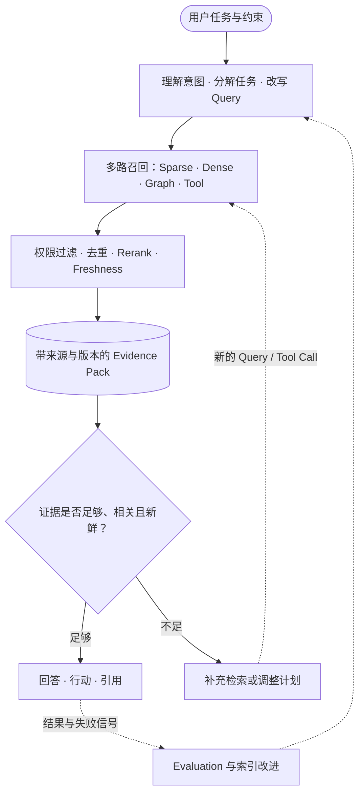

# Search：模型怎样找到它现在不知道的东西？

**中文** · [English](README.en.md)

## 先用一句话讲清楚

Search 不只是从数据库里找最相似的内容，而是帮助模型在信息不完整时，决定**该找什么、去哪里找、还缺什么证据，以及什么时候可以停止**。

## 一个最简单的例子

用户说：“把我上次提到的那篇关于 Agent memory 的论文找出来。”

系统可能需要：

1. 理解“上次”对应哪段历史；
2. 判断用户记得的是标题、作者还是主题；
3. 搜索个人对话、笔记和公开论文库；
4. 对多个相似结果消歧；
5. 如果证据还不够，先向用户追问。

这已经不是一次 nearest-neighbor lookup，而是一段小型推理过程。

## Search 的基本链路

每一步都可能成为瓶颈。候选没有召回，后面模型再强也无法补救；证据排序错误，模型可能被无关内容带偏；上下文过长，重要信息又可能被淹没。

## 为什么一个向量经常不够

双塔检索常把 query 和 item 分别压成一个向量，再计算相似度。这种方法便宜、适合大规模召回，但压缩得太早会丢失细节。

例如“适合带父母去、自然风景多、不要太累的意大利路线”同时包含多个条件。一个向量可能更强调“意大利旅行”，却弱化“父母”和“不要太累”。

常见改进包括：

- 多向量表示不同意图或 facet；
- late interaction 保留 token 级匹配；
- profile、历史和当前 query 分开编码；
- hybrid search 结合稀疏、稠密和结构化检索；
- reranker 在小候选集上做更细的交互判断。

## relevance 不是唯一目标

如果十个结果都高度相似，Recall 可能不错，但用户没有获得更多选择。

Search 还需要考虑：

- **Coverage**：重要方向是否都被覆盖？
- **Diversity**：结果是否只是同一个主题的重复？
- **Novelty**：有没有提供用户可能喜欢但尚未见过的内容？
- **Freshness**：信息是否过期？
- **Authority**：证据是否可靠？
- **Uncertainty**：系统是否知道还缺关键证据？

## Search 和 Agent 的连接

在 Agent 中，Search 可以成为一个 action。模型需要决定：

- 直接回答；
- 检索更多证据；
- 调用工具；
- 向用户澄清；
- 或者承认当前无法可靠完成。

这使 Search 从“返回文档”变成“管理信息获取过程”。

## 怎样评估

除了 Recall / NDCG，还可以看：

- 关键证据是否进入上下文；
- 结果是否覆盖不同意图；
- 错误是否集中在新用户、短历史或长 query；
- 加入检索后，最终任务是否真的更好；
- 系统是否在证据不足时继续搜索或正确追问。

## 从哪里继续读

- [表征与记忆](../02-memory/)
- [数据与反馈](../01-data-and-feedback/)
- [Evaluation](../07-evaluation/)
- [Agent Observability](../06-systems/agent-observability.md)

## 起始论文

- [Dense Passage Retrieval](https://arxiv.org/abs/2004.04906)
- [ColBERT](https://arxiv.org/abs/2004.12832)
- [Retrieval-Augmented Generation](https://arxiv.org/abs/2005.11401)
- [ReAct](https://arxiv.org/abs/2210.03629)
