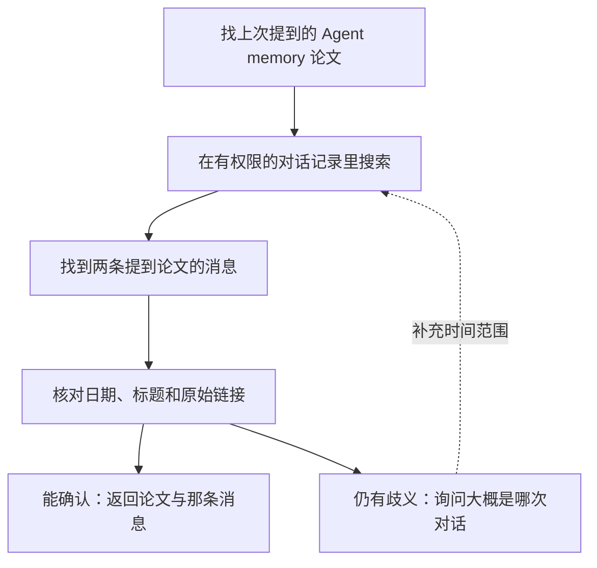

# 搜索与检索：模型怎样找到需要的信息？

**中文** · [English](README.en.md)

这一页先看完整路径。不必把这个板块全部读完，再开始做检索；按你现在的问题选就好。

| 现在想弄懂什么 | 从哪里看 | 读完先能解释什么 |
| --- | --- | --- |
| 为什么命中了关键词，却排不对？ | [TF-IDF 与 BM25](tfidf-and-bm25.md) | 重复词与文档长度怎样影响打分 |
| 文本怎样变成可检索的向量？ | [双塔检索](dual-encoder.md) | 什么能提前算，正负例怎样参与训练 |
| 选 Qwen Embedding 还是 BGE？ | [具体模型对比](embedding-models.md) | 输入、pooling 与索引为什么得配套 |
| 几路结果怎么合在一起？ | [混合检索与重排](hybrid-and-reranking.md) | 怎样融合，怎样在相同预算下比较 |

每篇先给直觉和小例子，再展开计算与实现。只想了解机制，可以先停在那里；准备动手时，再接后面的代码和排错。

## 不只是“找几段相似的文字”

这里说的搜索，不只是从数据库里找相似内容。模型还得判断：**该找什么、去哪里找、找到的资料够不够，以及什么时候可以停下来回答。**

## 从一个模型答不了的问题开始

用户说：“把我上次提到的那篇关于 Agent memory 的论文找出来。”

系统可能需要：

1. 理解“上次”对应哪段历史；
2. 判断用户记得的是标题、作者还是主题；
3. 搜索个人对话、笔记和公开论文库；
4. 分清几个相似结果，确认哪篇才是用户说的那篇；
5. 如果证据还不够，先向用户追问。

这时只做一次最近邻检索（nearest-neighbor lookup）还不够：系统得先判断去哪找，找到以后再核对。

## 一次搜索通常怎么走

```mermaid
flowchart TB
    query["找上次提到的 Agent memory 论文"] --> history["在有权限的对话记录里搜索"]
    history --> matches["找到两条提到论文的消息"]
    matches --> check["核对日期、标题和原始链接"]
    check --> found["能确认：返回论文与那条消息"]
    check --> unclear["仍有歧义：询问大概是哪次对话"]
    unclear -. "补充时间范围" .-> history
```

这些环节都可能出问题。相关内容没召回，后面的模型就缺少依据；排序不合适，无关内容可能干扰回答；上下文塞得太满，关键信息又容易被忽略。

## 为什么一个向量经常不够

双塔检索通常把查询和候选内容分别编码成一个向量，再比较相似度。这样适合在大量内容中快速找候选，但在固定维度和相似度函数下，表示未必保留了任务需要的全部差异。这是要验证的问题，不是“单向量一定不行”的结论。

例如“适合带父母去、自然风景多、不要太累的意大利路线”同时包含多个条件。一个向量可能更强调“意大利旅行”，却弱化“父母”和“不要太累”。

常见改进包括：

- 用多个向量保留不同意图或侧重点；
- 用延迟交互保留 token 之间的细粒度匹配；
- 将用户资料、历史和当前查询分开编码；
- 用混合检索结合关键词、向量和结构化信息；
- 先找出一小批候选，再用重排序模型仔细比较。

不过，每多一条召回路径都可能增加计算、存储和去重成本。先固定总候选数，比较新增路径是否找到了原来遗漏的相关内容；只是多给了候选预算，不能证明表示更好。

## 相关，不代表这组结果就够好

如果十个结果都高度相似，Recall 可能不错，但用户没有获得更多选择。

还要看看：

- **覆盖率（coverage）**：重要方向有没有漏掉？
- **多样性（diversity）**：结果是不是都在重复同一件事？
- **新颖性（novelty）**：有没有用户可能喜欢、但还没见过的内容？
- **新鲜度（freshness）**：信息是否已经过期？
- **来源可靠性（authority）**：这些资料来自哪里，值不值得信任？
- **不确定性（uncertainty）**：还有哪些关键问题没找到依据？

## Agent 什么时候需要搜索

对 Agent 来说，搜索是可选的行动之一。模型需要判断下一步该：

- 直接回答；
- 检索更多证据；
- 调用工具；
- 向用户澄清；
- 或者承认当前无法可靠完成。

所以不只是搜到文档就结束了，还得根据结果决定要不要继续找、换个问法，或先向用户确认。

## 怎样评估

除了 Recall / NDCG，还可以看：

- 关键证据是否进入上下文；
- 结果是否覆盖不同意图；
- 错误是否集中在新用户、短历史或长 query；
- 加入检索后，最终任务是否真的更好；
- 系统是否在证据不足时继续搜索或正确追问。

## 继续阅读

- [向量索引：IVF 与 PQ](vector-indexes.md)：从内存账、距离算例到索引取舍。
- [RAG：证据与评估](rag-evidence.md)：文档找到了，答案为什么仍然可能错。
- [表征与记忆](../02-memory/)
- [数据与反馈](../01-data-and-feedback/)
- [Evaluation](../07-evaluation/)
- [Agent Observability](../06-systems/agent-observability.md)

## 参考论文

- [Dense Passage Retrieval](https://arxiv.org/abs/2004.04906)
- [ColBERT](https://arxiv.org/abs/2004.12832)
- [Retrieval-Augmented Generation](https://arxiv.org/abs/2005.11401)
- [ReAct](https://arxiv.org/abs/2210.03629)
