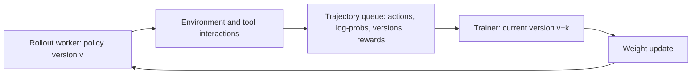

# Asynchronous RL: the model changes before the answer finishes

[中文](async-policy-learning.md) · **English**

> Last reviewed: 2026-10-08 · Prerequisites: [On- vs off-policy](rlhf/on-off-policy.en.md) and [GAE](deep-rl/actor-critic-gae.en.md)

One agent finishes in 5 seconds. Another searches, runs code, and takes 40. Waiting for the slowest leaves the trainer idle; training on whichever finishes first makes later trajectories stale. Asynchronous RL removes waiting, not the distribution mismatch.

## Draw the data path first



This is a teaching diagram. Production systems also handle timeouts, cancellation, duplicate delivery, and recovery. Tool output may enter the next context without being a sampled policy action; it should not automatically receive the same policy loss.

### A waiting-time example

Suppose 4 rollouts for one prompt start together and finish at `[5, 8, 13, 40]` seconds. A group-relative update must wait until 40 seconds for the group rewards. The first three trajectories wait another 35, 32, and 27 seconds, giving 23.5 seconds of average extra waiting.

Enqueuing individual completed trajectories removes this group barrier. Queues, batching, and weight synchronization still add delays. The arithmetic is not a claim of a particular training speedup.

## What SAO changes

[SAO (2026-07)](https://arxiv.org/html/2607.07508v1) studies single-rollout asynchronous agent training: use a value model rather than waiting for a same-prompt comparison group; calculate current / behavior ratios from rollout log-probabilities; mask tokens outside a chosen interval. The paper combines this with more frequent value updates, frozen attention parameters in the value model, and value pretraining.

“Single rollout” means no comparison group per prompt, not one sample per optimizer step. The Critic and its cost return. Compare total time and learning quality rather than assuming that fewer components must be better.

## Why the denominator belongs to generation time

A sampled token had probability 0.2 when generated and 0.3 now: its ratio is 1.5. Recomputing with a recently saved old checkpoint that assigns 0.25 gives 1.2 instead. Both look plausible; they describe different sampling processes.

$$
\rho_t=\exp\left(\log p_{\rm current,t}-\log p_{\rm rollout,t}\right).
$$

“Old model” is not a sufficient identifier. Record policy, tokenizer, and template versions; sampling settings; action positions; actual log-probabilities; and termination reasons. Weight refreshes between tool calls may require segment-level version records.

Temperature, top-p, numerical precision, and the sampling engine can affect the behavior distribution. Clarify whether saved log-probabilities come from the raw model or the transformed sampling distribution. Saving a number does not automatically correct every mismatch.

## Two-sided masking is not ordinary PPO clipping

SAO's DIS retains tokens within a ratio interval. Use illustrative bounds `[0.7, 1.5]`, with the strict inequalities in the paper's equation:

$$
w(\rho)=\begin{cases}
\rho,&0.7<\rho<1.5,\\
0,&\text{otherwise}.
\end{cases}
$$

| Ratio | DIS weight | Difference from the PPO surrogate |
| --- | --- | --- |
| 0.6 | 0 | Discarded for either advantage sign |
| 1.1 | 1.1 | Retained |
| 1.8 | 0 | No distinction based on whether the move is in the wrong direction |

PPO retains corrective gradients for movement in a bad direction. This two-sided filter more directly discards highly shifted tokens. It introduces selection bias: if long tasks become stale more often, retained data may favor easy, quickly completed tasks.

```python
import math

def dis_weight(current_logp, rollout_logp, lower=0.7, upper=1.5):
    if not 0 < lower < 1 < upper:
        raise ValueError("bounds must straddle one")
    if not all(math.isfinite(value) and value <= 0 for value in (current_logp, rollout_logp)):
        raise ValueError("log probabilities must be finite and nonpositive")
    log_ratio = current_logp - rollout_logp
    if not math.log(lower) < log_ratio < math.log(upper):
        return 0.0
    return math.exp(log_ratio)

completion_times = [5, 8, 13, 40]
mean_group_wait = sum(max(completion_times) - value for value in completion_times) / 4
assert mean_group_wait == 23.5
assert math.isclose(dis_weight(math.log(0.22), math.log(0.2)), 1.1)
assert dis_weight(math.log(0.36), math.log(0.2)) == 0
```

The code computes **forward weights and masks only**. A multiplication in a paper is not a full autograd specification: detachment and loss normalization need separate implementation checks. No end-to-end SAO training was run for this chapter, and the helper does not reproduce the paper's performance.

## What the Critic contributes, and where it fails

Without within-group comparisons, $A=R-V(s)$ illustrates the simplest one-step case. Multi-step trajectories need TD / GAE and correct termination handling.

For reward 1, an easy task with expected return 0.9 has advantage 0.1; a harder task with expected return 0.2 has advantage 0.8. A reliable Critic can distinguish them. If it instead predicts 1.3 for the hard task, the sign turns negative: an unconstrained value output need not stay within the reward range.

More frequent value updates can track the policy faster or fit stale noise faster. Freezing parameters reduces trainable state, not necessarily forward compute; it does not justify breaking every gradient path with `no_grad`.

| Record | Question it answers |
| --- | --- |
| Trajectory ages and policy-version gaps | Is the environment slow, or is the queue congested? |
| Retention by task and length | Are only easy-to-finish samples surviving? |
| Critic errors, explained variance, and return variance | Are predictions useful? Is near-zero return variance distorting the metric? |
| Valid action tokens and update norms | Is extra throughput producing more useful gradient? |
| Independent success at a fixed budget | Does the faster pipeline actually learn better? |

## Before integrating it

Replay one trajectory: check action-prefix alignment, reward alignment, exclusion of tool output from policy actions, and the distinction between natural termination and budget truncation. Then test cancellation, worker restarts, duplicate delivery, and old queued trajectories after recovery.

An asynchronous algorithm addresses some staleness problems, not leakage, tool side effects, or user consent. Online-learning simulation is not permission to update a model directly on live user traffic.

Continue with [training infrastructure](post-training-infrastructure.en.md) and [experiments and debugging](deep-rl/experiments.en.md).
