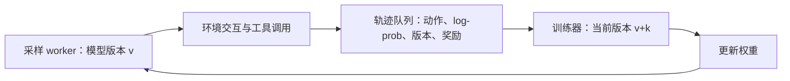

# 异步 RL：回答还没生成完，模型已经更新了

**中文** · [English](async-policy-learning.en.md)

> 最近审阅：2026-10-08 · 先读：[On-policy / off-policy](rlhf/on-off-policy.md)与 [GAE](deep-rl/actor-critic-gae.md)

一个 agent 花 5 秒就完成任务，另一个要查资料、跑代码，花了 40 秒。如果每轮都等最慢的那个，训练器会闲着；如果谁先完成就先训练，晚回来的轨迹又可能由旧模型生成。异步 RL 省下的是等待，不是这个分布差异。

## 先画清数据怎么流



这是教学流程图。生产系统还要处理超时、取消、重复投递与恢复。环境返回的文本虽然会进入下一次上下文，但不是 policy 自己采样的 action，不能直接套同一个 policy loss。

### 一个等待时间例子

假设同题 4 条 rollout 同时启动，完成时间是 `[5, 8, 13, 40]` 秒。必须等整组评分的流程，要到 40 秒才能计算组相对 advantage；前三条完成后分别又等了 35、32、27 秒，平均额外等待 23.5 秒。

单条完成就入队能去掉这道“等同组”的屏障，但队列、batch 凑齐和权重同步仍然会引入等待。这个算例不等于训练吞吐提高某个倍数。

## SAO 改了哪几件事

[SAO（2026-07）](https://arxiv.org/html/2607.07508v1)研究 single-rollout 的异步 agent 训练：不再等同题的一组回答，用 value model 估计 advantage；通过 rollout 记录的 log-prob 计算当前 / 行为比值，并把区间外 token mask 掉。论文还结合更频繁的 value 更新、冻结 value model 的 attention 参数和 value 预训练。

“Single rollout”指每个 prompt 不依赖一个比较组，不是每次 optimizer step 只用一条样本。Critic 回来了，成本也回来了；要比较的是总时间和学习质量，而不是“少一个组件一定更好”。

## 为什么分母必须来自生成当时

某 token 生成时概率是 0.2，现在模型给 0.3，正确比值是 1.5。若用最近保存的一个旧 checkpoint 重算出 0.25，比值变成 1.2。两个数都很像合理数字，却代表不同的采样过程。

$$
\rho_t=\exp\left(\log p_{\rm current,t}-\log p_{\rm rollout,t}\right).
$$

“旧模型”这个名字不够。至少要保存模型版本、tokenizer / template 版本、采样设置、动作位置、实际 log-prob 和终止原因。工具调用之间若刷新了权重，还可能需要逐段记录版本。

温度、top-p、模型数值精度和采样引擎都可能影响行为分布。记录了 log-prob，也要明确记录的是原始模型分布还是采样变换后的分布；不能自动声称所有 mismatch 已被精确消除。

## 双边 mask，不是 PPO 的同一个 clipping

SAO 的 DIS 选择只保留指定比值区间内的 token。这里用教学阈值 `[0.7, 1.5]`，按论文公式的严格不等号：

$$
w(\rho)=\begin{cases}
\rho,&0.7<\rho<1.5,\\
0,&\text{其他情况}.
\end{cases}
$$

| 比值 | DIS 权重 | 和 PPO surrogate 的区别 |
| --- | --- | --- |
| 0.6 | 0 | 无论 advantage 正负都丢弃 |
| 1.1 | 1.1 | 保留 |
| 1.8 | 0 | 不像 PPO 那样还区分是不是朝错误方向变化 |

PPO 在坏方向偏移时仍保留纠正梯度；这个双边筛选更直接地舍弃分布偏离大的 token。代价是样本选择偏差，尤其当长任务更容易过期时，训练集可能偏向容易、快速完成的任务。

```python
import math

def dis_weight(current_logp, rollout_logp, lower=0.7, upper=1.5):
    if not 0 < lower < 1 < upper:
        raise ValueError("bounds must straddle one")
    if not all(math.isfinite(value) and value <= 0 for value in (current_logp, rollout_logp)):
        raise ValueError("log probabilities must be finite and nonpositive")
    log_ratio = current_logp - rollout_logp
    if not math.log(lower) < log_ratio < math.log(upper):
        return 0.0
    return math.exp(log_ratio)

completion_times = [5, 8, 13, 40]
mean_group_wait = sum(max(completion_times) - value for value in completion_times) / 4
assert mean_group_wait == 23.5
assert math.isclose(dis_weight(math.log(0.22), math.log(0.2)), 1.1)
assert dis_weight(math.log(0.36), math.log(0.2)) == 0
```

代码只算**前向权重与 mask**。论文公式中的乘法不能替代 autograd 实现说明：权重是否 detach、loss 怎么归一化，都要在复现时单独确认。本章没有执行 SAO 端到端训练，也不把这个小函数当成论文性能的复现。

## Critic 怎么帮上忙，又会在哪里出错

没有组内比较后，可以用 $A=R-V(s)$ 理解最简单的单步情况；多步轨迹则需要 TD / GAE 和正确的终止处理。

比如同样得到 reward 1，容易任务的预期是 0.9，advantage 为 0.1；困难任务预期 0.2，advantage 为 0.8。一个可靠的 Critic 可以区分这些情况。若它恰好把难题预期估到 1.3，方向就变成负的了——连续的价值输出未必自动落在 reward 的范围内。

value 更新更频繁，可能更快跟上策略，也可能更快拟合旧轨迹里的噪声。冻结部分参数减少可训练状态，却不意味着那部分前向计算免费，更不等于所有梯度路径都能用 `no_grad` 断开。

| 要看的记录 | 它帮助回答什么 |
| --- | --- |
| 轨迹年龄分布与 policy version gap | 是环境慢，还是队列堵了？ |
| 按任务 / 长度分组的保留率 | 有没有只留下容易完成的样本？ |
| Critic 误差、解释方差与回报方差 | 预测是否有用？回报方差接近零时指标是否失真？ |
| 有效 action token 数与更新范数 | throughput 增加，实际梯度是否也增加？ |
| 固定预算的独立成功率 | 更快的流水线是否真的学得更好？ |

## 真正接进系统前的检查

先拿一条轨迹回放：确认每个 action 对应同一个 prefix、reward 对齐正确、工具输出不算 action、自然结束和预算截断有区别。再测试取消、worker 重启、重复回传，以及恢复后队列里的旧轨迹。

异步算法可以处理一部分旧数据问题，但不会替你处理训练数据泄漏、工具副作用或真实用户的同意。仿真中的在线学习也不等于已经可以在真实用户流量里直接更新模型。

继续读：[训练基础设施](post-training-infrastructure.md) · [实验与排错](deep-rl/experiments.md)。
