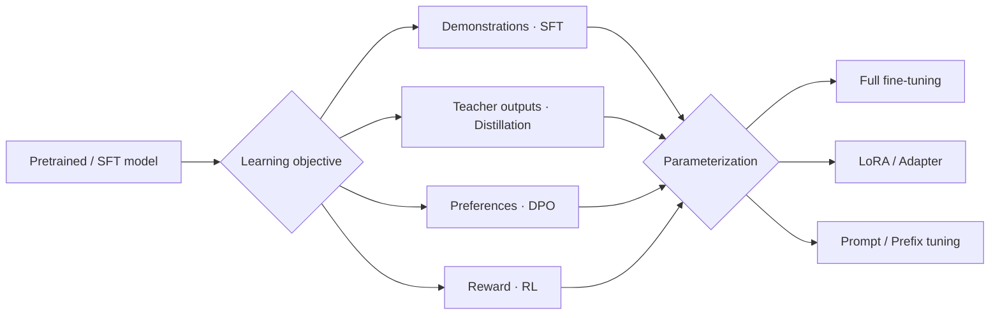

# Model Adaptation: Full Fine-Tuning, LoRA, Prompt Tuning, and Distillation

[中文](model-adaptation.md) · **English**

> Reading time: about 16 minutes · Level: core · Last reviewed: 2026-09

<div class="lesson-recipe">
  <div><span>Problem</span><strong>adapt an existing model to a target task at an acceptable cost</strong></div>
  <div><span>Separate first</span><strong>the learning signal · the parameters allowed to change</strong></div>
  <div><span>Core methods</span><strong>Full FT · LoRA · Prompt / Prefix Tuning · Distillation</strong></div>
  <div><span>Common mistake</span><strong>treating SFT, LoRA, Prompt Tuning, and distillation as peer algorithms</strong></div>
</div>

## Quick learning: separate the two axes

<details class="interview" markdown="1">
<summary>Explain the whole map in two minutes</summary>

The first axis is the **learning objective**: demonstrations produce SFT, teacher
distributions produce distillation, chosen/rejected pairs produce DPO, and rewards
produce RL.

The second axis is **parameterization**: update all weights, train LoRA / Adapters, or
train only an input-side soft prompt. The axes can be combined: LoRA-SFT, LoRA-DPO, or
a LoRA-parameterized student trained by distillation.

> **Distillation determines that supervision comes from a teacher. LoRA and Prompt Tuning determine which parameters gradients may change.**

<details markdown="1">
<summary><b>Deep dive</b>: why does the distinction matter?</summary>

“LoRA beats SFT” is an incomplete experiment: LoRA is an update mechanism while SFT is
a data-and-loss choice. Compare full-parameter SFT with LoRA-SFT, or compare SFT with
distillation under the same parameterization. Otherwise two variables changed at once.

</details>
</details>



## Four parameter-adaptation mechanisms

### Full fine-tuning: every model weight may move

Full-parameter fine-tuning computes gradients for all parameters:

$$
\theta\leftarrow\theta-\eta\nabla_\theta\mathcal L.
$$

It gives the optimizer the most freedom and usually consumes the most training memory,
optimizer state, and checkpoint storage. With limited data or poor learning-rate
control, it can also overfit or damage existing capability. It fits settings with
enough data, substantial task shift, and a real need to change internal representations.

### LoRA: learn a weight update rather than retraining the full matrix

For a frozen linear layer $W_0\in\mathbb R^{d_{out}\times d_{in}}$, LoRA learns a
low-rank update:

$$
W=W_0+\Delta W,\qquad \Delta W=\frac{\alpha}{r}BA,
$$

where $A\in\mathbb R^{r\times d_{in}}$, $B\in\mathbb R^{d_{out}\times r}$, and
$r\ll\min(d_{in},d_{out})$; $\alpha/r$ controls the update scale. Only $A,B$ train.
LoRA changes internal linear maps and
therefore has more freedom than an input-only soft prompt. Adapters can be loaded
dynamically or merged for serving.

### Prompt Tuning: learn virtual tokens before the input

Prompt Tuning freezes the model and prepends $m$ learned vectors to ordinary token
embeddings:

$$
P\in\mathbb R^{m\times d_{model}},\qquad
H_0=[P;E(x)],\qquad
\hat y=f_{\theta_{\text{frozen}}}(H_0).
$$

$P$ is a **soft prompt**. It is not a hidden natural-language sentence and does not
correspond to lexical token IDs in the vocabulary (a framework may assign placeholder
indices). It generally cannot be translated into readable words. Gradients pass through
the Transformer, but only $P$ updates:

$$
\nabla_\theta\mathcal L=0,\qquad \nabla_P\mathcal L\neq0.
$$

Its direct parameter count is

$$
N_{\text{prompt}}=m\,d_{model}.
$$

For prompt length $m=4$ and hidden dimension $d_{model}=1024$, only
$4\times1024=4096$ parameters train. The embedding table and all other model weights
remain frozen.

Each task can store a tiny $P_k$ while sharing one large model:

```text
P_refund  + customer message → frozen model → refund output
P_routing + customer message → frozen model → routing output
P_summary + conversation     → frozen model → summary
```

The soft prompt must still be prepended at inference; it is not absorbed into the base
weights. It also consumes $m$ context positions and adds those positions to every layer.

<details class="interview" markdown="1">
<summary>Worked example: Prompt Tuning for commerce-support routing</summary>

Suppose the valid classes are `refund / shipping / product question`. Train five
virtual-token embeddings for this task:

$$P_{route}=[p_1,p_2,p_3,p_4,p_5].$$

One training item is

```text
input: When will my package arrive?
label: shipping
```

The model actually receives

```text
[p1][p2][p3][p4][p5] When will my package arrive?
```

If “shipping” initially has low probability, a classification loss or label-token CE
produces a gradient. The model weights stay fixed while the five $p_i$ vectors update.
Across many examples, they learn to place the frozen model into a useful support-routing
state. Every new production message receives the same $P_{route}$.

These vectors mainly **invoke and reorganize capability already present in the model**.
If the base does not know a new company policy or product fact, a few prompt parameters
are a poor knowledge store; retrieval, continued pretraining, LoRA, or full fine-tuning
is more appropriate.

</details>

### Prefix Tuning: parameters enter every layer

Prompt Tuning usually adds virtual tokens only at the embedding layer. Prefix Tuning
directly provides learned prefix keys and values to attention at every layer:

$$
K_l'=[P_l^K;K_l],\qquad V_l'=[P_l^V;V_l].
$$

Ordinary token queries can attend to these virtual K/V states at every layer. If the
total KV dimension per layer is $d_{KV}=n_{kv\_heads}d_{head}$, the directly stored
prefix KV state has approximate size

$$
N_{\text{prefix}}\approx2Lmd_{KV}.
$$

For standard MHA, $d_{KV}=d_{model}$, giving the familiar
$2\times L\times m\times d_{model}$. With $L=24,m=4,d_{model}=1024$, that is about
$196{,}608$ prefix KV parameters. GQA and MQA have fewer KV heads, so use $d_{KV}$
rather than blindly substituting $d_{model}$.

Some implementations use a small MLP to generate layer-wise prefix K/V. The expression
above then describes the **final prefix-state size**; the actual trainable parameter
count must also include the reparameterization network. Prefix Tuning influences every
attention block more directly, uses more parameters, and often has greater capacity:

```text
Prompt Tuning: prepend P to input embeddings
Prefix Tuning: add learned K/V prefixes at every attention layer
```

Both are parameter-efficient fine-tuning (PEFT), but they are different mechanisms.

<details class="interview" markdown="1">
<summary>One-sentence distinction: Prompt Tuning also produces K/V at every layer, so why is it different?</summary>

Prompt tokens propagate like ordinary tokens and therefore produce K/V at every layer,
but those states evolve indirectly from **one shared set of input embeddings**. Prefix
Tuning directly supplies layer-specific prefix K/V, giving each layer its own control
signal.

</details>

## Guaranteeing valid classification output

A soft prompt can make the right label more probable, but **cannot by itself guarantee
the output schema**. A reliable system separates predictive accuracy from output
validity.

### Score a fixed label set

Avoid free generation and compare candidate sequence log-probabilities:

$$
\hat c=\arg\max_{c\in\mathcal C}\log P(c\mid P,x),
\qquad
\log P(c\mid P,x)=\sum_j\log P(c_j\mid P,x,c_{<j}).
$$

Production systems often use single-token, equal-length labels such as `A/B/C` and map
them to business classes, avoiding tokenization and label-length bias.

### Constrained decoding

Mask every token outside the legal label set to $-\infty$ before softmax. This guarantees
that the output belongs to the enum; it does not guarantee that the classification is
correct.

### Add a classification head

Take a hidden state $h$ and train a fixed-width classifier:

$$
p(c\mid x)=\operatorname{softmax}(W_ch+b).
$$

For a fixed classification-only task this is often more direct than free-form decoder
generation. The backbone can remain frozen while a soft prompt and small head train.

> **The model or soft prompt improves accuracy; a serving constraint guarantees the schema.** Do not rely on a natural-language instruction saying “output only the label.”

## Distillation: supervision comes from a Teacher

Knowledge Distillation normally has a capable or expensive Teacher and a Student that
will be deployed. It is not one fixed parameter-update method; it is a family of
supervision sources.

### Response distillation

The Teacher generates answers and the Student treats them as SFT demonstrations. This
is simple but keeps only one sampled output and loses the Teacher's relative preference
over alternative tokens.

### Logit / distribution distillation

The Student matches the Teacher's token distribution, for example by minimizing

$$
\mathcal L_{KD}
=T^2\,D_{KL}\!\left(
p_T(\cdot\mid x,y_{<t};T)
\,\|\,
p_S(\cdot\mid x,y_{<t};T)
\right).
$$

Temperature $T$ flattens the distribution so relationships among secondary tokens also
become supervision. Storing full-vocabulary logits is expensive, so systems often retain
only Teacher top-$k$ logits. That creates obligations around residual probability mass,
cross-tokenizer projection, masking, and normalization.

### On-policy distillation

The Student samples from its current policy, then the Teacher scores token distributions
on those same prefixes. Supervision now follows states the Student actually visits, but
the system must sustain rollout, Teacher inference, and model-version tracking—much like
an online training loop.

Distillation combines with any parameterization: the Student may full fine-tune or train
only LoRA. The Teacher is normally frozen; the Student is optimized and deployed.

## Choosing a method

| Goal | Natural starting point | Why |
| --- | --- | --- |
| many simple tasks sharing one huge model | Prompt / Prefix Tuning | store only a small task state |
| substantial behavior change under limited resources | LoRA-SFT | more capacity than a soft prompt at far lower cost than full FT |
| ample data, large task shift, maximum adaptation ceiling | Full Fine-Tuning | fewest parameter constraints, highest cost and regression risk |
| transfer a large model's capability into a small model | Distillation | Teacher supplies denser information than hard labels |
| fixed enum classification | Label scoring or classification head | avoid free-generation uncertainty |
| missing, changing external facts | Retrieval / tool use | model parameters should not act as a live database |

## Three interview-ready sentences

1. Prompt Tuning learns continuous virtual-token embeddings, not a natural-language prompt; the model is frozen and the prompt remains prepended at inference.
2. LoRA, Prompt Tuning, and full fine-tuning specify which parameters update; SFT, DPO, and distillation specify supervision and objective, so the two sets compose.
3. For classification, training improves accuracy while fixed-label scoring, constrained decoding, or a classification head guarantees output validity.

## Self-check

<div class="taste-check">
  <strong>If you understand the page, you can explain:</strong>
  <ol>
    <li>Why does a soft prompt not correspond to vocabulary tokens or require a natural-language interpretation?</li>
    <li>Where do Prompt Tuning and Prefix Tuning inject their parameters?</li>
    <li>Why is “LoRA versus SFT” an incomplete comparison?</li>
    <li>How can a generative classifier be forced to return only legal enum values?</li>
    <li>What information does response distillation lose compared with token-distribution distillation?</li>
  </ol>
</div>

## Continue reading

- [SFT: how far imitation goes](sft-and-its-ceiling.en.md)
- [Post-training infrastructure](post-training-infrastructure.en.md)

## Papers

- [The Power of Scale for Parameter-Efficient Prompt Tuning](https://arxiv.org/abs/2104.08691)
- [Prefix-Tuning](https://arxiv.org/abs/2101.00190)
- [LoRA](https://arxiv.org/abs/2106.09685)
- [Distilling the Knowledge in a Neural Network](https://arxiv.org/abs/1503.02531)
