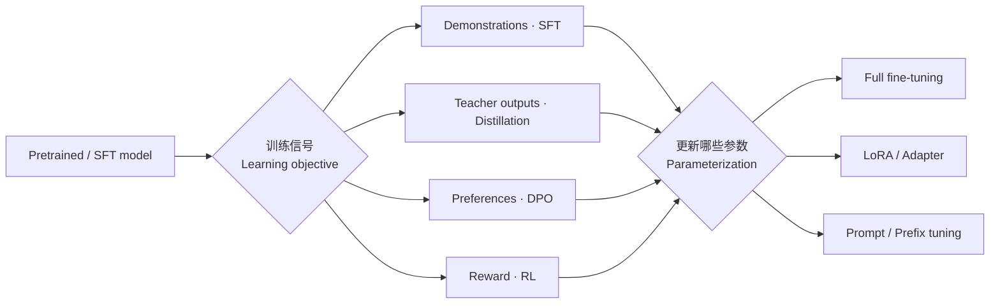

# 模型适配：Full Fine-Tuning、LoRA、Prompt Tuning 与蒸馏

**中文** · [English](model-adaptation.en.md)

> 阅读时间：约 16 分钟 · 难度：必修 · 最近审阅：2026-09

<div class="lesson-recipe">
  <div><span>解决什么问题</span><strong>用多大代价，把一个已有模型变成适合目标任务的模型</strong></div>
  <div><span>先分清</span><strong>训练信号是什么 · 哪些参数会更新</strong></div>
  <div><span>核心方法</span><strong>Full FT · LoRA · Prompt / Prefix Tuning · Distillation</strong></div>
  <div><span>常见错误</span><strong>把 SFT、LoRA、Prompt Tuning 和蒸馏当成同一层级的算法</strong></div>
</div>

## 快速学习：先把两条轴分开

<details class="interview" markdown="1">
<summary>两分钟讲清这些方法到底差在哪里</summary>

**第一条轴是 learning objective（学什么）**：可以用 demonstration 做 SFT，用 teacher
distribution 做 distillation，用 chosen/rejected pair 做 DPO，也可以用 reward 做 RL。

**第二条轴是 parameterization（改哪里）**：可以更新全部权重，训练 LoRA / Adapter，
或者只训练输入侧的 soft prompt。两条轴可以组合，例如 LoRA-SFT、LoRA-DPO，或者用
LoRA 参数化的 student 做 distillation。

> **Distillation 决定监督从 teacher 来；LoRA 与 Prompt Tuning 决定梯度允许改哪些参数。**

<details markdown="1">
<summary><b>深挖</b>：为什么这个区分很重要？</summary>

如果实验说“LoRA 比 SFT 好”，比较本身就不完整：LoRA 是更新参数的方式，SFT 是数据与
损失。正确对照应当是 full-parameter SFT 与 LoRA-SFT，或者在相同 parameterization 下
比较 SFT 与 distillation。否则改变了两件事，却不知道提升来自哪里。

</details>
</details>



## 四种参数适配方式

### Full Fine-Tuning：整个模型都能动

Full-parameter fine-tuning 对所有参数求梯度：

$$
\theta\leftarrow\theta-\eta\nabla_\theta\mathcal L.
$$

它给优化器最大的自由度，通常也需要最多的训练显存、optimizer state 和 checkpoint
存储。数据少或学习率控制不好时，还更容易过拟合或破坏原有能力。它适合数据充分、
任务变化大，而且确实需要改变模型内部表示的场景。

### LoRA：学习权重更新，而不是重训整块权重

对冻结的线性层 $W_0\in\mathbb R^{d_{out}\times d_{in}}$，LoRA 学习低秩增量：

$$
W=W_0+\Delta W,\qquad \Delta W=\frac{\alpha}{r}BA,
$$

其中 $A\in\mathbb R^{r\times d_{in}}$、$B\in\mathbb R^{d_{out}\times r}$，且
$r\ll\min(d_{in},d_{out})$；$\alpha/r$ 控制增量尺度。基础权重冻结，只更新 $A,B$。
它改的是模型内部线性变换，
比只改输入的 Prompt Tuning 表达自由度更高；部署时也可以动态挂载或合并 adapter。

### Prompt Tuning：只学习输入前的 virtual tokens

Prompt Tuning 冻结整个模型，在正常 token embedding 前拼接 $m$ 个可学习向量：

$$
P\in\mathbb R^{m\times d_{model}},\qquad
H_0=[P;E(x)],\qquad
\hat y=f_{\theta_{\text{frozen}}}(H_0).
$$

$P$ 叫 **soft prompt**。它不是一句隐藏的自然语言，也不对应词表里的 lexical token ID
（框架可以给它分配占位索引），通常不能翻译成人能读懂的词。训练时梯度穿过整个
Transformer，但只有 $P$ 更新：

$$
\nabla_\theta\mathcal L=0,\qquad \nabla_P\mathcal L\neq0.
$$

它的直接参数量就是：

$$
N_{\text{prompt}}=m\,d_{model}.
$$

例如 prompt length $m=4$、hidden dimension $d_{model}=1024$，只训练
$4\times1024=4096$ 个参数；embedding table 与其余模型参数全部不动。

每个任务可以保存一份很小的 $P_k$，共享同一个大模型：

```text
P_refund  + 用户消息 → 冻结模型 → 退款任务输出
P_routing + 用户消息 → 冻结模型 → 路由任务输出
P_summary + 对话记录 → 冻结模型 → 摘要
```

推理时 soft prompt 也必须放在输入前；它不是训练完就被吸收到基础模型里。代价是多占
$m$ 个上下文位置，并让每层多处理这些位置。

<details class="interview" markdown="1">
<summary>完整例子：用 Prompt Tuning 做电商客服分类</summary>

假设固定类别为 `退款 / 物流 / 商品咨询`。为这个任务训练五个 virtual-token embeddings：

$$P_{route}=[p_1,p_2,p_3,p_4,p_5].$$

一条训练数据是：

```text
输入：我的包裹什么时候到？
标签：物流
```

模型实际接收：

```text
[p1][p2][p3][p4][p5] 我的包裹什么时候到？
```

如果第一次给“物流”的概率很低，classification loss 或 label-token CE 产生梯度。模型
权重不动，五个 $p_i$ 被更新。许多样本之后，这组向量学会把冻结模型带入“客服路由”
的内部工作状态。上线后，任何新消息都先拼同一组 $P_{route}$。

这组向量主要是在**调用与重组模型已有能力**。如果基础模型根本不懂新的企业政策或
商品事实，soft prompt 很难凭少量参数把知识装进去；此时更应考虑 retrieval、continued
pretraining、LoRA 或 full fine-tuning。

</details>

### Prefix Tuning：不只在输入层加向量

Prompt Tuning 通常只在 embedding 层加 virtual tokens；Prefix Tuning 为每一层 attention
直接提供可学习的 prefix key/value：

$$
K_l'=[P_l^K;K_l],\qquad V_l'=[P_l^V;V_l].
$$

普通 token 的 Query 可以在每一层关注这些虚拟 K/V。若每层的总 KV 维度是
$d_{KV}=n_{kv\_heads}d_{head}$，直接存储 prefix KV 的规模近似为：

$$
N_{\text{prefix}}\approx2Lmd_{KV}.
$$

标准 MHA 中 $d_{KV}=d_{model}$，因此就是你记的 $2\times L\times m\times d_{model}$。
例如 $L=24,m=4,d_{model}=1024$，大约是 $196{,}608$ 个 prefix KV 参数。GQA / MQA
因为 KV heads 更少，应当使用 $d_{KV}$，不能直接套 $d_{model}$。

有些实现用一个小 MLP 生成每层 prefix K/V，所以上式更准确地说是**最终 prefix-state
规模**；若采用 reparameterization，实际 trainable parameter count 还要把 MLP 算进去。
它比 Prompt Tuning 更直接影响各层注意力，参数更多、表达力也通常更强：

```text
Prompt Tuning：input embedding 前加 P
Prefix Tuning：每一层 attention 都加入 learned K/V prefix
```

两者都属于 parameter-efficient fine-tuning（PEFT），但不是同一个机制。

<details class="interview" markdown="1">
<summary>一句话分清：为什么 Prompt Tuning 也会产生每层 K/V，却仍不等于 Prefix Tuning？</summary>

Prompt tokens 像普通 token 一样从输入层逐层传播，因此当然会在每层产生 K/V；但这些
状态都由**同一组输入 embeddings 间接演化**而来。Prefix Tuning 则为各层直接提供
layer-specific prefix K/V，每层拥有独立控制信号。

</details>

## 分类输出怎么保证只落在合法标签里

Soft prompt 只能让正确标签更可能，**不能单独保证输出 schema**。可靠系统要把“模型学得
准不准”和“输出是否合法”分开处理。

### 方法一：直接给固定标签打分

不让模型自由生成，而是比较候选标签的 sequence log-probability：

$$
\hat c=\arg\max_{c\in\mathcal C}\log P(c\mid P,x),
\qquad
\log P(c\mid P,x)=\sum_j\log P(c_j\mid P,x,c_{<j}).
$$

工程上常用单 token、等长的 `A/B/C` 再映射到业务标签，避免不同 tokenization 与标签
长度带来的偏差。

### 方法二：Constrained Decoding

在生成时把合法标签之外的 token logits mask 成 $-\infty$，只在允许集合上做 softmax。
这样可以保证输出属于枚举集合，但不能保证分类一定正确。

### 方法三：Classification Head

取一个 hidden state $h$，训练固定输出维度的分类头：

$$
p(c\mid x)=\operatorname{softmax}(W_ch+b).
$$

类别固定、只需要分类时，这通常比让 decoder 自由生成更直接。可以冻结 backbone，同时
训练 soft prompt 与小分类头。

> **模型或 soft prompt 提高 accuracy；serving constraint 保证 schema。** 不要把格式
> 保证寄托在一句“请只输出标签”的自然语言指令上。

## Distillation：监督来自 Teacher

Knowledge Distillation（知识蒸馏）通常有一个能力更强或成本更高的 Teacher，以及要部署的
Student。它不是一种固定的参数更新方式，而是一类监督来源。

### Response Distillation

Teacher 先生成答案，Student 把答案当 demonstration 做 SFT。实现简单，但只保留了一条
采样结果，看不到 Teacher 对其他 token 的相对偏好。

### Logit / Distribution Distillation

Student 拟合 Teacher 的 token distribution，例如最小化：

$$
\mathcal L_{KD}
=T^2\,D_{KL}\!\left(
p_T(\cdot\mid x,y_{<t};T)
\,\|\,
p_S(\cdot\mid x,y_{<t};T)
\right).
$$

温度 $T$ 把分布变平，让次优 token 之间的关系也成为监督。大词表下保存全部 logits 很
贵，因此系统常只保存 Teacher top-$k$ logits；但这要求明确处理其余概率质量、不同
tokenizer 的映射，以及 mask 和 normalization 的一致性。

### On-policy Distillation

Student 先从当前策略采样，Teacher 再给这些同一前缀上的 token distribution 打分。这样
监督更贴近 Student 真正会访问的状态，但需要持续 rollout、Teacher inference 和权重版本
管理，系统复杂度接近 online training loop。

Distillation 可以和任何 parameterization 组合：Student 可以 full fine-tune，也可以只训
LoRA。Teacher 通常冻结；Student 才是被优化和最终部署的模型。

## 怎么选

| 目标 | 更自然的起点 | 原因 |
| --- | --- | --- |
| 多个简单任务共享同一超大模型 | Prompt / Prefix Tuning | 每个任务只保存少量参数 |
| 需要明显改变内部行为，但资源有限 | LoRA-SFT | 比 soft prompt 自由度高，成本远低于 full FT |
| 数据充分、任务差异大、追求最高适配上限 | Full Fine-Tuning | 参数约束最少，但成本和回归风险最高 |
| 把大模型能力迁到小模型 | Distillation | Teacher 提供比 hard label 更密的监督 |
| 固定枚举分类 | Label scoring 或 classification head | 不需要承担自由生成的不确定性 |
| 缺少会变化的外部事实 | Retrieval / tool use | 不应指望微调参数充当实时数据库 |

## 面试时最值得说清楚的三句话

1. Prompt Tuning 学的是连续 virtual-token embeddings，不是自然语言 prompt；模型冻结，推理时仍要把它们拼到输入前。
2. LoRA、Prompt Tuning 和 full fine-tuning 描述参数怎样更新；SFT、DPO 和 distillation 描述监督与 objective，两组概念可以交叉组合。
3. 对分类任务，训练方法负责 accuracy，固定标签打分、constrained decoding 或 classification head 负责输出合法性。

## 自检

<div class="taste-check">
  <strong>如果真的理解了，你应该能解释：</strong>
  <ol>
    <li>为什么 soft prompt 不对应词表里的 lexical token，也不一定能翻译成人话？</li>
    <li>Prompt Tuning 与 Prefix Tuning 分别在哪一层加入参数？</li>
    <li>为什么“LoRA 和 SFT 哪个更好”不是一个完整的问题？</li>
    <li>如何让生成式分类器保证只返回合法枚举值？</li>
    <li>Response distillation 与 token-distribution distillation 丢失的信息有什么不同？</li>
  </ol>
</div>

## 继续阅读

- [SFT：模仿能到哪儿，到哪儿为止](sft-and-its-ceiling.md)
- [后训练基础设施](post-training-infrastructure.md)
- [NeMo RL 开源手记](../open-source/nemo-rl/)：on-policy distillation 在真实系统里怎样流动

## 参考论文

- [The Power of Scale for Parameter-Efficient Prompt Tuning](https://arxiv.org/abs/2104.08691)
- [Prefix-Tuning](https://arxiv.org/abs/2101.00190)
- [LoRA](https://arxiv.org/abs/2106.09685)
- [Distilling the Knowledge in a Neural Network](https://arxiv.org/abs/1503.02531)
