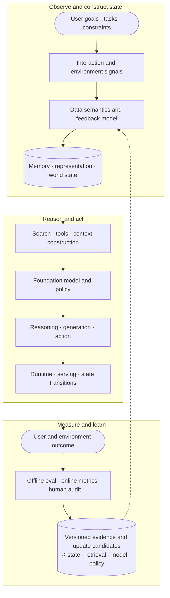
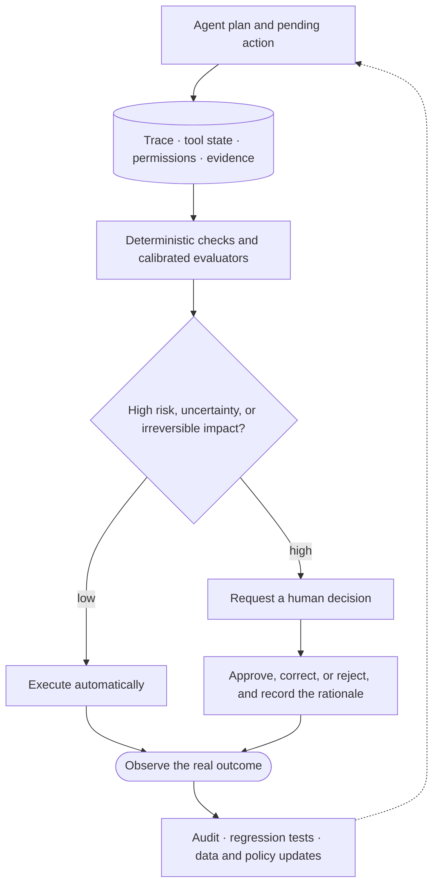

# Modern AI Systems: The Model Is Only One Part

[中文](README.md) · **English**

## First, put the model back into the full system

The final behavior of an AI system is not decided by model parameters alone. It also depends on what data the system saw, which memory it pulled out, what evidence it found, which tools it called, and how we judge whether the result is good.

Many apparent model failures originate outside the model: training data does not represent the task, retrieval supplies the wrong evidence, tool state violates model assumptions, offline evaluation measures the wrong objective, or deployed feedback is contaminated by the product policy.

I therefore view an AI system as a continuous **sense–model–search–act–measure–learn loop**.

## Which stages one request really passes through

Suppose a travel agent books the user a flight on the wrong date.

“The model got it wrong” is only the most superficial description. The real cause may be that:

- the user changed the date in the previous turn, but the state was not updated;
- search found outdated flight information;
- the time-zone conversion in the tool arguments was wrong;
- the model picked the right date, but the execution layer passed the wrong field;
- the final evaluation only checked the reply text and never verified the real order.

If you stare only at the last sentence of the answer, you will very likely fix the wrong place.

## Walk through it end to end



### 1. User goal: what are we actually trying to solve

First state clearly the task, the target population, the cost of failure, and the conditions that must not be violated. Otherwise the system easily optimizes a metric that is convenient to measure but does not represent real value.

### 2. Data and feedback: the past the model sees

Data is produced jointly by previous models, the product interface, and user behavior. It is not a neutral fact. See [Data and feedback](../01-data-and-feedback/README.en.md).

Training requires understanding who was observed, who was omitted, and why feedback occurred.

### 3. Representation and memory: how the system keeps state

This layer decides what enters the current context, what persists across sessions, and how new evidence revises old understanding. See [Representation and memory](../02-memory/README.en.md).

User intent is often a distribution rather than one static point.

### 4. Search and tools: how the system connects to the outside world

Search is responsible for finding evidence and candidates; tools are responsible for reading or changing external state. Both can return successfully and still deliver wrong or outdated information.

Search includes query formulation, candidate generation, evidence deduplication, exploration, tool choice, and context-budget allocation—not only similarity ranking.

### 5. Model and policy: how the system decides the next step

The model combines the goal, the state, and the evidence to decide whether to answer, ask a follow-up question, search, or act. Post-training shapes that behavioral tendency.

Pretraining creates a capability prior; continued pretraining shifts domain knowledge; SFT shapes imitable behavior; preference learning and RL adjust policy. The feedback must be dense, stable, and attributable enough for the selected method.

### 6. Runtime and execution: what decides whether it can really be done

Latency, caching, concurrency, retries, permissions, state synchronization, and cost are not necessarily research topics, yet they directly change the behavior the user sees.

### 7. User outcome: “generation finished” does not mean finished

What really has to be checked is whether the task was completed, whether the external state is correct, and whether the user got the result they wanted.

### 8. Evaluation and learning: how the next round gets better

Rules, executors, LLM judges, human review, and online metrics together form the evidence. Failure cases also have to flow back as new tests, data, or policy updates.

Evaluation is not a final score. It continuously tests the system contract through regression checks, structural invariants, semantic quality, subgroup behavior, online outcomes, and long-term effects. Deployed behavior becomes future data, but it is conditioned on the current policy; the system must distinguish what users prefer from what the system happened to expose.

## Example: a support agent that can look up orders and issue refunds

This kind of system cannot stop at generating natural language. It reads constantly
changing business facts and may execute actions with side effects:

```text
User message
→ Language, intent, and risk detection
→ Structured conversation state
→ Retrieve order, logistics, policy, and seller evidence
→ Model decides to reply, ask a follow-up question, or call a tool
→ Authorization, schema, and policy validation
→ Execute the read / write tool
→ Generate the answer from the execution result
→ Confidence check, clarification, or human escalation
```

Order status, logistics tracking, refund eligibility, and current policy cannot rely on
what the model's parameters remember; they must be obtained at run time through retrieval
or tool calling. Post-training teaches the model **how to use evidence and take action**;
it is not responsible for storing constantly changing business facts.

State should also be layered. The most recent raw turns preserve linguistic continuity;
structured task state stores the order ID, the verified identity, tool results, and
actions pending confirmation; a long-conversation summary keeps only evidence-backed facts
and unresolved items. The enterprise database and versioned policy remain the source of
truth and cannot be replaced by a summary.

A write action such as a refund needs, at minimum, authorization, schema validation, user
confirmation, an idempotency key, and an audit log. A tool timeout can be retried safely,
but the model must never pretend the operation succeeded. When evidence is insufficient,
policies conflict, or risk is too high, the system should clarify or hand off to a human.

Evaluation looks at task resolution, grounding, policy compliance, tool-call correctness,
unsafe-action rate, multilingual consistency, escalation quality, latency, cost, CSAT, and
repeat-contact rate all together. More natural language is only one of these.

## A more reliable evaluation stack

| Layer | Best for | Strength | Risk |
| --- | --- | --- | --- |
| Deterministic rules | Schema, format, state, tools, structure | Fast, stable, regression-friendly | Cannot judge open-ended semantic quality |
| Reference / executor | Math, code, evidence, task completion | Close to verifiable truth | References may be incomplete or wrong |
| LLM judge | Relevance, helpfulness, style, open-ended quality | Scalable semantic judgment | Bias, drift, and nondeterminism |
| Pairwise judge | Relative model, prompt, or policy comparison | More natural than absolute scoring | Position bias; may hide that both are bad |
| Human audit | Rubrics, edge cases, value judgments | Understands real context | Expensive and internally inconsistent |
| Online and longitudinal metrics | Real outcomes and sustained experience | Closest to the product objective | Confounding, delay, and experiment cost |

### When using an LLM judge

- Specify the criterion before selecting single-output or pairwise evaluation.
- Do not delegate deterministic conditions to a probabilistic model.
- Decompose complex rubrics into atomic judgments; a DAG organizes decisions but does not guarantee validity.
- Swap pairwise order and allow ties or “both bad.”
- Calibrate with references, few-shot examples, and human-labeled cases.
- Track agreement with humans and failures across meaningful slices.
- Record the prompt, model version, temperature, and evidence for reproducibility.

## Why look at the full chain

Errors in the system propagate downstream:

```text
Wrong or missing data
→ wrong user state
→ wrong query
→ wrong retrieval results
→ the model makes a “reasonable” decision in the wrong context
→ the final experience fails
```

The model may be entirely reasonable given its own inputs, and the system as a whole is still wrong.

## When analyzing a problem, I first write down these nine questions

```text
Goal        What are we really trying to improve?
User        Improve it for whom? Is any group hidden by the average?
System      How do the data, components, and control flow connect?
Invariant   Which properties must never be broken?
Failure     Where, specifically, does it fail, and how?
Hypothesis  What do I think the cause is? What result would overturn it?
Constraint  What are the latency, cost, hardware, privacy, and compatibility limits?
Evidence    What evidence will tell us the fix works?
Tradeoff    What improves, and what might it hurt?
```

This is not about making a simple problem complicated. It is about not fixing only the most visible symptom.

The point is not to master every layer. It is to preserve the complete context while working deeply on one part.

## Two modules that help the system keep improving

### Agent Observability: first, see what happened

It strings the model, retrieval, tools, memory, and state changes into one trajectory that can be queried and reproduced.

→ [Read Agent Observability](agent-observability.en.md)

### Human-in-the-Loop: put human judgment where it is worth the most

It does not mean having people do everything. It means having a person confirm, correct, or take over when risk is high, evidence is insufficient, or the task is novel.

→ [Read Human-in-the-Loop](human-in-the-loop.en.md)

Together they form an improvement loop:


