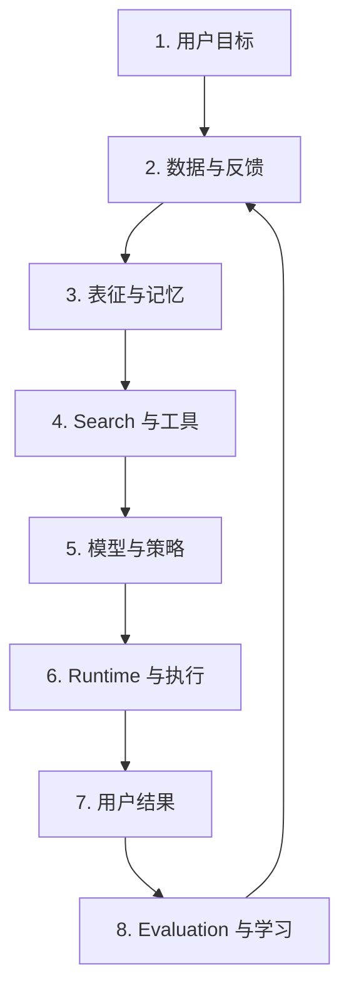
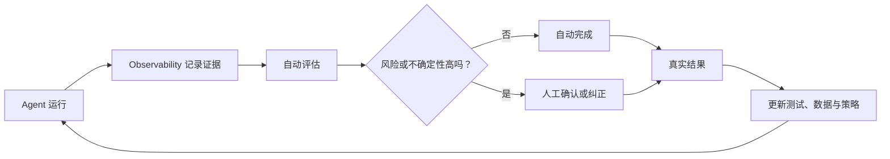

# 现代 AI 系统：模型只是其中一部分

**中文** · [English](README.en.md)

## 先用一句话讲清楚

一个 AI 系统的最终行为，不只由模型参数决定，还取决于它看到了什么数据、取出了什么记忆、找到了什么证据、调用了哪些工具，以及我们怎样判断结果好不好。

## 一个最简单的例子

假设旅行 Agent 给用户订错了机票日期。

“模型答错了”只是最表面的描述。真正原因可能是：

- 用户在前一轮修改了日期，但状态没有更新；
- Search 找到了过期航班信息；
- 工具参数里的时区转换错误；
- 模型选对了日期，但执行层传错字段；
- 最终评估只检查回复文字，没有核对真实订单。

如果只盯着最后一句回答，很可能修错地方。

## 从头到尾走一遍



### 1. 用户目标：到底想解决什么

先说清楚任务、目标人群、失败成本和不能违反的条件。否则系统很容易优化一个方便测量、却不代表真实价值的指标。

### 2. 数据与反馈：模型看见的过去

数据由旧模型、产品界面和用户行为共同产生。它不是中立事实。详见 [数据与反馈](../01-data-and-feedback/)。

### 3. 表征与记忆：系统怎样保存状态

这一层决定什么进入当前上下文，什么跨 session 保留，以及新证据怎样修改旧理解。详见 [表征与记忆](../02-memory/)。

### 4. Search 与工具：系统怎样连接外部世界

Search 负责找证据和候选，工具负责读取或改变外部状态。两者都可能成功返回，却提供了错误或过期的信息。

### 5. 模型与策略：系统怎样决定下一步

模型把目标、状态和证据组合起来，决定回答、追问、搜索还是行动。Post-training 则塑造这种行为倾向。

### 6. Runtime 与执行：决定能不能真的做出来

延迟、缓存、并发、重试、权限、状态同步和成本不一定是研究主题，却会直接改变用户看到的行为。

### 7. 用户结果：不是“生成完成”就算完成

真正要看任务有没有完成、外部状态是否正确，以及用户是否得到想要的结果。

### 8. Evaluation 与学习：下一轮怎样变好

规则、executor、LLM Judge、人工审查和在线指标共同形成证据。失败案例还要回流成新的测试、数据或策略更新。

## 为什么要看完整链路

系统里的错误会向后传播：

```text
错误或缺失的数据
→ 错误的用户状态
→ 错误的 query
→ 错误的检索结果
→ 模型在错误上下文里做出“合理”决定
→ 最终体验失败
```

模型可能在自己的输入条件下完全合理，但整个系统仍然错了。

## 分析问题时，我会先写这九个问题

```text
Goal        真正想改善什么？
User        对谁改善？有没有被平均值遮住的群体？
System      数据、组件和控制流怎样连接？
Invariant   哪些性质绝对不能破坏？
Failure     具体在哪里、怎样失败？
Hypothesis  我认为原因是什么？什么结果会推翻它？
Constraint  延迟、成本、硬件、隐私和兼容性限制是什么？
Evidence    用什么证据判断修复有效？
Tradeoff    改善了什么，又可能伤害什么？
```

这不是为了把简单问题写复杂，而是避免只修最显眼的症状。

## 两个帮助系统持续改进的模块

### Agent Observability：先看见发生了什么

它把模型、检索、工具、记忆和状态变化串成一条可以查询和复现的轨迹。

→ [阅读 Agent Observability](agent-observability.md)

### Human-in-the-Loop：把人的判断放在最值得的位置

它不是所有事情都让人做，而是在风险高、证据不足或任务新颖时，让人确认、纠正或接管。

→ [阅读 Human-in-the-Loop](human-in-the-loop.md)


